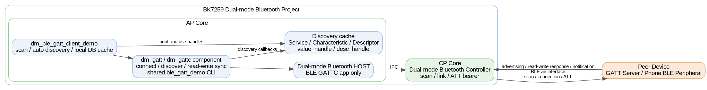
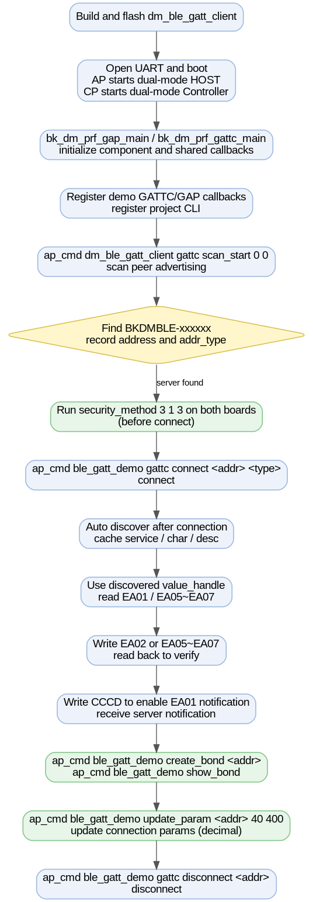
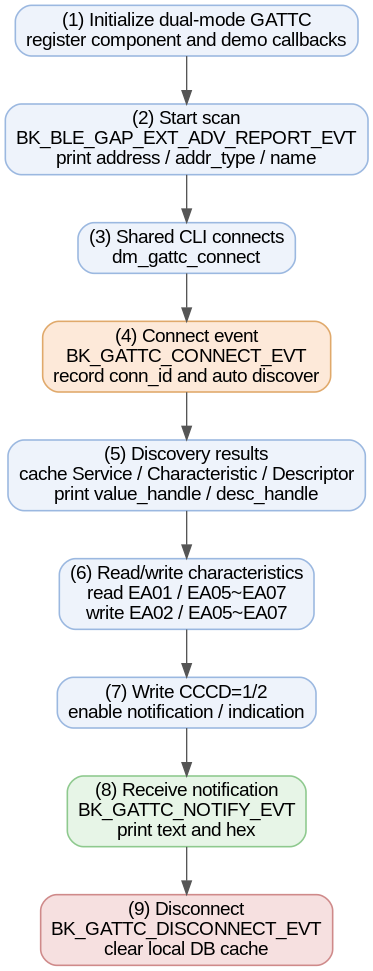

# Dual-mode BLE GATT Client Example

* [中文](./README_CN.md)

this project turns a BK7259 development board into a BLE GATT Client running on the dual-mode Bluetooth Host architecture. The BLE Host runs on AP and the Controller runs on CP. The application demonstrates BLE GATT Client only; it does not start BT Classic profiles such as A2DP, HFP, or SPP.

Use it together with [dm_ble_gatt_server](../dm_ble_gatt_server) for a two-board BLE scan / connect / discover / read / write / notify test.

## Supported Targets

| Target | Status | BLE role | Host / Controller split |
| --- | --- | --- | --- |
| BK7259 | Supported | Central / GATT Client | Host on AP, Controller on CP |

## 1. Overview

After boot, the demo initializes the dm BLE GAP and GATT Client framework, registers a GATTC callback, and provides project CLI commands for scan, read, and CCCD write. Common operations such as connect, disconnect, service discovery, characteristic write, pairing, security settings, and white-list management are provided by the shared `ble_gatt_demo` CLI.

After connecting to a GATT Server, the client can:

- Scan advertising devices and read address, address type, and advertising name.
- Connect to a BLE GATT Server.
- Automatically discover peer services, characteristics, and descriptors.
- Read and write by runtime-discovered value handles.
- Write a CCCD descriptor handle to enable or disable notifications.
- Receive and print notifications from the peer.



Source code: `projects/bluetooth/dm_ble_gatt_client/ap/dm_ble_gatt_client_demo.c`

## 2. Requirements

| Item | Requirement |
| --- | --- |
| Target board | BK7259 development board |
| Peer device | A second board running [dm_ble_gatt_server](../dm_ble_gatt_server), or another BLE GATT Server |
| UART | UART0 for flashing, logs, and CLI |
| Firmware output | `build/bk7259/dm_ble_gatt_client/package/all-app.bin` |

## 3. Peer GATT Database

When the peer is [dm_ble_gatt_server](../dm_ble_gatt_server), service discovery should report this database:

| UUID | Type | Properties / permissions | Client usage |
| --- | --- | --- | --- |
| `0xFA00` | Primary Service | Read | Runtime-discovered primary service |
| `0xEA01` | Characteristic | Read / Notify | Read default bytes and subscribe through CCCD |
| `0x2902` | Descriptor | Read / Write | CCCD for `0xEA01` |
| `0xEA02` | Characteristic | Write / Write No Response | Write-only test characteristic |
| `0xEA05` | Characteristic | Read / Write | N2 string buffer; write then read back |
| `0xEA06` | Characteristic | Read / Write | N3 string buffer; write then read back |
| `0xEA07` | Characteristic | Read / Write | N4 string buffer; write then read back |

ATT handles come from the peer runtime database. Commands must use the `value_handle` and `desc_handle` printed by the current discovery log.

## 4. Directory Structure

```text
dm_ble_gatt_client/
├── README.md / README_CN.md         # This document (EN / CN)
├── picture/                         # Architecture, flow, and sequence diagrams
├── .ci                              # CI build command
├── .it.csv                          # Integration test entry
├── ap/                              # AP side: BLE Host + GATT Client application
│   ├── ap_main.c
│   ├── dm_ble_gatt_client_demo.c    # Scan, discovery cache, read, CCCD write, callbacks, project CLI
│   ├── dm_ble_gatt_client_demo.h
│   └── config/bk7259_ap/defconfig
├── cp/                              # CP side: controller-only config
└── partitions/                      # Flash / RAM partition tables
```

## 5. Configuration

AP side enables the dual-mode Host and dm BLE GATT component:

```text
CONFIG_BLUETOOTH_AP=y
CONFIG_BLUETOOTH_HOST_ONLY=y
CONFIG_BT=y
CONFIG_BLE=y
CONFIG_BLUETOOTH_BTDM_COMPONENT_BLE_GATT=y
```

CP side enables the dual-mode Controller:

```text
CONFIG_BT=y
CONFIG_BTDM_CONTROLLER_ONLY=y
```

`CONFIG_BLE` is enabled by default on the CP side and does not need to be set explicitly in the project defconfig.

`CONFIG_BT=y` makes the dm BLE component menu selectable. This project keeps `CONFIG_BLUETOOTH_BTDM_COMPONENT_ENABLE` disabled, so BT Classic profile components are not built.

## 6. Build And Flash

Build from the SDK root:

```bash
make bk7259 PROJECT=bluetooth/dm_ble_gatt_client
```

Flash the combined image:

```text
build/bk7259/dm_ble_gatt_client/package/all-app.bin
```

After a healthy boot, the client framework and project CLI are ready.

## 7. Testing

The two-board test flow is shown below.



Using [dm_ble_gatt_server](../dm_ble_gatt_server) as the peripheral:

1. Flash `dm_ble_gatt_server` on board A and `dm_ble_gatt_client` on board B.
2. Board A starts advertising as `BKDMBLE-xxxxxx` after boot.
3. Board B starts scanning:

   ```bash
   ap_cmd dm_ble_gatt_client gattc scan_start 0 0
   ```

4. Record board A address and `addr_type` from the scan log, then stop scanning:

   ```bash
   ap_cmd dm_ble_gatt_client gattc scan_stop
   ```

5. Connect to board A:

   ```bash
   ap_cmd ble_gatt_demo gattc connect <server_addr> <addr_type>
   ```

6. Service discovery starts automatically after connection. To run discovery again:

   ```bash
   ap_cmd ble_gatt_demo gattc discover <conn_id>
   ```

7. Use handles from the discovery log for read/write tests:

   ```bash
   ap_cmd dm_ble_gatt_client gattc read <conn_id> <ea01_value_handle> 2
   ap_cmd ble_gatt_demo gattc write <conn_id> <ea02_value_handle> 1234
   ap_cmd ble_gatt_demo gattc write <conn_id> <ea05_value_handle> 5678
   ap_cmd dm_ble_gatt_client gattc read <conn_id> <ea05_value_handle> 4
   ap_cmd ble_gatt_demo gattc write <conn_id> <ea06_value_handle> hello_n3
   ap_cmd dm_ble_gatt_client gattc read <conn_id> <ea06_value_handle> 8
   ap_cmd ble_gatt_demo gattc write <conn_id> <ea07_value_handle> hello_n4
   ap_cmd dm_ble_gatt_client gattc read <conn_id> <ea07_value_handle> 8
   ```

8. Enable notifications on `0xEA01`:

   ```bash
   ap_cmd dm_ble_gatt_client gattc write_ccc <conn_id> <ea01_cccd_handle> 1
   ```

9. Trigger notification from the server side:

   ```bash
   ap_cmd dm_ble_gatt_server gatts notify hello
   ```

10. Disable notifications and disconnect when done:

    ```bash
    ap_cmd dm_ble_gatt_client gattc write_ccc <conn_id> <ea01_cccd_handle> 0
    ap_cmd ble_gatt_demo gattc disconnect <server_addr>
    ```

### Bonding Test

Before bonding, configure the same security parameters on **both Client and Server** (run before connect):

```bash
ap_cmd ble_gatt_demo security_method 3 1 3
```

| Parameter | Value | Meaning |
| --- | --- | --- |
| iocap | `3` | NoInputNoOutput |
| authen | `1` | Bonding without MITM |
| key_distr | `3` | Key distribution |

After connecting and waiting for service discovery, start bonding on the Client:

```bash
ap_cmd ble_gatt_demo gattc connect <server_addr> <addr_type>
ap_cmd ble_gatt_demo create_bond <server_addr>
ap_cmd ble_gatt_demo show_bond
```

On success, both boards log `pairing success`, and `show_bond` lists the peer address and LTK.

### Connection Parameter Update

While connected, run on the Client (`interval` and `timeout` are decimal):

```bash
ap_cmd ble_gatt_demo update_param <server_addr> 40 400
```

On success, the log shows `conn params updated status=0`.

### White List

```bash
ap_cmd ble_gatt_demo clear_whitelist
ap_cmd ble_gatt_demo add_whitelist <server_addr> <addr_type>
ap_cmd ble_gatt_demo remove_whitelist <server_addr> <addr_type>
```

The white list filters connections. Scan results still list nearby devices; this is expected.

## 8. CLI Reference

On BK7259 SMP, AP-side Bluetooth commands must use the `ap_cmd` prefix. This project keeps only GATT Client-specific commands; connect, discovery, write, pairing, security, and white-list commands are provided by the shared `ble_gatt_demo` CLI.

| Command | Description |
| --- | --- |
| `ap_cmd dm_ble_gatt_client -h` | Print project CLI help |
| `ap_cmd dm_ble_gatt_client gattc scan_start [duration] [period]` | Start active scan |
| `ap_cmd dm_ble_gatt_client gattc scan_stop` | Stop scan |
| `ap_cmd dm_ble_gatt_client gattc read <conn_id> <handle> [len]` | Read by value handle |
| `ap_cmd dm_ble_gatt_client gattc write_ccc <conn_id> <ccc_handle> <0|1|2>` | Write CCCD: `0` disable, `1` notify, `2` indicate |

Common shared commands:

| Command | Description |
| --- | --- |
| `ap_cmd ble_gatt_demo gattc connect <addr> <addr_type>` | Connect to a GATT Server |
| `ap_cmd ble_gatt_demo gattc disconnect <addr>` | Disconnect |
| `ap_cmd ble_gatt_demo gattc discover <conn_id>` | Run service discovery |
| `ap_cmd ble_gatt_demo gattc write <conn_id> <handle> <data>` | Write characteristic |
| `ap_cmd ble_gatt_demo security_method <iocap> <authen> <key_distr>` | Configure pairing security |
| `ap_cmd ble_gatt_demo create_bond <peer_addr>` | Start bonding (must be connected) |
| `ap_cmd ble_gatt_demo show_bond` | Show bonded devices |
| `ap_cmd ble_gatt_demo update_param <addr> <interval> <timeout>` | Update connection parameters (decimal) |
| `ap_cmd ble_gatt_demo add_whitelist <peer_addr> <addr_type>` | Add a white-list entry |
| `ap_cmd ble_gatt_demo remove_whitelist <peer_addr> <addr_type>` | Remove a white-list entry |
| `ap_cmd ble_gatt_demo clear_whitelist` | Clear the white list |

## 9. Implementation Notes

Initialization flow:

```c
bk_dm_prf_gap_main(&param);
bk_dm_prf_gattc_main(&param);
bk_dm_prf_gattc_add_gattc_callback(dm_ble_gatt_client_demo_gattc_cb);
```

- `bk_dm_prf_gattc_main()` registers the component internal GATTC callback for connection state and synchronized read/write flow.
- `bk_dm_prf_gattc_add_gattc_callback()` appends the application callback; it does not replace the component callback.
- The application callback handles connection, discovery result, read/write result, and notification events.
- The client discovers the peer database at runtime and caches service, characteristic, and descriptor information.

Full interaction sequence:



## 10. Notes

- Commands must use the `conn_id` from the current connection log and handles from the discovery log.
- `0xEA02` is write-only. A read returns Read Not Permitted; this is expected.
- `write` sends ASCII bytes. Logs print both text and hex to make data verification easier.
- When reading `0xEA05` / `0xEA06` / `0xEA07`, specify `len` to avoid 128-byte padded log output.
- To subscribe to notification, write the CCCD descriptor handle of `0xEA01`, not the value handle.
- For bonding, use `security_method 3 1 3`. Parameters with MITM may fail in a two-board setup.
- The default GATT component log level is used. For detailed bring-up logs, temporarily set `CONFIG_BLUETOOTH_BTDM_COMPONENT_BLE_GATT_LOG_LEVEL=4`.
