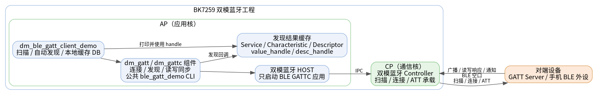
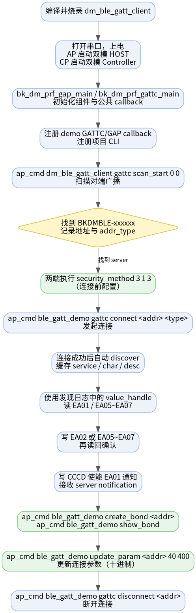
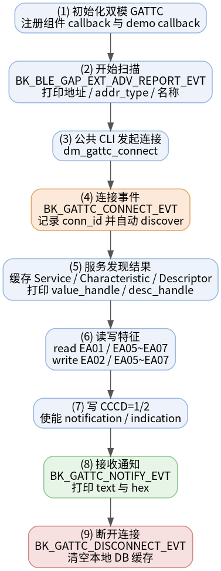

# 双模 BLE GATT Client 示例工程

* [English](./README.md)

本工程把 BK7259 开发板配置为双模蓝牙 Host 架构下的 BLE GATT Client。BLE Host 运行在 AP 侧，Controller 运行在 CP 侧；应用只演示 BLE GATT Client，不启动 A2DP、HFP、SPP 等 BT Classic profile。

本工程可与 [dm_ble_gatt_server](../dm_ble_gatt_server) 配合完成双板 BLE 扫描、连接、发现、读、写和通知测试。

## 支持的芯片

| 芯片 | 状态 | BLE 角色 | Host / Controller 划分 |
| --- | --- | --- | --- |
| BK7259 | 支持 | Central / GATT Client | Host 在 AP，Controller 在 CP |

## 1. 工程概述

上电后，工程会初始化 dm BLE GAP 和 GATT Client 框架，注册 GATTC callback，并提供项目 CLI 用于扫描、读取和写 CCCD。连接、断开、服务发现、写特征值、配对、安全参数、白名单等通用能力由共享 `ble_gatt_demo` CLI 提供。

Client 连接到 GATT Server 后可以：

- 扫描广播设备并读取地址、地址类型和广播名；
- 连接 BLE GATT Server；
- 自动发现对端 service、characteristic 和 descriptor；
- 按运行时发现到的 value handle 执行读写；
- 写 CCCD descriptor handle，使能或关闭 notification；
- 接收并打印对端发送的 notification。



源码：`projects/bluetooth/dm_ble_gatt_client/ap/dm_ble_gatt_client_demo.c`

## 2. 测试环境

| 项目 | 要求 |
| --- | --- |
| 目标板 | BK7259 开发板 |
| 对端设备 | 第二块烧录 [dm_ble_gatt_server](../dm_ble_gatt_server) 的开发板，或其它 BLE GATT Server |
| 串口 | UART0 用于烧录、日志与 CLI |
| 固件产物 | `build/bk7259/dm_ble_gatt_client/package/all-app.bin` |

## 3. 对端 GATT 数据库

当对端使用 [dm_ble_gatt_server](../dm_ble_gatt_server) 时，Client 服务发现应能看到以下数据库：

| UUID | 类型 | 属性 / 权限 | Client 用法 |
| --- | --- | --- | --- |
| `0xFA00` | Primary Service | Read | 运行时发现到的主服务 |
| `0xEA01` | Characteristic | Read / Notify | 读取默认字节，并通过 CCCD 订阅通知 |
| `0x2902` | Descriptor | Read / Write | `0xEA01` 的 CCCD |
| `0xEA02` | Characteristic | Write / Write No Response | write-only 测试特征 |
| `0xEA05` | Characteristic | Read / Write | N2 字符串缓冲，写入后读回 |
| `0xEA06` | Characteristic | Read / Write | N3 字符串缓冲，写入后读回 |
| `0xEA07` | Characteristic | Read / Write | N4 字符串缓冲，写入后读回 |

ATT handle 由对端运行时数据库决定。测试命令中的 `value_handle` 和 `desc_handle` 必须使用当前服务发现日志打印的值。

## 4. 目录结构

```text
dm_ble_gatt_client/
├── README.md / README_CN.md         # 本文档（中英）
├── picture/                         # 架构图、流程图和时序图
├── .ci                              # CI 编译命令
├── .it.csv                          # 集成测试入口
├── ap/                              # AP 侧：BLE Host + GATT Client 应用
│   ├── ap_main.c
│   ├── dm_ble_gatt_client_demo.c    # 扫描、发现缓存、读、写 CCCD、回调和项目 CLI
│   ├── dm_ble_gatt_client_demo.h
│   └── config/bk7259_ap/defconfig
├── cp/                              # CP 侧：Controller-only 配置
└── partitions/                      # Flash / RAM 分区表
```

## 5. 配置说明

AP 侧启用双模 Host 和 dm BLE GATT 组件：

```text
CONFIG_BLUETOOTH_AP=y
CONFIG_BLUETOOTH_HOST_ONLY=y
CONFIG_BT=y
CONFIG_BLE=y
CONFIG_BLUETOOTH_BTDM_COMPONENT_BLE_GATT=y
```

CP 侧启用双模 Controller：

```text
CONFIG_BT=y
CONFIG_BTDM_CONTROLLER_ONLY=y
```

CP 侧 `CONFIG_BLE` 默认已开启，无需在工程 defconfig 中显式配置。

`CONFIG_BT=y` 用于使 dm BLE 组件菜单可选；本工程不启用 `CONFIG_BLUETOOTH_BTDM_COMPONENT_ENABLE`，因此不会编入 BT Classic profile 组件。

## 6. 编译与烧录

在 SDK 根目录编译：

```bash
make bk7259 PROJECT=bluetooth/dm_ble_gatt_client
```

烧录合并镜像：

```text
build/bk7259/dm_ble_gatt_client/package/all-app.bin
```

正常启动后，Client 框架和项目 CLI 会完成初始化。

## 7. 测试流程

双板端到端流程如下图：



以 [dm_ble_gatt_server](../dm_ble_gatt_server) 作为从设备：

1. A 板烧录 `dm_ble_gatt_server`，B 板烧录 `dm_ble_gatt_client`。
2. A 板上电后等待广播启动，广播名为 `BKDMBLE-xxxxxx`。
3. B 板启动扫描：

   ```bash
   ap_cmd dm_ble_gatt_client gattc scan_start 0 0
   ```

4. 从扫描日志中记录 A 板地址和 `addr_type`，然后停止扫描：

   ```bash
   ap_cmd dm_ble_gatt_client gattc scan_stop
   ```

5. 连接 A 板：

   ```bash
   ap_cmd ble_gatt_demo gattc connect <server_addr> <addr_type>
   ```

6. 连接成功后会自动服务发现。若需要手动重新发现，可执行：

   ```bash
   ap_cmd ble_gatt_demo gattc discover <conn_id>
   ```

7. 使用服务发现日志中的 handle 执行读写：

   ```bash
   ap_cmd dm_ble_gatt_client gattc read <conn_id> <ea01_value_handle> 2
   ap_cmd ble_gatt_demo gattc write <conn_id> <ea02_value_handle> 1234
   ap_cmd ble_gatt_demo gattc write <conn_id> <ea05_value_handle> 5678
   ap_cmd dm_ble_gatt_client gattc read <conn_id> <ea05_value_handle> 4
   ap_cmd ble_gatt_demo gattc write <conn_id> <ea06_value_handle> hello_n3
   ap_cmd dm_ble_gatt_client gattc read <conn_id> <ea06_value_handle> 8
   ap_cmd ble_gatt_demo gattc write <conn_id> <ea07_value_handle> hello_n4
   ap_cmd dm_ble_gatt_client gattc read <conn_id> <ea07_value_handle> 8
   ```

8. 使能 `0xEA01` notification：

   ```bash
   ap_cmd dm_ble_gatt_client gattc write_ccc <conn_id> <ea01_cccd_handle> 1
   ```

9. 在 Server 侧触发 notification：

   ```bash
   ap_cmd dm_ble_gatt_server gatts notify hello
   ```

10. 测试完成后关闭通知并断开连接：

    ```bash
    ap_cmd dm_ble_gatt_client gattc write_ccc <conn_id> <ea01_cccd_handle> 0
    ap_cmd ble_gatt_demo gattc disconnect <server_addr>
    ```

### 绑定测试

绑定前，**Client 和 Server 两端** 需先配置相同的安全参数（连接前执行）：

```bash
ap_cmd ble_gatt_demo security_method 3 1 3
```

| 参数 | 取值 | 含义 |
| --- | --- | --- |
| iocap | `3` | NoInputNoOutput |
| authen | `1` | 绑定，不要求 MITM |
| key_distr | `3` | 密钥分发 |

连接并等待服务发现完成后，在 Client 侧发起绑定：

```bash
ap_cmd ble_gatt_demo gattc connect <server_addr> <addr_type>
ap_cmd ble_gatt_demo create_bond <server_addr>
ap_cmd ble_gatt_demo show_bond
```

成功时两端日志应出现 `pairing success`，`show_bond` 可看到对端地址和 LTK。

### 连接参数更新

在已连接状态下，Client 侧执行（`interval` 和 `timeout` 使用十进制）：

```bash
ap_cmd ble_gatt_demo update_param <server_addr> 40 400
```

成功时日志为 `conn params updated status=0`。

### 白名单

```bash
ap_cmd ble_gatt_demo clear_whitelist
ap_cmd ble_gatt_demo add_whitelist <server_addr> <addr_type>
ap_cmd ble_gatt_demo remove_whitelist <server_addr> <addr_type>
```

白名单用于连接侧过滤；扫描仍会报告周围设备，属正常现象。

## 8. CLI 参考

BK7259 SMP 上，AP 侧蓝牙命令需要加 `ap_cmd` 前缀。本工程只保留 GATT Client 项目特有命令；连接、发现、写入、配对、安全、白名单等公共命令由共享 `ble_gatt_demo` 提供。

| 命令 | 说明 |
| --- | --- |
| `ap_cmd dm_ble_gatt_client -h` | 打印项目 CLI 帮助 |
| `ap_cmd dm_ble_gatt_client gattc scan_start [duration] [period]` | 开始主动扫描 |
| `ap_cmd dm_ble_gatt_client gattc scan_stop` | 停止扫描 |
| `ap_cmd dm_ble_gatt_client gattc read <conn_id> <handle> [len]` | 按 value handle 读取 |
| `ap_cmd dm_ble_gatt_client gattc write_ccc [conn_id] [ccc_handle] [0, 1, or 2]` | 写 CCCD：`0` 关闭，`1` notify，`2` indicate |

常用共享命令：

| 命令 | 说明 |
| --- | --- |
| `ap_cmd ble_gatt_demo gattc connect <addr> <addr_type>` | 连接 GATT Server |
| `ap_cmd ble_gatt_demo gattc disconnect <addr>` | 断开连接 |
| `ap_cmd ble_gatt_demo gattc discover <conn_id>` | 手动执行服务发现 |
| `ap_cmd ble_gatt_demo gattc write <conn_id> <handle> <data>` | 写 characteristic |
| `ap_cmd ble_gatt_demo security_method <iocap> <authen> <key_distr>` | 配置配对安全参数 |
| `ap_cmd ble_gatt_demo create_bond <peer_addr>` | 发起 bond（需已连接） |
| `ap_cmd ble_gatt_demo show_bond` | 查看 bond 设备 |
| `ap_cmd ble_gatt_demo update_param <addr> <interval> <timeout>` | 更新连接参数（十进制） |
| `ap_cmd ble_gatt_demo add_whitelist <peer_addr> <addr_type>` | 添加白名单 |
| `ap_cmd ble_gatt_demo remove_whitelist <peer_addr> <addr_type>` | 移除白名单 |
| `ap_cmd ble_gatt_demo clear_whitelist` | 清空白名单 |

## 9. 实现说明

初始化流程：

```c
bk_dm_prf_gap_main(&param);
bk_dm_prf_gattc_main(&param);
bk_dm_prf_gattc_add_gattc_callback(dm_ble_gatt_client_demo_gattc_cb);
```

- `bk_dm_prf_gattc_main()` 注册组件内部 GATTC callback，用于维护连接状态和同步读写流程。
- `bk_dm_prf_gattc_add_gattc_callback()` 追加注册应用 callback，不替换组件 callback。
- 应用 callback 处理连接、服务发现结果、读写结果和 notification 事件。
- Client 会在运行时发现对端数据库，并缓存 service、characteristic 和 descriptor 信息。

完整交互时序：



## 10. 注意事项

- 测试命令必须使用当前连接日志中的 `conn_id` 和服务发现日志中的 handle。
- `0xEA02` 为只写特征，读取会返回 Read Not Permitted，属正常现象。
- `write` 命令写入的是 ASCII 字节；日志会同时打印 text 和 hex，便于确认数据。
- 读 `0xEA05` / `0xEA06` / `0xEA07` 时建议指定 `len`，避免日志显示 128 字节填充数据。
- 订阅 notification 时需要写 `0xEA01` 的 CCCD descriptor handle，而不是 value handle。
- 绑定测试推荐使用 `security_method 3 1 3`；`authen` 含 MITM 的参数在双板环境下可能配对失败。
- 默认使用 GATT 组件日志等级。需要更详细日志时，可临时配置 `CONFIG_BLUETOOTH_BTDM_COMPONENT_BLE_GATT_LOG_LEVEL=4`。
