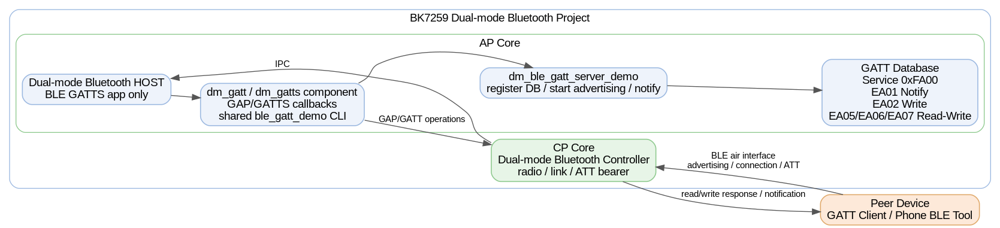
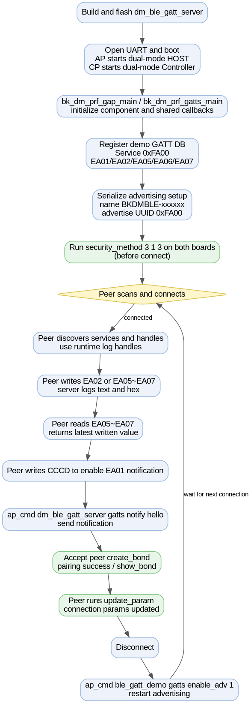
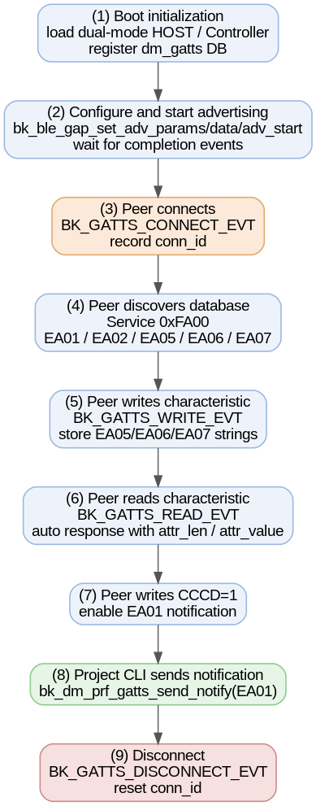

# Dual-mode BLE GATT Server Example

* [中文](./README_CN.md)

This project turns a BK7259 development board into a BLE GATT Server running on the dual-mode Bluetooth Host architecture. The BLE Host runs on AP and the Controller runs on CP. The application demonstrates BLE GATT Server only; it does not start BT Classic profiles such as A2DP, HFP, or SPP.

Use it together with [dm_ble_gatt_client](../dm_ble_gatt_client) for a two-board BLE read / write / notify test, or connect from a phone BLE tool such as nRF Connect or LightBlue.

## Supported Targets

| Target | Status | BLE role | Host / Controller split |
| --- | --- | --- | --- |
| BK7259 | Supported | Peripheral / GATT Server | Host on AP, Controller on CP |

## 1. Overview

After boot, the demo initializes the dm BLE GAP and GATT Server framework, registers a custom GATT database, and starts legacy connectable advertising. A central device can then:

- Discover advertising name `BKDMBLE-xxxxxx` and primary service `0xFA00`.
- Read the default value of notify characteristic `0xEA01`.
- Write the write-only characteristic `0xEA02`.
- Write and read back N2 / N3 / N4 characteristics (`0xEA05` / `0xEA06` / `0xEA07`).
- Enable CCCD `0x2902` and receive notifications from `0xEA01`.
- Use the shared `ble_gatt_demo` CLI to test common features such as advertising control, disconnect, pairing, security settings, white list, and connection parameter update.



Source code: `projects/bluetooth/dm_ble_gatt_server/ap/dm_ble_gatt_server_demo.c`

## 2. Requirements

| Item | Requirement |
| --- | --- |
| Target board | BK7259 development board |
| Central device | A second board running [dm_ble_gatt_client](../dm_ble_gatt_client), or a phone BLE tool |
| UART | UART0 for flashing, logs, and CLI |
| Firmware output | `build/bk7259/dm_ble_gatt_server/package/all-app.bin` |

## 3. Advertising And GATT Database

**Advertising data**

| Field | Value | Description |
| --- | --- | --- |
| Flags | `0x06` | LE General Discoverable |
| Local Name | `BKDMBLE-xxxxxx` | Generated by the dm GATT Server framework from the BLE identity address |
| Service UUID | `0xFA00` | Custom GATT primary service UUID |
| Manufacturer Company ID | `0x05F0` | Beken manufacturer data |

**GATT attribute table (primary service `0xFA00`)**

| UUID | Type | Properties / permissions | Description |
| --- | --- | --- | --- |
| `0xFA00` | Primary Service | Read | Custom primary service declaration |
| `0xEA01` | Characteristic | Read / Notify | Notification source, default value `12 34` |
| `0x2902` | Descriptor | Read / Write | CCCD for `0xEA01` |
| `0xEA02` | Characteristic | Write / Write No Response | Write-only test characteristic; server logs received data |
| `0xEA05` | Characteristic | Read / Write | N2 string buffer; read returns latest written data |
| `0xEA06` | Characteristic | Read / Write | N3 string buffer; read returns latest written data |
| `0xEA07` | Characteristic | Read / Write | N4 string buffer; read returns latest written data |

Runtime ATT handles are assigned by the stack. Client tests should use the current discovery log's `value_handle` and `desc_handle`; do not hard-code handles.

## 4. Directory Structure

```text
dm_ble_gatt_server/
├── README.md / README_CN.md         # This document (EN / CN)
├── picture/                         # Architecture, flow, and sequence diagrams
├── .ci                              # CI build command
├── .it.csv                          # Integration test entry
├── ap/                              # AP side: BLE Host + GATT Server application
│   ├── ap_main.c
│   ├── dm_ble_gatt_server_demo.c    # GATT DB, advertising, callbacks, project CLI
│   ├── dm_ble_gatt_server_demo.h
│   └── config/bk7259_ap/defconfig
├── cp/                              # CP side: controller-only config
└── partitions/                      # Flash / RAM partition tables
```

## 5. Configuration

AP side enables the dual-mode Host and dm BLE GATT component:

```text
CONFIG_BLUETOOTH_AP=y
CONFIG_BLUETOOTH_HOST_ONLY=y
CONFIG_BT=y
CONFIG_BLE=y
CONFIG_BLUETOOTH_BTDM_COMPONENT_BLE_GATT=y
```

CP side enables the dual-mode Controller:

```text
CONFIG_BT=y
CONFIG_BTDM_CONTROLLER_ONLY=y
```

`CONFIG_BLE` is enabled by default on the CP side and does not need to be set explicitly in the project defconfig.

`CONFIG_BT=y` makes the dm BLE component menu selectable. This project keeps `CONFIG_BLUETOOTH_BTDM_COMPONENT_ENABLE` disabled, so BT Classic profile components are not built.

## 6. Build And Flash

Build from the SDK root:

```bash
make bk7259 PROJECT=bluetooth/dm_ble_gatt_server
```

Flash the combined image:

```text
build/bk7259/dm_ble_gatt_server/package/all-app.bin
```

After a healthy boot, the device starts advertising automatically. The serial log shows GATT Server initialization, database registration, and advertising startup.

## 7. Testing

The two-board test flow is shown below.



Using [dm_ble_gatt_client](../dm_ble_gatt_client) as the central:

1. Flash `dm_ble_gatt_server` on board A and `dm_ble_gatt_client` on board B.
2. Board A starts advertising as `BKDMBLE-xxxxxx` after boot.
3. Board B scans and connects to board A. Service discovery starts automatically after connection.
4. Board B records the discovered `0xEA01` value handle, `0xEA01` CCCD handle, and value handles for `0xEA02` / `0xEA05` / `0xEA06` / `0xEA07`.
5. Board B writes `0xEA02`; board A logs the received data.
6. Board B writes and reads back `0xEA05` / `0xEA06` / `0xEA07`; read-back data should match the write data.
7. Board B writes the `0xEA01` CCCD to enable notifications.
8. Board A sends a project notification; board B should receive it.
9. Board B disconnects when the test is done. Before the next connection, advertising can be restarted through the shared CLI.

Project notification command:

```bash
ap_cmd dm_ble_gatt_server gatts notify hello
```

Restart advertising:

```bash
ap_cmd ble_gatt_demo gatts enable_adv 1
```

### Bonding Test

Before bonding, configure the same security parameters on **both Server and Client** (run before connect):

```bash
ap_cmd ble_gatt_demo security_method 3 1 3
```

After the Client connects and service discovery completes, run `create_bond` on the Client. The Server accepts the security request automatically. On success, both boards log `pairing success`, and `show_bond` lists the peer address and LTK.

### Connection Parameter Update

Run on the Client while connected (`interval` and `timeout` are decimal):

```bash
ap_cmd ble_gatt_demo update_param <client_addr> 40 400
```

## 8. CLI Reference

On BK7259 SMP, AP-side Bluetooth commands must use the `ap_cmd` prefix. This project keeps only GATT Server-specific commands; connection, pairing, security, and white-list commands are provided by the shared `ble_gatt_demo` CLI.

| Command | Description |
| --- | --- |
| `ap_cmd dm_ble_gatt_server -h` | Print project CLI help |
| `ap_cmd dm_ble_gatt_server gatts notify <data>` | Send notification data after the peer enables CCCD |

Common shared commands:

| Command | Description |
| --- | --- |
| `ap_cmd ble_gatt_demo gatts enable_adv 1` | Start advertising |
| `ap_cmd ble_gatt_demo gatts enable_adv 0` | Stop advertising |
| `ap_cmd ble_gatt_demo gatts disconnect <peer_addr>` | Disconnect the peer |
| `ap_cmd ble_gatt_demo security_method <iocap> <authen> <key_distr>` | Configure pairing security |
| `ap_cmd ble_gatt_demo create_bond <peer_addr>` | Start bonding (must be connected) |
| `ap_cmd ble_gatt_demo show_bond` | Show bonded devices |
| `ap_cmd ble_gatt_demo update_param <addr> <interval> <timeout>` | Update connection parameters (decimal) |
| `ap_cmd ble_gatt_demo add_whitelist <peer_addr> <addr_type>` | Add a white-list entry |
| `ap_cmd ble_gatt_demo remove_whitelist <peer_addr> <addr_type>` | Remove a white-list entry |
| `ap_cmd ble_gatt_demo clear_whitelist` | Clear the white list |

## 9. Implementation Notes

Initialization flow:

```c
bk_dm_prf_gap_main(&param);
bk_dm_prf_gatts_main(&param);
bk_dm_prf_gatts_add_gatts_callback(dm_ble_gatt_server_demo_gatts_cb);
bk_dm_prf_gatts_reg_db(s_gatts_db, DM_GATTS_IDX_NB, s_attr_handles, dm_ble_gatt_server_demo_db_cb, 1);
dm_ble_gatt_server_demo_start_adv();
```

- `bk_dm_prf_gatts_main()` sets the default device name and registers the component GAP/GATTS callbacks.
- `bk_dm_prf_gatts_add_gatts_callback()` appends the application callback; it does not replace the component callback.
- This project disables the component's internal test attribute table and registers service `0xFA00` in application code.
- Advertising setup waits for GAP completion events with a semaphore, so asynchronous GAP operations are serialized.

Full interaction sequence:



## 10. Notes

- `0xEA02` is write-only. A read returns Read Not Permitted; this is expected.
- `0xEA05` / `0xEA06` / `0xEA07` have zero length before the first write. Read the same value handle after writing to verify the stored data. Specify `len` when reading back.
- Notifications on `0xEA01` require the peer to enable CCCD `0x2902` first.
- Advertising stops after a central connects. Run `ap_cmd ble_gatt_demo gatts enable_adv 1` before reconnecting after disconnect.
- For bonding, use `security_method 3 1 3` on both boards before connect.
- The default GATT component log level is used. For detailed bring-up logs, temporarily set `CONFIG_BLUETOOTH_BTDM_COMPONENT_BLE_GATT_LOG_LEVEL=4`.
