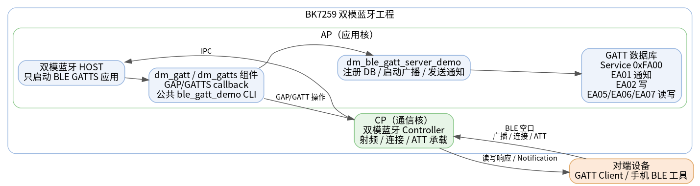
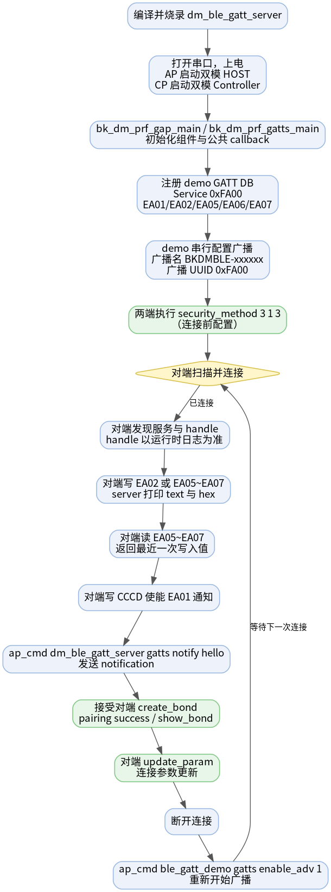
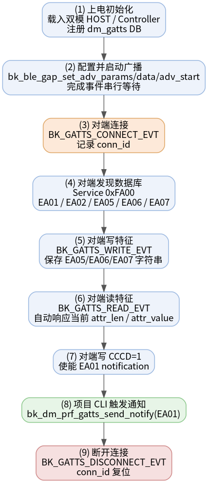

# 双模 BLE GATT Server 示例工程

* [English](./README.md)

本工程把 BK7259 开发板配置为双模蓝牙 Host 架构下的 BLE GATT Server。BLE Host 运行在 AP 侧，Controller 运行在 CP 侧；应用只演示 BLE GATT Server，不启动 A2DP、HFP、SPP 等 BT Classic profile。

本工程可与 [dm_ble_gatt_client](../dm_ble_gatt_client) 配合完成双板 BLE 读、写、通知测试，也可以使用手机 BLE 工具（如 nRF Connect、LightBlue）连接验证。

## 支持的芯片

| 芯片 | 状态 | BLE 角色 | Host / Controller 划分 |
| --- | --- | --- | --- |
| BK7259 | 支持 | Peripheral / GATT Server | Host 在 AP，Controller 在 CP |

## 1. 工程概述

上电后，工程会初始化 dm BLE GAP 和 GATT Server 框架，注册自定义 GATT 数据库并启动 legacy 可连接广播。中心设备连接后可以：

- 发现广播名 `BKDMBLE-xxxxxx` 和主服务 `0xFA00`；
- 读取通知特征 `0xEA01` 的默认值；
- 写入 write-only 特征 `0xEA02`；
- 对 N2 / N3 / N4 三个读写特征（`0xEA05` / `0xEA06` / `0xEA07`）执行写入后读回；
- 写 CCCD `0x2902` 后接收 `0xEA01` 上的 notification；
- 通过共享 `ble_gatt_demo` CLI 验证广播开关、断开、配对、安全参数、白名单和连接参数更新等通用能力。



源码：`projects/bluetooth/dm_ble_gatt_server/ap/dm_ble_gatt_server_demo.c`

## 2. 测试环境

| 项目 | 要求 |
| --- | --- |
| 目标板 | BK7259 开发板 |
| 中心设备 | 第二块烧录 [dm_ble_gatt_client](../dm_ble_gatt_client) 的开发板，或手机 BLE 工具 |
| 串口 | UART0 用于烧录、日志与 CLI |
| 固件产物 | `build/bk7259/dm_ble_gatt_server/package/all-app.bin` |

## 3. 广播与 GATT 数据库

**广播数据**

| 字段 | 取值 | 说明 |
| --- | --- | --- |
| Flags | `0x06` | LE General Discoverable |
| Local Name | `BKDMBLE-xxxxxx` | 由 dm GATT Server 框架根据 BLE identity address 生成 |
| Service UUID | `0xFA00` | 本工程自定义 GATT 主服务 UUID |
| Manufacturer Company ID | `0x05F0` | Beken 厂商数据 |

**GATT 属性表（主服务 `0xFA00`）**

| UUID | 类型 | 属性 / 权限 | 说明 |
| --- | --- | --- | --- |
| `0xFA00` | Primary Service | Read | 自定义主服务声明 |
| `0xEA01` | Characteristic | Read / Notify | 通知源特征，默认值为 `12 34` |
| `0x2902` | Descriptor | Read / Write | `0xEA01` 的 CCCD，用于开启或关闭通知 |
| `0xEA02` | Characteristic | Write / Write No Response | 只写测试特征，server 打印写入内容 |
| `0xEA05` | Characteristic | Read / Write | N2 字符串缓冲，写入后可读回 |
| `0xEA06` | Characteristic | Read / Write | N3 字符串缓冲，写入后可读回 |
| `0xEA07` | Characteristic | Read / Write | N4 字符串缓冲，写入后可读回 |

运行时 ATT handle 由协议栈分配。Client 测试时应以当前服务发现日志中的 `value_handle` 和 `desc_handle` 为准，不要硬编码 handle。

## 4. 目录结构

```text
dm_ble_gatt_server/
├── README.md / README_CN.md         # 本文档（中英）
├── picture/                         # 架构图、流程图和时序图
├── .ci                              # CI 编译命令
├── .it.csv                          # 集成测试入口
├── ap/                              # AP 侧：BLE Host + GATT Server 应用
│   ├── ap_main.c
│   ├── dm_ble_gatt_server_demo.c    # GATT DB、广播、回调和项目 CLI
│   ├── dm_ble_gatt_server_demo.h
│   └── config/bk7259_ap/defconfig
├── cp/                              # CP 侧：Controller-only 配置
└── partitions/                      # Flash / RAM 分区表
```

## 5. 配置说明

AP 侧启用双模 Host 和 dm BLE GATT 组件：

```text
CONFIG_BLUETOOTH_AP=y
CONFIG_BLUETOOTH_HOST_ONLY=y
CONFIG_BT=y
CONFIG_BLE=y
CONFIG_BLUETOOTH_BTDM_COMPONENT_BLE_GATT=y
```

CP 侧启用双模 Controller：

```text
CONFIG_BT=y
CONFIG_BTDM_CONTROLLER_ONLY=y
```

CP 侧 `CONFIG_BLE` 默认已开启，无需在工程 defconfig 中显式配置。

`CONFIG_BT=y` 用于使 dm BLE 组件菜单可选；本工程不启用 `CONFIG_BLUETOOTH_BTDM_COMPONENT_ENABLE`，因此不会编入 BT Classic profile 组件。

## 6. 编译与烧录

在 SDK 根目录编译：

```bash
make bk7259 PROJECT=bluetooth/dm_ble_gatt_server
```

烧录合并镜像：

```text
build/bk7259/dm_ble_gatt_server/package/all-app.bin
```

正常启动后，设备会自动开始广播。串口日志中可看到 GATT Server 初始化、属性表注册和广播启动相关信息。

## 7. 测试流程

双板端到端流程如下图：



以 [dm_ble_gatt_client](../dm_ble_gatt_client) 作为中心设备：

1. A 板烧录 `dm_ble_gatt_server`，B 板烧录 `dm_ble_gatt_client`。
2. A 板上电后等待广播启动，广播名为 `BKDMBLE-xxxxxx`。
3. B 板扫描并连接 A 板，连接成功后会自动执行服务发现。
4. B 板记录服务发现日志中的 `0xEA01` value handle、`0xEA01` CCCD handle、`0xEA02` / `0xEA05` / `0xEA06` / `0xEA07` value handle。
5. B 板写入 `0xEA02`，A 板日志会打印写入内容。
6. B 板对 `0xEA05` / `0xEA06` / `0xEA07` 执行写入后读回，读回值应与写入内容一致。
7. B 板写 `0xEA01` CCCD 使能 notification。
8. A 板执行项目 notify 命令，B 板应收到 notification。
9. 测试完成后，B 板断开连接。下次连接前可通过共享 CLI 重新启动广播。

项目 notify 命令：

```bash
ap_cmd dm_ble_gatt_server gatts notify hello
```

重新启动广播：

```bash
ap_cmd ble_gatt_demo gatts enable_adv 1
```

### 绑定测试

绑定前，**Server 和 Client 两端**需先配置相同的安全参数（连接前执行）：

```bash
ap_cmd ble_gatt_demo security_method 3 1 3
```

Client 连接并完成服务发现后，在 Client 侧执行 `create_bond`。Server 收到安全请求后会自动接受配对。成功时两端日志出现 `pairing success`，`show_bond` 可看到对端地址和 LTK。

### 连接参数更新

Client 在已连接状态下执行（`interval` 和 `timeout` 使用十进制）：

```bash
ap_cmd ble_gatt_demo update_param <client_addr> 40 400
```

## 8. CLI 参考

BK7259 SMP 上，AP 侧蓝牙命令需要加 `ap_cmd` 前缀。本工程只保留 GATT Server 项目特有命令；连接、配对、安全、白名单等公共命令由共享 `ble_gatt_demo` 提供。

| 命令 | 说明 |
| --- | --- |
| `ap_cmd dm_ble_gatt_server -h` | 打印项目 CLI 帮助 |
| `ap_cmd dm_ble_gatt_server gatts notify <data>` | 向已连接且已使能 CCCD 的对端发送 notification |

常用共享命令：

| 命令 | 说明 |
| --- | --- |
| `ap_cmd ble_gatt_demo gatts enable_adv 1` | 启动广播 |
| `ap_cmd ble_gatt_demo gatts enable_adv 0` | 停止广播 |
| `ap_cmd ble_gatt_demo gatts disconnect <peer_addr>` | 主动断开连接 |
| `ap_cmd ble_gatt_demo security_method <iocap> <authen> <key_distr>` | 配置配对安全参数 |
| `ap_cmd ble_gatt_demo create_bond <peer_addr>` | 发起 bond（需已连接） |
| `ap_cmd ble_gatt_demo show_bond` | 查看 bond 设备 |
| `ap_cmd ble_gatt_demo update_param <addr> <interval> <timeout>` | 更新连接参数（十进制） |
| `ap_cmd ble_gatt_demo add_whitelist <peer_addr> <addr_type>` | 添加白名单 |
| `ap_cmd ble_gatt_demo remove_whitelist <peer_addr> <addr_type>` | 移除白名单 |
| `ap_cmd ble_gatt_demo clear_whitelist` | 清空白名单 |

## 9. 实现说明

初始化流程：

```c
bk_dm_prf_gap_main(&param);
bk_dm_prf_gatts_main(&param);
bk_dm_prf_gatts_add_gatts_callback(dm_ble_gatt_server_demo_gatts_cb);
bk_dm_prf_gatts_reg_db(s_gatts_db, DM_GATTS_IDX_NB, s_attr_handles, dm_ble_gatt_server_demo_db_cb, 1);
dm_ble_gatt_server_demo_start_adv();
```

- `bk_dm_prf_gatts_main()` 会设置默认设备名并注册组件内部 GAP/GATTS callback。
- `bk_dm_prf_gatts_add_gatts_callback()` 追加注册应用 callback，不替换组件 callback。
- 本工程关闭组件内部测试属性表，由应用注册自己的 service `0xFA00`。
- 广播配置使用 GAP completion event + semaphore 串行等待，避免连续下发异步 GAP 操作。

完整交互时序：



## 10. 注意事项

- `0xEA02` 为只写特征，读取会返回 Read Not Permitted，属正常现象。
- `0xEA05` / `0xEA06` / `0xEA07` 写入前长度为 0；写入后读取同一个 value handle 才会返回新数据。读回时建议指定 `len`。
- `0xEA01` 的 notification 需要对端先写 CCCD `0x2902` 使能。
- 对端连接后广播会停止；断开后如需再次连接，可执行 `ap_cmd ble_gatt_demo gatts enable_adv 1`。
- 绑定测试推荐使用 `security_method 3 1 3`；两端需在连接前配置相同参数。
- 默认使用 GATT 组件日志等级。需要更详细日志时，可临时配置 `CONFIG_BLUETOOTH_BTDM_COMPONENT_BLE_GATT_LOG_LEVEL=4`。
