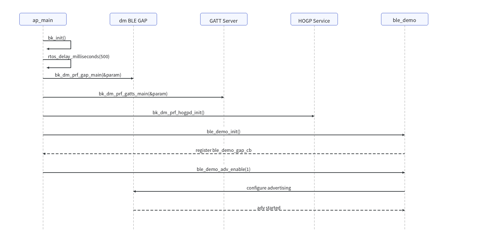
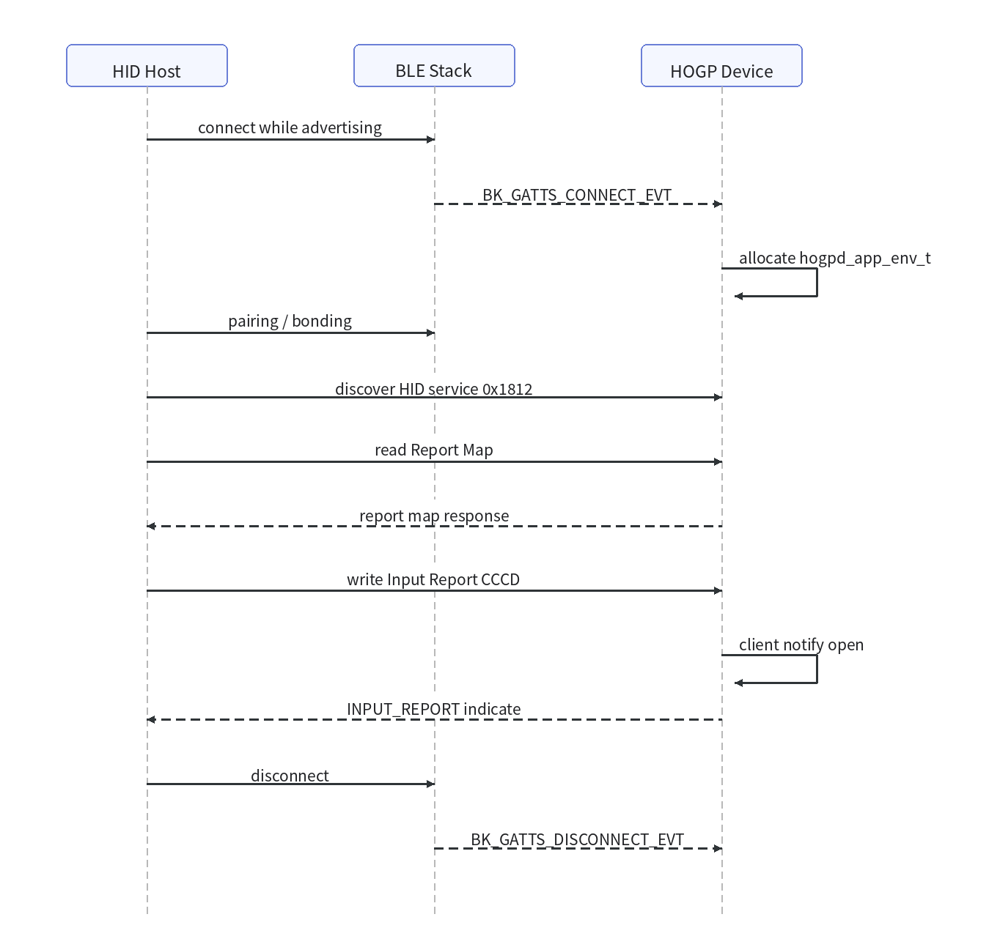
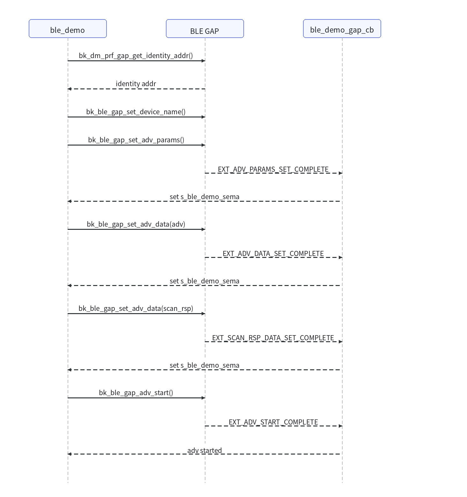
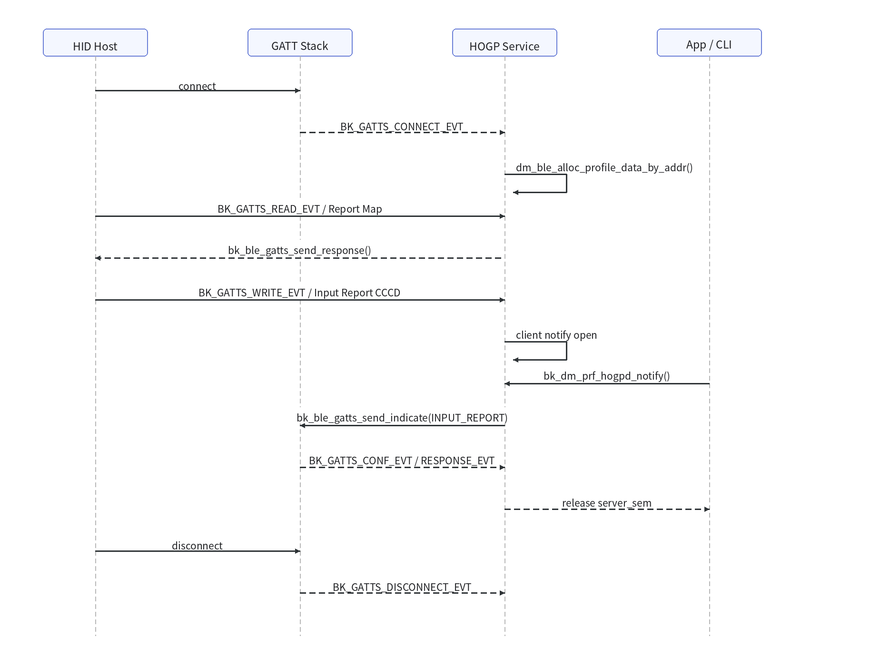

# HID over GATT (HOGP) Device Demo (BK7259)

* [中文](./README_CN.md)

## 1. Project Overview

This project demonstrates a Bluetooth HID over GATT (HOGP) device on the BK7259 SMP platform. The BLE host runs on AP and the controller runs on CP. The board acts as a BLE HID keyboard peripheral (HID Device) that can be discovered, paired, and connected by a HID host such as a phone or PC.

The demo provides:

- dm BLE GAP + GATT server framework setup (`bk_dm_prf_gap_main` / `bk_dm_prf_gatts_main`)
- HID over GATT (HOGP) service database registration (`bk_dm_prf_hogpd_init`)
- A custom advertising module `ble_demo`: advertising parameter/data setup with start/stop control
- Automatic init and advertising start after boot
- Integration-test entries in `.it.csv`

Source code:

- Project entry: `projects/bluetooth/dm_ble_hogp_device/ap/ap_main.c`
- Advertising module: `projects/bluetooth/dm_ble_hogp_device/ap/bluetooth/ble_demo.c`
- HOGP service (shared component): `ap/components/bk_bluetooth/service/dm/ble/hogpd/hogpd.c`

### 1.1 Test Environment

- Hardware: BK7259 development board
- Peer device: a BLE HID host (Android / Windows / macOS), or a phone BLE tool such as nRF Connect
- UART: UART0 for flashing, logging, and CLI
- Firmware output: `build/bk7259/dm_ble_hogp_device/package/all-app.bin`

### 1.2 Advertising And UUIDs

- HID service UUID: `0x1812` (`BK_GATT_UUID_HID_SVC`)
- Advertising data carries the HID service UUID, the device name, and the Beken company id (`0x05F0`)
- Advertising type: legacy connectable (`BK_BLE_GAP_SET_EXT_ADV_PROP_LEGACY_IND`)
- Advertising name is `BK_HOGPD-XXYYZZ`, derived from the BLE identity address

## 2. Directory Structure

```text
dm_ble_hogp_device/
├── README.md
├── README_CN.md
├── .ci                         # CI build command
├── .it.csv                     # Integration test cases
├── Makefile
├── CMakeLists.txt
├── ap/
│   ├── ap_main.c               # Entry: GAP/GATTS/HOGPD/advertising init
│   ├── bluetooth/
│   │   ├── ble_demo.c          # Custom advertising (params/data/start/stop)
│   │   └── ble_demo.h
│   ├── config/bk7259_ap/       # AP-side defconfig (BLE + HOGPD)
│   └── CMakeLists.txt          # Copies .it.csv to build directory
├── cp/                         # CP-side controller-only config
├── partitions/
└── config files
```

> The HOGP service implementation lives in the shared component `ap/components/bk_bluetooth/service/dm/ble/hogpd/`, enabled by `CONFIG_BLUETOOTH_BTDM_COMPONENT_BLE_HOGPD=y`.

## 3. Features

After boot, `ap_main.c` performs in order:

1. `bk_dm_prf_gap_main()`: initialize the dm BLE GAP framework
2. `bk_dm_prf_gatts_main()`: initialize the GATT server framework
3. `bk_dm_prf_hogpd_init()`: register the HID over GATT (keyboard) service database
4. `ble_demo_init()` + `ble_demo_adv_enable(1)`: register the advertising GAP callback and start advertising

As a result, the device starts advertising right after boot and is directly discoverable by a HID host.

- After a HID host connects, advertising stops automatically. This demo does not restart advertising automatically after disconnect; reboot the board or re-trigger advertising before the next connection.
- Pairing/bonding is handled by the dm GAP framework; bonding-related commands are available in the `ble_gatt_demo` command group.

### 3.1 Boot / Init Flow



### 3.2 Connection And Report Flow



### 3.3 Key Flow Walkthrough

#### 3.3.1 Boot / Init Flow (`ap/ap_main.c`)

```text
bk_init()
  → rtos_delay_milliseconds(500)   // wait for auto-enabled BT stack to be ready
  → bk_dm_prf_gap_main(&param)     // GAP: address type, security params, GAP event dispatch
  → bk_dm_prf_gatts_main(&param)   // GATT server: register gatts callback, advertising framework
  → bk_dm_prf_hogpd_init()         // register the HOGP attribute database
  → ble_demo_init()                // register the custom advertising GAP callback
  → ble_demo_adv_enable(1)         // start advertising
  → cli_ble_hogpd_init() / cli_ble_gatt_demo_init()  // register CLI
```

Notes:

- With `CONFIG_BLUETOOTH_AUTO_ENABLE=y`, Bluetooth is enabled automatically during boot, so `main()` uses a 500ms delay to ensure the controller/host is ready before calling BLE APIs.
- In `param`, both `pa/rpa` are 0, meaning the stack default address policy is used (not forced public, not RPA).
- `bk_dm_prf_gatts_main()` must run before `bk_dm_prf_hogpd_init()`: `bk_dm_prf_hogpd_init()` first checks `bk_dm_prf_gatts_is_init()` and returns an error if the GATT server is not initialized.

#### 3.3.2 Advertising Setup Flow (`ap/bluetooth/ble_demo.c`)

Advertising setup is a sequence of "send command + wait for completion event", using a semaphore to turn asynchronous GAP events into sequential execution:

```text
bk_dm_prf_gap_get_identity_addr()         // derive the adv name from the identity address
bk_ble_gap_set_device_name("BK_HOGPD-XXYYZZ")
bk_ble_gap_set_adv_params()  → wait ADV_PARAMS_SET_COMPLETE
[optional] bk_ble_gap_set_adv_rand_addr() → wait SET_RAND_ADDR_COMPLETE   // random address only
bk_ble_gap_set_adv_data(adv)  → wait ADV_DATA_SET_COMPLETE                // adv packet: HID UUID 0x1812 + name + company id
bk_ble_gap_set_adv_data(scan_rsp) → wait SCAN_RSP_DATA_SET_COMPLETE
bk_ble_gap_adv_start() → wait ADV_START_COMPLETE                          // logs "adv started"
```

Notes:

- `ble_demo_gap_cb()` is a "secondary callback" registered via `bk_dm_prf_gap_add_gap_callback()`. The GAP framework dispatches events to every registered callback, so the dm_gatts callback keeps working; this one only forwards advertising-related completion events to `s_ble_demo_sema`.
- Each step uses `ble_demo_wait_complete()` to wait for the matching completion event (timeout `SYNC_CMD_TIMEOUT_MS = 4000ms`); a timeout in any step aborts and returns an error.
- The default `own_addr_type = BLE_ADDR_TYPE_PUBLIC`, so the random-address branch is skipped; if a static random address is used, `[47:46]=0b11` is set before applying it.
- `ble_demo_adv_enable(0)` calls `bk_ble_gap_adv_stop()` to stop advertising.

#### 3.3.3 HOGP Service Interaction And HID Reporting (`service/dm/ble/hogpd/hogpd.c`)

The attribute database `s_gatts_attr_db_service_hidd[]` is registered during `bk_dm_prf_hogpd_init() → hogpd_reg_db() → bk_dm_prf_gatts_reg_db()`. It contains: Protocol Mode, Report Map (with the keyboard report descriptor), Input/Output/Feature Report (each with a Report Reference descriptor; Input also has a CCCD), HID Control Point, HID Information, and Boot Keyboard Input/Output Report. The returned handles are stored in `s_hogpd_attr_handle_list[]`.

The connected state is driven by `hogpd_gatts_cb()`:

- `BK_GATTS_CONNECT_EVT`: allocate a `hogpd_app_env_t` for the connection via `dm_ble_alloc_profile_data_by_addr()` (`PROFILE_ID=2`).
- `BK_GATTS_READ_EVT`: resolve the attribute index and buffer from the handle via `bk_dm_prf_gatts_get_buff_from_attr_handle()`. Protocol Mode uses `BK_GATT_RSP_BY_APP`, so the callback replies explicitly with `bk_ble_gatts_send_response()`; the other attributes use `BK_GATT_AUTO_RSP` and the stack replies automatically.
- `BK_GATTS_WRITE_EVT`: when the Input Report CCCD is written, it parses `config & 1`; if set it logs `client notify open`, meaning the host has enabled notifications.
- `BK_GATTS_CONF_EVT` / `BK_GATTS_RESPONSE_EVT`: record `send_notify_read_rsp_status` and release `server_sem`, which the reporting flow waits on.

HID input reporting `bk_dm_prf_hogpd_notify()`:

```text
dm_ble_find_app_env_by_conn_id() → get the connection's hogpd_app_env_t
rtos_init_semaphore(server_sem)
bk_ble_gatts_send_indicate(if, conn, INPUT_REPORT handle, len, data, is_notify?0:1)
rtos_get_semaphore(server_sem, 4000ms)   // wait for CONF/RESPONSE event
return send_notify_read_rsp_status==0 ? success : failure
```

Notes:

- `is_notify` non-zero sends a notification (no peer ack required); zero sends an indication (waits for the peer ACK).
- Reporting always uses the Input Report handle `s_hogpd_attr_handle_list[HOGPD_DB_IDX_INPUT_REPORT]`.
- This API is a synchronous blocking call: after sending it waits on `server_sem`, which is signaled by `BK_GATTS_CONF_EVT`/`BK_GATTS_RESPONSE_EVT`, then returns the result based on status and releases the semaphore.

### 3.4 Sequence Diagrams

#### 3.4.1 Advertising Setup Sequence



#### 3.4.2 Connection, Pairing And HID Reporting Sequence



## 4. Build And Run

### 4.1 Build

From the SDK root:

```bash
make bk7259 PROJECT=bluetooth/dm_ble_hogp_device
```

Docker build:

```bash
./dbuild.sh make bk7259 PROJECT=bluetooth/dm_ble_hogp_device
```

The project `.ci` file contains the docker build command used by CI:

```text
./dbuild.sh make bk7259 PROJECT=bluetooth/dm_ble_hogp_device
```

### 4.2 Flash

Flash the generated image with BKFIL:

```text
build/bk7259/dm_ble_hogp_device/package/all-app.bin
```

### 4.3 CLI Commands

On BK7259 SMP, AP-side commands must use the `ap_cmd` prefix.

HOGPD command group:

```text
ap_cmd hogpd -h
ap_cmd hogpd init
```

Generic GAP / GATT debug command group `ble_gatt_demo`:

```text
ap_cmd ble_gatt_demo -h
ap_cmd ble_gatt_demo gatts disconnect <xx:xx:xx:xx:xx:xx>
ap_cmd ble_gatt_demo create_bond <xx:xx:xx:xx:xx:xx>
ap_cmd ble_gatt_demo passkey <key>
ap_cmd ble_gatt_demo show_bond
ap_cmd ble_gatt_demo update_param <xx:xx:xx:xx:xx:xx> <interval> <timeout>
```

> Note: the HOGP service is registered automatically at boot. `ap_cmd hogpd init` is only for manual re-trigger; if the service is already registered it returns an error response, which is expected.

### 4.4 How To Judge Pass Or Fail

After reboot, advertising is up when the log contains:

```text
ble_demo: adv name BK_HOGPD-XXYYZZ
ble_demo: adv started
```

After a HID host connects, the `dm_hogpd` tag prints connection and read/write events, for example:

```text
dm_hogpd: BK_GATTS_CONNECT_EVT ...
dm_hogpd: read report map
dm_hogpd: client notify open
```

Once the host enables the CCCD of the input report (`client notify open`), the device can send HID input reports to the host.

### 4.5 Integration Test Commands

`.it.csv` is the runtime integration-test entry file. The test platform reads each row, sends the test command to the selected device UART, waits for the expected result string, and marks the case as passed if the string is found before timeout.

Current cases:

```text
reboot
ap_cmd hogpd init
```

The current static CSV only covers a stable single-board smoke test. Full HID pairing, connection, and input-report verification requires a real HID host and manual interaction, so it is documented as a manual flow (see section 5) instead of being hard-coded in `.it.csv`.

## 5. Test With A HID Host (Manual Flow)

1. Flash `projects/bluetooth/dm_ble_hogp_device` on the board.
2. Confirm the UART log shows `ble_demo: adv started`.
3. On the phone/PC Bluetooth settings or in nRF Connect, scan for a device named `BK_HOGPD-XXYYZZ`.
4. Initiate a connection and complete pairing/bonding.
5. After connecting, the host discovers the HID service (`0x1812`) and reads the report map.
6. Once the host enables input-report notifications, the device can send keyboard input reports.

## 6. Notes

1. AP logs may be prefixed with `ap0:` or `ap1:`.
2. CP logs may appear without an AP prefix.
3. Use `ap_cmd` for all AP-side Bluetooth CLI commands on BK7259 SMP.
4. After a HID host disconnects, this demo does not restart advertising automatically; reboot the board before reconnecting.
5. The HOGP service is already registered at boot, so running `ap_cmd hogpd init` is not required.
