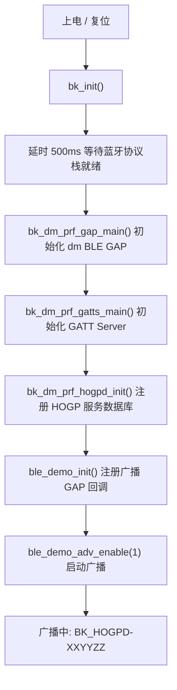
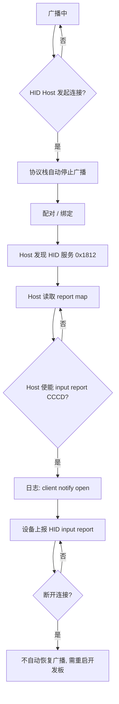
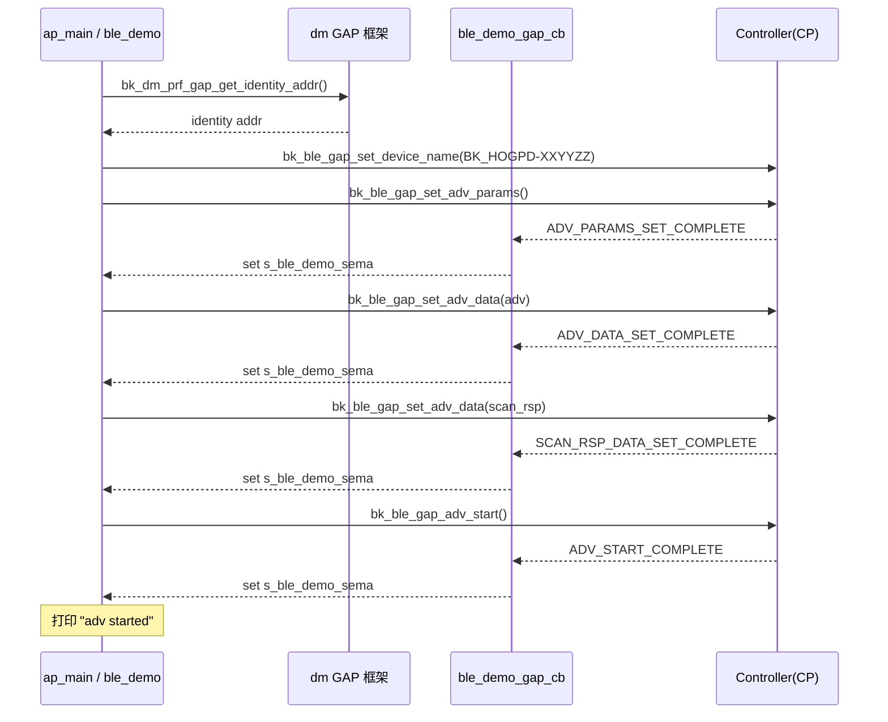
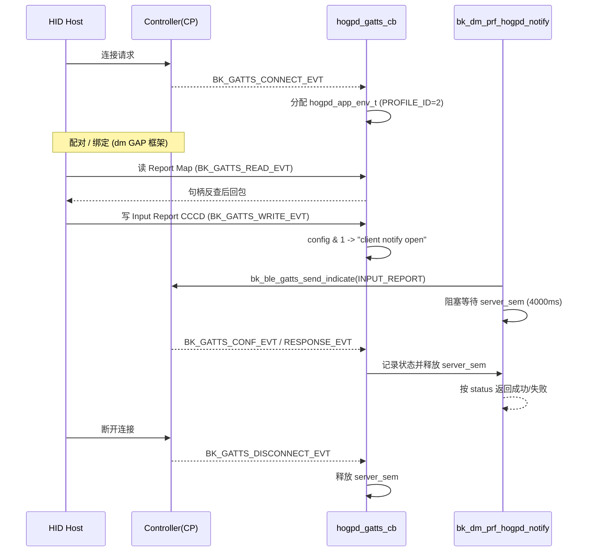

# HID over GATT (HOGP) 设备示例工程 (BK7259)

* [English](./README.md)

## 1. 项目概述

本工程用于演示 BK7259 SMP 平台上的 Bluetooth HID over GATT（HOGP）设备。BLE Host 运行在 AP 侧，Controller 运行在 CP 侧。本示例把开发板模拟成一个 BLE HID 键盘外设（HID Device），可被手机、PC 等 HID Host 发现、配对并连接。

本示例包含：

- dm BLE GAP + GATT Server 框架初始化（`bk_dm_prf_gap_main` / `bk_dm_prf_gatts_main`）
- HID over GATT（HOGP）服务数据库注册（`bk_dm_prf_hogpd_init`）
- 自定义广播模块 `ble_demo`：配置广播参数与广播数据，并支持广播启动/停止
- 上电后自动初始化并启动广播
- `.it.csv` 集成测试用例入口

源码路径：

- 工程入口：`projects/bluetooth/dm_ble_hogp_device/ap/ap_main.c`
- 广播模块：`projects/bluetooth/dm_ble_hogp_device/ap/bluetooth/ble_demo.c`
- HOGP 服务（公共组件）：`ap/components/bk_bluetooth/service/dm/ble/hogpd/hogpd.c`

### 1.1 测试环境

- 硬件：BK7259 开发板
- 对端设备：支持 BLE HID 的 Host（Android / Windows / macOS），或 nRF Connect 等手机 BLE 工具
- 串口：UART0 用于烧录、日志和 CLI
- 固件输出：`build/bk7259/dm_ble_hogp_device/package/all-app.bin`

### 1.2 广播与 UUID 说明

- HID Service UUID：`0x1812`（`BK_GATT_UUID_HID_SVC`）
- 广播数据中携带 HID Service UUID、设备名以及 Beken 厂商 ID（`0x05F0`）
- 广播类型：legacy 可连接广播（`BK_BLE_GAP_SET_EXT_ADV_PROP_LEGACY_IND`）
- 广播名称为 `BK_HOGPD-XXYYZZ`，由 BLE identity 地址派生

## 2. 目录结构

```text
dm_ble_hogp_device/
├── README.md
├── README_CN.md
├── .ci                         # CI 编译命令
├── .it.csv                     # 集成测试用例
├── Makefile
├── CMakeLists.txt
├── ap/
│   ├── ap_main.c               # 工程入口：GAP/GATTS/HOGPD/广播 初始化
│   ├── bluetooth/
│   │   ├── ble_demo.c          # 自定义广播（参数/数据/启停）
│   │   └── ble_demo.h
│   ├── config/bk7259_ap/       # AP 侧 defconfig（BLE + HOGPD）
│   └── CMakeLists.txt          # 复制 .it.csv 到 build 目录
├── cp/                         # CP 侧 controller-only 配置
├── partitions/
└── 配置文件
```

> HOGP 服务实现位于公共组件 `ap/components/bk_bluetooth/service/dm/ble/hogpd/`，由 `CONFIG_BLUETOOTH_BTDM_COMPONENT_BLE_HOGPD=y` 启用。

## 3. 功能说明

上电后 `ap_main.c` 会依次完成：

1. `bk_dm_prf_gap_main()`：初始化 dm BLE GAP 框架
2. `bk_dm_prf_gatts_main()`：初始化 GATT Server 框架
3. `bk_dm_prf_hogpd_init()`：注册 HID over GATT（键盘）服务数据库
4. `ble_demo_init()` + `ble_demo_adv_enable(1)`：注册广播 GAP 回调并启动广播

因此设备上电即开始广播，可被 HID Host 直接搜索到。

- HID Host 连接后，协议栈会自动停止广播；断开连接后本示例不会自动恢复广播，需要重启开发板或重新触发广播。
- 配对/绑定由 dm GAP 框架处理，可使用 `ble_gatt_demo` 命令组中的 bonding 相关命令。

### 3.1 启动流程



### 3.2 连接与上报流程



### 3.3 关键流程讲解

#### 3.3.1 启动初始化流程（`ap/ap_main.c`）

```text
bk_init()
  → rtos_delay_milliseconds(500)   // 等待协议栈自动使能完成
  → bk_dm_prf_gap_main(&param)     // GAP：地址类型、安全参数、GAP 事件分发
  → bk_dm_prf_gatts_main(&param)   // GATT Server：注册 gatts 回调、广播框架
  → bk_dm_prf_hogpd_init()         // 注册 HOGP 属性数据库
  → ble_demo_init()                // 注册自定义广播 GAP 回调
  → ble_demo_adv_enable(1)         // 启动广播
  → cli_ble_hogpd_init() / cli_ble_gatt_demo_init()  // 注册 CLI
```

要点：

- `CONFIG_BLUETOOTH_AUTO_ENABLE=y` 时蓝牙在启动阶段自动使能，因此 `main()` 里用 500ms 延时保证 controller/host 就绪后再调用 BLE API。
- `param` 中 `pa/rpa` 均为 0，表示使用协议栈默认地址策略（非强制 public、非 RPA）。
- 必须先 `bk_dm_prf_gatts_main()` 再 `bk_dm_prf_hogpd_init()`：`bk_dm_prf_hogpd_init()` 内部会先检查 `bk_dm_prf_gatts_is_init()`，未初始化会直接返回错误。

#### 3.3.2 广播建立流程（`ap/bluetooth/ble_demo.c`）

广播配置是一组“发命令 + 等完成事件”的同步序列，借助信号量把异步 GAP 事件转换为顺序执行：

```text
bk_dm_prf_gap_get_identity_addr()         // 取 identity 地址派生广播名
bk_ble_gap_set_device_name("BK_HOGPD-XXYYZZ")
bk_ble_gap_set_adv_params()  → 等 ADV_PARAMS_SET_COMPLETE
[可选] bk_ble_gap_set_adv_rand_addr() → 等 SET_RAND_ADDR_COMPLETE   // 仅随机地址时
bk_ble_gap_set_adv_data(adv)  → 等 ADV_DATA_SET_COMPLETE            // 广播包：HID UUID 0x1812 + name + 厂商 ID
bk_ble_gap_set_adv_data(scan_rsp) → 等 SCAN_RSP_DATA_SET_COMPLETE
bk_ble_gap_adv_start() → 等 ADV_START_COMPLETE                     // 打印 "adv started"
```

要点：

- `ble_demo_gap_cb()` 是通过 `bk_dm_prf_gap_add_gap_callback()` 注册的“二级回调”，GAP 框架会把事件分发给所有已注册回调，因此 dm_gatts 自身的回调仍照常工作；这里只把广播相关的完成事件投递到 `s_ble_demo_sema`。
- 每一步用 `ble_demo_wait_complete()` 等待对应完成事件（超时 `SYNC_CMD_TIMEOUT_MS = 4000ms`），任一步超时即终止并返回错误。
- 默认 `own_addr_type = BLE_ADDR_TYPE_PUBLIC`，所以随机地址分支不会执行；如改用静态随机地址，会设置 `[47:46]=0b11` 后再下发。
- `ble_demo_adv_enable(0)` 调用 `bk_ble_gap_adv_stop()` 停止广播。

#### 3.3.3 HOGP 服务交互与 HID 上报（`service/dm/ble/hogpd/hogpd.c`）

属性数据库 `s_gatts_attr_db_service_hidd[]` 在 `bk_dm_prf_hogpd_init() → hogpd_reg_db() → bk_dm_prf_gatts_reg_db()` 时注册，包含：Protocol Mode、Report Map（含 keyboard report 描述符）、Input/Output/Feature Report（各带 Report Reference 描述符，Input 另带 CCCD）、HID Control Point、HID Information、Boot Keyboard Input/Output Report。注册返回的句柄保存在 `s_hogpd_attr_handle_list[]`。

连接态由 `hogpd_gatts_cb()` 驱动：

- `BK_GATTS_CONNECT_EVT`：用 `dm_ble_alloc_profile_data_by_addr()` 为该连接分配 `hogpd_app_env_t`（`PROFILE_ID=2`）。
- `BK_GATTS_READ_EVT`：通过 `bk_dm_prf_gatts_get_buff_from_attr_handle()` 由句柄反查属性 index 与缓冲区；Protocol Mode 用 `BK_GATT_RSP_BY_APP`，由回调用 `bk_ble_gatts_send_response()` 显式回包，其余属性为 `BK_GATT_AUTO_RSP`，协议栈自动回包。
- `BK_GATTS_WRITE_EVT`：写 Input Report 的 CCCD 时解析 `config & 1`，置位即打印 `client notify open`，表示 Host 已使能通知。
- `BK_GATTS_CONF_EVT` / `BK_GATTS_RESPONSE_EVT`：记录 `send_notify_read_rsp_status` 并释放 `server_sem`，供上报流程同步等待。

HID 输入上报 `bk_dm_prf_hogpd_notify()`：

```text
dm_ble_find_app_env_by_conn_id() → 取连接的 hogpd_app_env_t
rtos_init_semaphore(server_sem)
bk_ble_gatts_send_indicate(if, conn, INPUT_REPORT handle, len, data, is_notify?0:1)
rtos_get_semaphore(server_sem, 4000ms)   // 等 CONF/RESPONSE 事件
返回 send_notify_read_rsp_status==0 ? 成功 : 失败
```

要点：

- `is_notify` 非 0 走 notify（无需对端确认），为 0 走 indicate（等待对端 ACK）。
- 上报固定使用 Input Report 句柄 `s_hogpd_attr_handle_list[HOGPD_DB_IDX_INPUT_REPORT]`。
- 该接口为同步阻塞调用：发送后等待 `server_sem`，由 `BK_GATTS_CONF_EVT`/`BK_GATTS_RESPONSE_EVT` 唤醒，再依据状态返回结果，调用结束后释放信号量。

### 3.4 时序图

#### 3.4.1 广播建立时序



#### 3.4.2 连接、配对与 HID 上报时序



## 4. 编译与运行

### 4.1 编译方法

在 SDK 根目录执行：

```bash
make bk7259 PROJECT=bluetooth/dm_ble_hogp_device
```

Docker 编译：

```bash
./dbuild.sh make bk7259 PROJECT=bluetooth/dm_ble_hogp_device
```

工程 `.ci` 文件中保存了 CI 使用的 docker 编译命令：

```text
./dbuild.sh make bk7259 PROJECT=bluetooth/dm_ble_hogp_device
```

### 4.2 烧录

使用 BKFIL 烧录生成的镜像：

```text
build/bk7259/dm_ble_hogp_device/package/all-app.bin
```

### 4.3 CLI 命令

BK7259 SMP 上 AP 侧命令必须带 `ap_cmd` 前缀。

HOGPD 命令组：

```text
ap_cmd hogpd -h
ap_cmd hogpd init
```

通用 GAP / GATT 调试命令组 `ble_gatt_demo`：

```text
ap_cmd ble_gatt_demo -h
ap_cmd ble_gatt_demo gatts disconnect <xx:xx:xx:xx:xx:xx>
ap_cmd ble_gatt_demo create_bond <xx:xx:xx:xx:xx:xx>
ap_cmd ble_gatt_demo passkey <key>
ap_cmd ble_gatt_demo show_bond
ap_cmd ble_gatt_demo update_param <xx:xx:xx:xx:xx:xx> <interval> <timeout>
```

> 说明：HOGP 服务已在上电时自动注册，`ap_cmd hogpd init` 仅用于手动重复触发；若服务已注册，会返回错误响应，属正常现象。

### 4.4 如何判断测试成功或失败

重启后，出现以下日志表示广播已启动：

```text
ble_demo: adv name BK_HOGPD-XXYYZZ
ble_demo: adv started
```

HID Host 连接后，`dm_hogpd` 标签会打印连接及读写事件日志，例如：

```text
dm_hogpd: BK_GATTS_CONNECT_EVT ...
dm_hogpd: read report map
dm_hogpd: client notify open
```

当 Host 使能 input report 的 CCCD（`client notify open`）后，设备即可向 Host 上报 HID 输入报文。

### 4.5 集成测试命令

`.it.csv` 是运行时集成测试入口。测试平台会逐行读取用例，向指定设备串口发送“测试命令”，在超时时间内等待“期望结果”字符串；匹配到期望字符串即判定该 case 通过。

当前用例：

```text
reboot
ap_cmd hogpd init
```

当前静态 CSV 仅覆盖稳定的单板冒烟测试。完整的 HID 配对、连接以及 input report 上报验证需要一个真实 HID Host，且依赖人工交互，因此不在 `.it.csv` 中硬编码，改为以手动流程说明（见第 5 节）。

## 5. 与 HID Host 联调（手动流程）

1. 开发板烧录 `projects/bluetooth/dm_ble_hogp_device`。
2. 确认串口日志出现 `ble_demo: adv started`。
3. 在手机/PC 的蓝牙设置或 nRF Connect 中搜索名为 `BK_HOGPD-XXYYZZ` 的设备。
4. 发起连接并完成配对/绑定。
5. 连接成功后，Host 会发现 HID 服务（`0x1812`）并读取 report map。
6. Host 使能 input report 的通知后，设备可上报键盘输入报文。

## 6. 注意事项

1. AP 侧日志可能带有 `ap0:` 或 `ap1:` 前缀。
2. CP 侧日志可能不带 AP 前缀。
3. BK7259 SMP 上所有 AP 侧 Bluetooth CLI 命令都需要使用 `ap_cmd`。
4. HID Host 断开后，本示例不会自动恢复广播，需要重启开发板后再次连接。
5. HOGP 服务在上电时已自动注册，无需手动执行 `ap_cmd hogpd init`。
