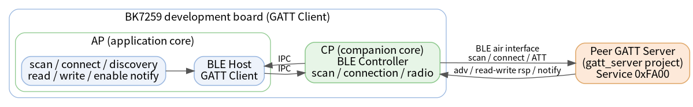
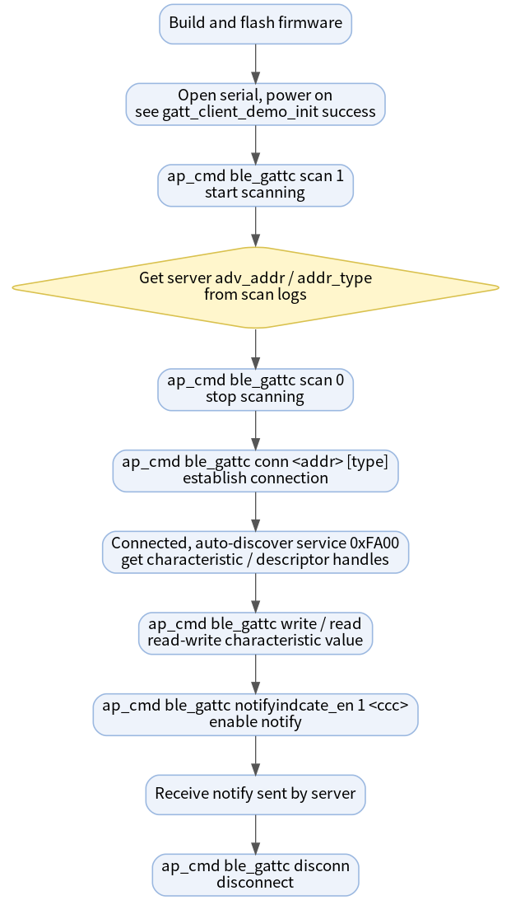
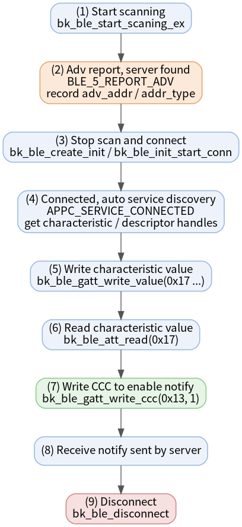

# Bluetooth LE GATT Client Example

* [中文](./README_CN.md)

In one sentence: this project turns a **BK7259 development board into a Bluetooth LE central (GATT Client)** — it scans for peripherals, connects, discovers their GATT database, then reads / writes characteristics and subscribes to notifications, all driven from the UART CLI.

It is the natural companion of the [gatt_server](../gatt_server) example: flash one board with the server and another with this client, and you have a complete two-board BLE read / write / notify demo.

## Supported Targets

| Target | Status | BLE role | Host / Controller split |
| --- | --- | --- | --- |
| BK7259 | Supported | Central (GATT Client) | Host on AP, Controller on CP |

## 1. Overview

After boot the demo creates a passive scan activity and registers the `ble_gattc` CLI. From the serial terminal you can:

- Start / stop scanning and switch the scan filter policy (all devices vs. white-list only).
- Connect to an advertising peripheral by address.
- Run automatic GATT service discovery on connect, and additionally trigger manual service / characteristic / descriptor discovery.
- Perform ATT read, read-by-UUID, write, write-command, and enable notifications via the CCC descriptor.
- Manage bonding and the controller white list.

On BK7259 the BLE host runs on the AP core and the BLE controller runs on the CP core; the two communicate over IPC. This is why all Bluetooth CLI commands are sent through the `ap_cmd` prefix.



Source code: `projects/bluetooth/gatt_client/ap/gatt_client_demo.c`

## 2. Quick Start

> Assumes you already have a working BK7259 build and flash environment and a peripheral to connect to (the [gatt_server](../gatt_server) board is the simplest choice).

1. **Build the firmware**

   ```bash
   make bk7259 PROJECT=bluetooth/gatt_client
   ```

2. **Flash** `build/bk7259/gatt_client/package/all-app.bin` to the board.

3. **Open a serial terminal** and power on. Wait for:

   ```text
   gatt_client_demo_init success
   ```

4. **Scan, then connect** to the peripheral:

   ```bash
   ap_cmd ble_gattc scan 1
   # read the server adv_addr / addr_type from the scan log, then:
   ap_cmd ble_gattc scan 0
   ap_cmd ble_gattc conn <adv_addr> [addr_type]
   ```

5. **Read / write / subscribe** using the handles printed by the auto discovery log:

   ```bash
   ap_cmd ble_gattc write 17 ssid_ab
   ap_cmd ble_gattc read 17
   ap_cmd ble_gattc notifyindcate_en 1 13
   ```

That is the full central round trip. Details, the command reference, and troubleshooting follow.

## 3. Requirements

| Item | Requirement |
| --- | --- |
| Target board | BK7259 development board |
| Peripheral device | A second board running [gatt_server](../gatt_server) (recommended for matching handles) |
| UART | UART0 for flashing, logs, and the CLI |
| Firmware output | `build/bk7259/gatt_client/package/all-app.bin` |

## 4. Directory Structure

```text
gatt_client/
├── README.md / README_CN.md         # This document (EN / CN)
├── picture/                         # Diagrams embedded in this document
├── .ci                              # CI build command
├── .it.csv                          # Integration test entries
├── ap/                              # AP core: BLE host + GATT client + CLI
│   ├── ap_main.c
│   ├── gatt_client_demo.c           # Scan / connect / discovery / read-write / CLI
│   ├── gatt_client_demo.h
│   └── config/bk7259_ap/defconfig
├── cp/                              # CP core: BLE controller bring-up
└── partitions/                      # Flash / RAM partition tables
```

## 5. Build and Flash

Build from the SDK root:

```bash
make bk7259 PROJECT=bluetooth/gatt_client
```

Docker build:

```bash
./dbuild.sh make bk7259 PROJECT=bluetooth/gatt_client
```

Flash the combined image with BKFIL:

```text
build/bk7259/gatt_client/package/all-app.bin
```

The client is ready when this log appears:

```text
gatt_client_demo_init success
```

## 6. Testing

The end-to-end flow with a peripheral board is shown below.



Using the [gatt_server](../gatt_server) board as the peripheral:

1. Flash `gatt_server` on board A (server) and this project on board B (client).
2. Board A: wait for `start adv success`.
3. Board B: `ap_cmd ble_gattc scan 1`. Find board A's `adv_addr` and `addr_type` in the scan log.
4. Board B: `ap_cmd ble_gattc scan 0`.
5. Board B: `ap_cmd ble_gattc conn <adv_addr> [addr_type]` (`addr_type`: `0` public, `1` random).
6. Board B: wait for the connect event and automatic discovery of service `0xFA00`; note the printed handles.
7. Board B: write and read N2, e.g. `ap_cmd ble_gattc write 17 ssid_ab` then `ap_cmd ble_gattc read 17`.
8. Board B: enable notify, e.g. `ap_cmd ble_gattc notifyindcate_en 1 13`.
9. Board A: `ap_cmd ble_gatts notify` — board B prints the received notification.
10. Board B: `ap_cmd ble_gattc disconn` when done.

Typical handles with the matching server: notify value `0x12`, CCC descriptor `0x13`, N2 / N3 / N4 value handles `0x17` / `0x19` / `0x1B`.

## 7. CLI Reference

On BK7259 SMP, AP-side Bluetooth commands must use the `ap_cmd` prefix; without it the shell reports `cmd NOT found: ble_gattc`. A successful submission returns `BLE GATTC RSP:OK`; an error returns `BLE GATTC RSP:ERROR`. Handles and UUIDs are parsed as hexadecimal — do **not** add a `0x` prefix.

**Scan and connection**

| Command | Description |
| --- | --- |
| `ap_cmd ble_gattc help` | Print all supported commands. |
| `ap_cmd ble_gattc scan 1` / `scan 0` | Start / stop scanning. |
| `ap_cmd ble_gattc scan_filter 0` / `1` | Recreate scan: `0` all devices, `1` white-list only. |
| `ap_cmd ble_gattc conn <addr> [addr_type]` | Connect to `xx:xx:xx:xx:xx:xx`; `addr_type`: `0` public, `1` random. |
| `ap_cmd ble_gattc disconn` | Disconnect the current connection. |

**GATT read / write / notify** (require an active connection)

| Command | Description |
| --- | --- |
| `ap_cmd ble_gattc read <value_handle>` | ATT read by value handle. |
| `ap_cmd ble_gattc write <value_handle> <data>` | ATT write of ASCII data. |
| `ap_cmd ble_gattc read_ext <handle> [offset]` | GATT read with a decimal offset. |
| `ap_cmd ble_gattc read_by_uuid [sh] [eh] [uuid16]` | Read by 16-bit UUID within a handle range. |
| `ap_cmd ble_gattc write_ext [handle] [len] [is_cmd]` | Write bytes `0..len-1`; `is_cmd=1` sends a write command. |
| `ap_cmd ble_gattc notifyindcate_en [0 or 1] [desc_handle]` | Write the CCC descriptor: `1` enable, `0` disable notify. |

**Discovery** (`uuid_len` supports `2` or `16`)

| Command | Description |
| --- | --- |
| `ap_cmd ble_gattc discover_service [sh] [eh] [uuid] [uuid_len]` | Discover primary services. |
| `ap_cmd ble_gattc discover_char [sh] [eh] [uuid] [uuid_len]` | Discover characteristics. |
| `ap_cmd ble_gattc discover_desc [sh] [eh]` | Discover descriptors. |

**Security and white list**

| Command | Description |
| --- | --- |
| `ap_cmd ble_gattc bond` | Start bonding on the current connection. |
| `ap_cmd ble_gattc add_whl <addr> [addr_type]` | Add a peer to the white list. |
| `ap_cmd ble_gattc rmv_whl <addr> [addr_type]` | Remove a peer from the white list. |
| `ap_cmd ble_gattc clear_whl` | Clear the white list. |

## 8. How It Works

The full client-side interaction sequence:



Key code map (`ap/gatt_client_demo.c`):

| Stage | Function / callback | Notes |
| --- | --- | --- |
| Init | `gatt_client_demo_init` | Registers CLI and callbacks, sets MTU `255`, creates passive scan |
| Scan | `bk_ble_start_scaning_ex` / `bk_ble_stop_scaning` | Adv reports arrive in `gattc_notice_cb` (`BLE_5_REPORT_ADV`) |
| Connect | `bk_ble_create_init` / `bk_ble_init_set_connect_dev_addr` / `bk_ble_init_start_conn` | Connection event sets `gatt_conn_ind` |
| Discovery | `gattc_sdp_comm_callback` | Prints service / characteristic / descriptor UUIDs and handles |
| Read / Write | `bk_ble_att_read` / `bk_ble_gatt_write_value` / `bk_ble_gattc_read` / `bk_ble_gattc_write` | Results arrive in `gattc_sdp_charac_callback` |
| Notify | `bk_ble_gatt_write_ccc` | Enables CCC; notifications arrive as `CHARAC_NOTIFY` |
| Security | `bk_ble_create_bond` / white-list APIs | No-MITM bonding and controller white list |

## 9. Example Output

Real client-side serial log for one full session (`BLE-GATT` is the demo log tag; the long scan list is trimmed to the server entry):

```text
# --- boot ---
ap1:BLE-GATT:I(596):gatt_client_demo_init success

# --- ap_cmd ble_gattc scan 1 : server BK_XXYYZZ found among many devices ---
BLE GATTC RSP:OK
ap1:BLE-GATT:I(4320):ADV_IND, addr_type:0, adv_addr:18:3e:12:8c:47:c8
# --- ap_cmd ble_gattc scan 0 ---
BLE GATTC RSP:OK

# --- ap_cmd ble_gattc conn c8:47:8c:12:3e:18 0 : connected ---
ap1:BLE-GATT:I(11300):BLE_5_INIT_CONNECT_EVENT:conn_idx:0, addr_type:0, peer_addr:18:3e:12:8c:47:c8

# --- automatic service discovery: standard GAP/GATT first, then custom 0xFA00 ---
ap1:BLE-GATT:I(11901):==>Get GATT Service UUID:0x1800, start_handle:0x01
ap1:BLE-GATT:I(12058):==>Get GATT Service UUID:0x1801, start_handle:0x08
ap1:BLE-GATT:I(12261):==>Get GATT Service UUID:0xFA00, start_handle:0x10
ap1:BLE-GATT:I(12261):==>Get GATT Characteristic UUID:0xEA01, cha_handle:0x11, val_handle:0x12, property:0x10
ap1:BLE-GATT:I(12261):==>Get GATT Characteristic UUID:0xEA02, cha_handle:0x14, val_handle:0x15, property:0x08
ap1:BLE-GATT:I(12261):==>Get GATT Characteristic UUID:0xEA05, cha_handle:0x16, val_handle:0x17, property:0x0a
ap1:BLE-GATT:I(12261):==>Get GATT Characteristic UUID:0xEA06, cha_handle:0x18, val_handle:0x19, property:0x0a
ap1:BLE-GATT:I(12261):==>Get GATT Characteristic UUID:0xEA07, cha_handle:0x1A, val_handle:0x1B, property:0x0a
ap1:BLE-GATT:I(12261):==>Get GATT Characteristic Description UUID:0x2902, desc_handle:0x13, char_index:0
ap1:BLE-GATT:I(12261):=============

# --- ap_cmd ble_gattc write 17 ssid_ab (write confirmation does not echo the handle) ---
BLE GATTC RSP:OK
ap1:BLE-GATT:I(14477):CHARAC_WRITE_DONE, handle:0x00, len:0

# --- ap_cmd ble_gattc read 17 : value read back (ASCII + hex of first 5 bytes) ---
ap1:BLE-GATT:I(17008):CHARAC_READ|CHARAC_READ_DONE, handle:0x17, len:7
ap1:BLE-GATT:I(17008):ssid_ab
ap1:BLE-GATT:I(17008):0x737369645f

# --- ap_cmd ble_gattc notifyindcate_en 1 13 : CCC written ---
BLE GATTC RSP:OK
ap1:BLE-GATT:I(22689):CHARAC_WRITE_DONE, handle:0x00, len:0

# --- server runs ap_cmd ble_gatts notify : notification received on 0x12 ---
ap1:BLE-GATT:I(27144):CHARAC_NOTIFY|CHARAC_INDICATE, handle:0x12, len:5
ap1:BLE-GATT:I(27144):0x0000000000

# --- ap_cmd ble_gattc disconn (reason 0x16 = local host terminated connection) ---
ap1:BLE-GATT:I(31071):BLE_5_INIT_DISCONNECT_EVENT:conn_idx:0,reason:22
```

## 10. Integration Test

`.it.csv` covers stable single-board smoke tests only:

```text
reboot
ap_cmd ble_gattc help
ap_cmd ble_gattc scan 1
ap_cmd ble_gattc scan 0
```

The full connect / read / write / notify flow needs a second board and a runtime peer address, so it is documented as the manual flow in [Testing](#6-testing).

## 11. Troubleshooting

| Symptom | Likely cause and fix |
| --- | --- |
| `cmd NOT found: ble_gattc` | Missing `ap_cmd` prefix. Bluetooth CLI runs on AP; always use `ap_cmd ble_gattc ...`. |
| Scan shows nothing | The peripheral is not advertising. On the server board run `ap_cmd ble_gatts adv_en 1`. |
| `conn` returns `ERROR` | Wrong address / `addr_type`, or out of connection resources. Use the exact `adv_addr` from the scan log. |
| `read` / `write` / `notifyindcate_en` returns `ERROR` | No active connection, or a handle from a previous firmware version. Reconnect and use the current discovery handles. |
| Notifications never arrive | `notifyindcate_en` must target the CCC descriptor handle (e.g. `0x13`), not the characteristic value handle. |

## 12. Notes and References

- `notifyindcate_en` is the exact CLI spelling in the source code; it writes the CCC descriptor handle, not the value handle.
- On a successful write, the confirmation prints `CHARAC_WRITE_DONE, handle:0x00, len:0` — the value handle is not echoed. Use a follow-up `read` to verify the value actually landed.
- Handles change across firmware versions; never hard-code them — always use the current discovery log.
- Companion example: [gatt_server](../gatt_server)
- Bluetooth LE GATT / ATT concepts: Bluetooth Core Specification, Generic Attribute Profile
- Demo source: `ap/gatt_client_demo.c`
