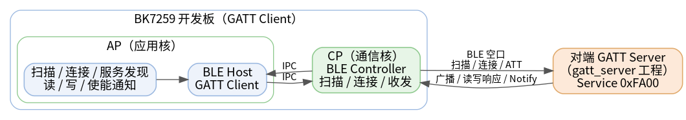
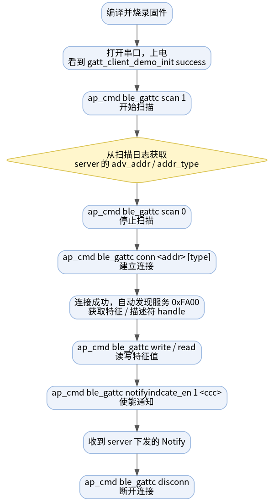
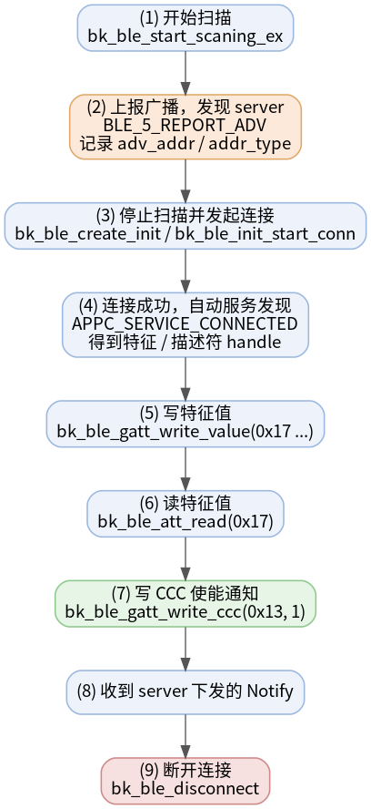

# 蓝牙 LE GATT Client 示例工程

* [English](./README.md)

一句话：**把 BK7259 开发板变成一个蓝牙 LE 中心设备（GATT Client）**——扫描从设备、发起连接、发现对端 GATT 数据库，然后读 / 写特征、订阅通知，全部通过串口 CLI 操作。

它是 [gatt_server](../gatt_server) 示例的天然搭档：一块板烧 server，另一块板烧本工程做 client，就能跑通完整的双板 BLE 读 / 写 / 通知 demo。

## 支持的芯片

| 芯片 | 状态 | BLE 角色 | Host / Controller 划分 |
| --- | --- | --- | --- |
| BK7259 | 支持 | 中心设备（GATT Client） | Host 在 AP，Controller 在 CP |

## 1. 工程概述

上电后，demo 会创建一个被动扫描活动并注册 `ble_gattc` CLI。在串口终端你可以：

- 开始 / 停止扫描，并切换扫描过滤策略（全部设备 vs 仅白名单）；
- 按地址连接一个正在广播的从设备；
- 连接后自动进行 GATT 服务发现，也可手动触发服务 / 特征 / 描述符发现；
- 执行 ATT 读、按 UUID 读、写、写命令，并通过 CCC 描述符使能通知；
- 管理 bond 配对与 controller 白名单。

在 BK7259 上，BLE host 跑在 AP 核、BLE controller 跑在 CP 核，两者通过 IPC 通信。这也是所有蓝牙 CLI 命令都要加 `ap_cmd` 前缀的原因。



源码：`projects/bluetooth/gatt_client/ap/gatt_client_demo.c`

## 2. 快速上手

> 假设你已搭好 BK7259 的编译与烧录环境，并有一个可连接的从设备（最简单的就是 [gatt_server](../gatt_server) 板）。

1. **编译固件**

   ```bash
   make bk7259 PROJECT=bluetooth/gatt_client
   ```

2. **烧录** `build/bk7259/gatt_client/package/all-app.bin` 到开发板。

3. **打开串口终端**并上电。等待出现：

   ```text
   gatt_client_demo_init success
   ```

4. **扫描并连接**从设备：

   ```bash
   ap_cmd ble_gattc scan 1
   # 从扫描日志读到 server 的 adv_addr / addr_type，然后：
   ap_cmd ble_gattc scan 0
   ap_cmd ble_gattc conn <adv_addr> [addr_type]
   ```

5. **读 / 写 / 订阅**，handle 用自动发现日志里打印的值：

   ```bash
   ap_cmd ble_gattc write 17 ssid_ab
   ap_cmd ble_gattc read 17
   ap_cmd ble_gattc notifyindcate_en 1 13
   ```

这就是中心设备的完整闭环。下面是命令详解和排查方法。

## 3. 测试环境

| 项目 | 要求 |
| --- | --- |
| 目标板 | BK7259 开发板 |
| 从设备 | 第二块烧录 [gatt_server](../gatt_server) 的开发板（推荐，handle 可对应） |
| 串口 | UART0 用于烧录、日志与 CLI |
| 固件产物 | `build/bk7259/gatt_client/package/all-app.bin` |

## 4. 目录结构

```text
gatt_client/
├── README.md / README_CN.md         # 本文档（中英）
├── picture/                         # 本文档内嵌的图片
├── .ci                              # CI 编译命令
├── .it.csv                          # 集成测试条目
├── ap/                              # AP 核：BLE host + GATT client + CLI
│   ├── ap_main.c
│   ├── gatt_client_demo.c           # 扫描 / 连接 / 发现 / 读写 / CLI
│   ├── gatt_client_demo.h
│   └── config/bk7259_ap/defconfig
├── cp/                              # CP 核：BLE controller 拉起
└── partitions/                      # Flash / RAM 分区表
```

## 5. 编译与烧录

在 SDK 根目录编译：

```bash
make bk7259 PROJECT=bluetooth/gatt_client
```

Docker 编译：

```bash
./dbuild.sh make bk7259 PROJECT=bluetooth/gatt_client
```

用 BKFIL 烧录合并镜像：

```text
build/bk7259/gatt_client/package/all-app.bin
```

出现以下日志即就绪：

```text
gatt_client_demo_init success
```

## 6. 测试流程

双板端到端流程如下图：



以 [gatt_server](../gatt_server) 板作为从设备：

1. A 板烧 `gatt_server`（server），B 板烧本工程（client）。
2. A 板：等待 `start adv success`。
3. B 板：`ap_cmd ble_gattc scan 1`，在扫描日志里找到 A 板的 `adv_addr` 和 `addr_type`。
4. B 板：`ap_cmd ble_gattc scan 0`。
5. B 板：`ap_cmd ble_gattc conn <adv_addr> [addr_type]`（`addr_type`：`0` 公有，`1` 随机）。
6. B 板：等待连接事件和服务 `0xFA00` 的自动发现，记下打印出的各 handle。
7. B 板：写 / 读 N2，例如 `ap_cmd ble_gattc write 17 ssid_ab` 再 `ap_cmd ble_gattc read 17`。
8. B 板：使能通知，例如 `ap_cmd ble_gattc notifyindcate_en 1 13`。
9. A 板：`ap_cmd ble_gatts notify`——B 板会打印收到的通知。
10. B 板：用完 `ap_cmd ble_gattc disconn`。

与配套 server 的典型 handle：通知值 `0x12`、CCC 描述符 `0x13`、N2 / N3 / N4 值 handle `0x17` / `0x19` / `0x1B`。

## 7. CLI 命令详解

BK7259 SMP 上，AP 侧蓝牙命令必须加 `ap_cmd` 前缀；不加会报 `cmd NOT found: ble_gattc`。提交成功返回 `BLE GATTC RSP:OK`，失败返回 `BLE GATTC RSP:ERROR`。handle 和 UUID 按十六进制解析——**不要**加 `0x` 前缀。

**扫描与连接**

| 命令 | 说明 |
| --- | --- |
| `ap_cmd ble_gattc help` | 打印所有支持的命令。 |
| `ap_cmd ble_gattc scan 1` / `scan 0` | 开始 / 停止扫描。 |
| `ap_cmd ble_gattc scan_filter 0` / `1` | 重建扫描：`0` 全部设备，`1` 仅白名单。 |
| `ap_cmd ble_gattc conn <addr> [addr_type]` | 连接 `xx:xx:xx:xx:xx:xx`；`addr_type`：`0` 公有，`1` 随机。 |
| `ap_cmd ble_gattc disconn` | 断开当前连接。 |

**GATT 读 / 写 / 通知**（需已连接）

| 命令 | 说明 |
| --- | --- |
| `ap_cmd ble_gattc read <value_handle>` | 按值 handle 进行 ATT 读。 |
| `ap_cmd ble_gattc write <value_handle> <data>` | 写入 ASCII 数据。 |
| `ap_cmd ble_gattc read_ext <handle> [offset]` | 带十进制偏移的 GATT 读。 |
| `ap_cmd ble_gattc read_by_uuid [sh] [eh] [uuid16]` | 在 handle 范围内按 16 位 UUID 读。 |
| `ap_cmd ble_gattc write_ext [handle] [len] [is_cmd]` | 写入字节 `0..len-1`；`is_cmd=1` 发送写命令。 |
| `ap_cmd ble_gattc notifyindcate_en <0|1> <desc_handle>` | 写 CCC 描述符：`1` 使能、`0` 关闭通知。 |

**服务发现**（`uuid_len` 支持 `2` 或 `16`）

| 命令 | 说明 |
| --- | --- |
| `ap_cmd ble_gattc discover_service [sh] [eh] [uuid] [uuid_len]` | 发现主服务。 |
| `ap_cmd ble_gattc discover_char [sh] [eh] [uuid] [uuid_len]` | 发现特征。 |
| `ap_cmd ble_gattc discover_desc [sh] [eh]` | 发现描述符。 |

**安全与白名单**

| 命令 | 说明 |
| --- | --- |
| `ap_cmd ble_gattc bond` | 对当前连接发起 bond 配对。 |
| `ap_cmd ble_gattc add_whl <addr> [addr_type]` | 把对端加入白名单。 |
| `ap_cmd ble_gattc rmv_whl <addr> [addr_type]` | 把对端从白名单移除。 |
| `ap_cmd ble_gattc clear_whl` | 清空白名单。 |

## 8. 工作原理

完整的 client 侧交互时序：



关键代码索引（`ap/gatt_client_demo.c`）：

| 阶段 | 函数 / 回调 | 说明 |
| --- | --- | --- |
| 初始化 | `gatt_client_demo_init` | 注册 CLI 与回调，设置 MTU `255`，创建被动扫描 |
| 扫描 | `bk_ble_start_scaning_ex` / `bk_ble_stop_scaning` | 广播上报进入 `gattc_notice_cb`（`BLE_5_REPORT_ADV`） |
| 连接 | `bk_ble_create_init` / `bk_ble_init_set_connect_dev_addr` / `bk_ble_init_start_conn` | 连接事件里设置 `gatt_conn_ind` |
| 服务发现 | `gattc_sdp_comm_callback` | 打印服务 / 特征 / 描述符的 UUID 和 handle |
| 读 / 写 | `bk_ble_att_read` / `bk_ble_gatt_write_value` / `bk_ble_gattc_read` / `bk_ble_gattc_write` | 结果进入 `gattc_sdp_charac_callback` |
| 通知 | `bk_ble_gatt_write_ccc` | 使能 CCC；通知以 `CHARAC_NOTIFY` 形式上报 |
| 安全 | `bk_ble_create_bond` / 白名单 API | 无 MITM bond 与 controller 白名单 |

## 9. 示例日志

一次完整会话的 client 侧真实串口日志（`BLE-GATT` 是 demo 的日志 TAG；冗长的扫描列表已裁剪到只保留 server 那一条）：

```text
# --- 上电 ---
ap1:BLE-GATT:I(596):gatt_client_demo_init success

# --- ap_cmd ble_gattc scan 1：在一堆设备中发现 server BK_XXYYZZ ---
BLE GATTC RSP:OK
ap1:BLE-GATT:I(4320):ADV_IND, addr_type:0, adv_addr:18:3e:12:8c:47:c8
# --- ap_cmd ble_gattc scan 0 ---
BLE GATTC RSP:OK

# --- ap_cmd ble_gattc conn c8:47:8c:12:3e:18 0：连接成功 ---
ap1:BLE-GATT:I(11300):BLE_5_INIT_CONNECT_EVENT:conn_idx:0, addr_type:0, peer_addr:18:3e:12:8c:47:c8

# --- 自动服务发现：先标准 GAP/GATT，再自定义服务 0xFA00 ---
ap1:BLE-GATT:I(11901):==>Get GATT Service UUID:0x1800, start_handle:0x01
ap1:BLE-GATT:I(12058):==>Get GATT Service UUID:0x1801, start_handle:0x08
ap1:BLE-GATT:I(12261):==>Get GATT Service UUID:0xFA00, start_handle:0x10
ap1:BLE-GATT:I(12261):==>Get GATT Characteristic UUID:0xEA01, cha_handle:0x11, val_handle:0x12, property:0x10
ap1:BLE-GATT:I(12261):==>Get GATT Characteristic UUID:0xEA02, cha_handle:0x14, val_handle:0x15, property:0x08
ap1:BLE-GATT:I(12261):==>Get GATT Characteristic UUID:0xEA05, cha_handle:0x16, val_handle:0x17, property:0x0a
ap1:BLE-GATT:I(12261):==>Get GATT Characteristic UUID:0xEA06, cha_handle:0x18, val_handle:0x19, property:0x0a
ap1:BLE-GATT:I(12261):==>Get GATT Characteristic UUID:0xEA07, cha_handle:0x1A, val_handle:0x1B, property:0x0a
ap1:BLE-GATT:I(12261):==>Get GATT Characteristic Description UUID:0x2902, desc_handle:0x13, char_index:0
ap1:BLE-GATT:I(12261):=============

# --- ap_cmd ble_gattc write 17 ssid_ab（写确认不回显 handle）---
BLE GATTC RSP:OK
ap1:BLE-GATT:I(14477):CHARAC_WRITE_DONE, handle:0x00, len:0

# --- ap_cmd ble_gattc read 17：读回数值（ASCII + 前 5 字节十六进制）---
ap1:BLE-GATT:I(17008):CHARAC_READ|CHARAC_READ_DONE, handle:0x17, len:7
ap1:BLE-GATT:I(17008):ssid_ab
ap1:BLE-GATT:I(17008):0x737369645f

# --- ap_cmd ble_gattc notifyindcate_en 1 13：写 CCC ---
BLE GATTC RSP:OK
ap1:BLE-GATT:I(22689):CHARAC_WRITE_DONE, handle:0x00, len:0

# --- server 执行 ap_cmd ble_gatts notify：在 0x12 上收到通知 ---
ap1:BLE-GATT:I(27144):CHARAC_NOTIFY|CHARAC_INDICATE, handle:0x12, len:5
ap1:BLE-GATT:I(27144):0x0000000000

# --- ap_cmd ble_gattc disconn（reason 0x16 = 本端主动断开）---
ap1:BLE-GATT:I(31071):BLE_5_INIT_DISCONNECT_EVENT:conn_idx:0,reason:22
```

## 10. 集成测试

`.it.csv` 仅覆盖稳定的单板冒烟测试：

```text
reboot
ap_cmd ble_gattc help
ap_cmd ble_gattc scan 1
ap_cmd ble_gattc scan 0
```

完整的连接 / 读 / 写 / 通知流程需要第二块板和运行时获取的对端地址，因此作为手动流程记录在 [测试流程](#6-测试流程)。

## 11. 常见问题排查

| 现象 | 可能原因与处理 |
| --- | --- |
| `cmd NOT found: ble_gattc` | 漏了 `ap_cmd` 前缀。蓝牙 CLI 在 AP 侧，必须用 `ap_cmd ble_gattc ...`。 |
| 扫描没有任何输出 | 从设备没有在广播。在 server 板执行 `ap_cmd ble_gatts adv_en 1`。 |
| `conn` 返回 `ERROR` | 地址 / `addr_type` 不对，或连接资源不足。请用扫描日志里准确的 `adv_addr`。 |
| `read` / `write` / `notifyindcate_en` 返回 `ERROR` | 没有活动连接，或用了旧固件的 handle。重连并使用当前发现的 handle。 |
| 收不到通知 | `notifyindcate_en` 要指向 CCC 描述符 handle（如 `0x13`），不是特征值 handle。 |

## 12. 注意事项与参考

- `notifyindcate_en` 是源码里的确切 CLI 拼写；它写的是 CCC 描述符 handle，不是值 handle。
- 写成功时确认日志打印的是 `CHARAC_WRITE_DONE, handle:0x00, len:0`——不会回显值 handle。可再用一次 `read` 确认数据确实写入。
- handle 会随固件版本变化，切勿硬编码——始终以当前服务发现日志为准。
- 配套示例：[gatt_server](../gatt_server)
- 蓝牙 LE GATT / ATT 概念：Bluetooth Core Specification，Generic Attribute Profile
- demo 源码：`ap/gatt_client_demo.c`
