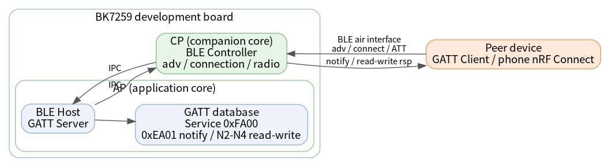
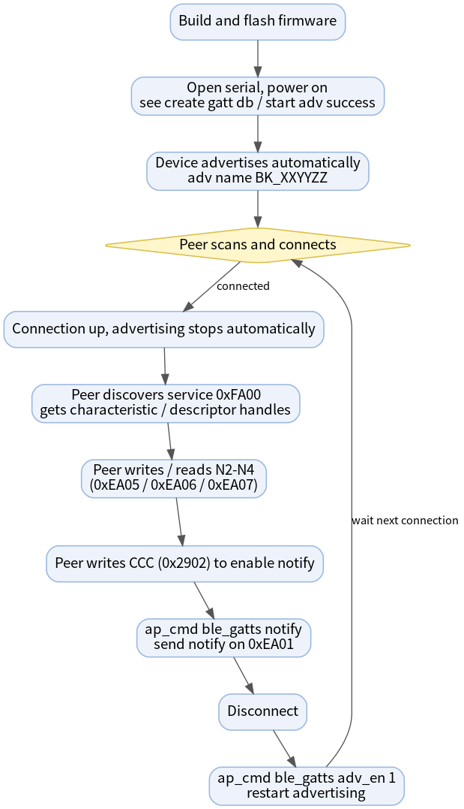
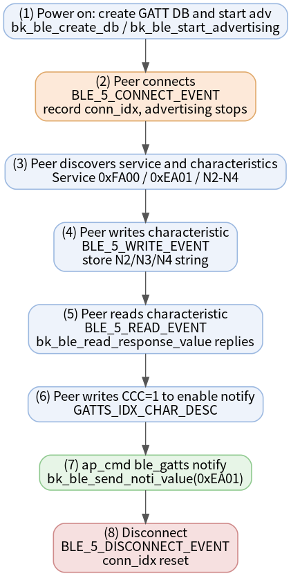

# Bluetooth LE GATT Server Example

* [中文](./README_CN.md)

In one sentence: this project turns a **BK7259 development board into a Bluetooth LE peripheral (GATT Server)** — it advertises, accepts a connection from a central, exposes a custom GATT database, answers read/write requests, and pushes notifications, all driven from the UART CLI.

It is the natural companion of the [gatt_client](../gatt_client) example: flash one board with this server and another with the client, and you have a complete two-board BLE read / write / notify demo.

## Supported Targets

| Target | Status | BLE role | Host / Controller split |
| --- | --- | --- | --- |
| BK7259 | Supported | Peripheral (GATT Server) | Host on AP, Controller on CP |

## 1. Overview

After boot the demo builds a GATT database, configures legacy connectable advertising, and starts advertising automatically. A central (the `gatt_client` board or a phone tool such as nRF Connect) can then:

- Discover the device by its advertising name `BK_XXYYZZ` and Service Data UUID `0xFE01`.
- Connect and discover the primary service `0xFA00` and its characteristics.
- Write and read the data characteristics N2 / N3 / N4 (`0xEA05` / `0xEA06` / `0xEA07`).
- Enable the CCC descriptor `0x2902` and receive notifications on `0xEA01`, pushed by the CLI command `ap_cmd ble_gatts notify`.
- Optionally bond (pairing without MITM).

On BK7259 the BLE host runs on the AP core and the BLE controller runs on the CP core; the two communicate over IPC. This is why all Bluetooth CLI commands are sent through the `ap_cmd` prefix.



Source code: `projects/bluetooth/gatt_server/ap/gatt_server_demo.c`

## 2. Quick Start

> Assumes you already have a working BK7259 build and flash environment and a second board (or phone) acting as the central.

1. **Build the firmware**

   ```bash
   make bk7259 PROJECT=bluetooth/gatt_server
   ```

2. **Flash** `build/bk7259/gatt_server/package/all-app.bin` to the board.

3. **Open a serial terminal** and power on. The device starts advertising automatically; wait for:

   ```text
   start adv success
   gatt_server_demo_init success
   ```

4. **Connect from the central.** From the `gatt_client` board, scan and connect; or from nRF Connect on a phone, find `BK_XXYYZZ` and tap CONNECT. Advertising stops automatically once connected.

5. **Push a notification** (after the client enables the CCC descriptor):

   ```bash
   ap_cmd ble_gatts notify
   ```

That is the full peripheral round trip. Details, the attribute table, and troubleshooting follow.

## 3. Requirements

| Item | Requirement |
| --- | --- |
| Target board | BK7259 development board |
| Central device | A second board running [gatt_client](../gatt_client), or a phone BLE tool such as nRF Connect / LightBlue |
| UART | UART0 for flashing, logs, and the CLI |
| Firmware output | `build/bk7259/gatt_server/package/all-app.bin` |

## 4. GATT Database

The advertising payload and the connected GATT database use different UUIDs. Do not confuse the advertising Service Data UUID with the GATT service UUID.

**Advertising payload**

| Field | Value | Description |
| --- | --- | --- |
| Flags | `0x06` | LE General Discoverable, BR/EDR not supported |
| Local Name | `BK_XXYYZZ` | `XXYYZZ` = first 3 bytes of the BLE MAC |
| Service Data UUID | `0xFE01` | Visible in scan results |
| Manufacturer Company ID | `0x05F0` | Beken manufacturer data |

**GATT attribute table (primary service `0xFA00`)**

| Index | UUID | Type | Properties | Description |
| --- | --- | --- | --- | --- |
| 0 | `0xFA00` | Primary Service | Read | Service declaration |
| 2 | `0xEA01` | Characteristic | Notify | Notification source characteristic |
| 3 | `0x2902` | Descriptor (CCC) | Read / Write | Client Characteristic Configuration for `0xEA01` |
| 5 | `0xEA02` | Characteristic | Write | Write-only placeholder (N1) |
| 7 | `0xEA05` | Characteristic | Read / Write | N2 string buffer |
| 9 | `0xEA06` | Characteristic | Read / Write | N3 string buffer |
| 11 | `0xEA07` | Characteristic | Read / Write | N4 string buffer |

Notes on behavior:

- N2 / N3 / N4 store the latest string written by the client; reading before any write returns zero-length data.
- Maximum attribute length is `128` bytes (`BLE_5_ATT_INFO_REQ` reports `128`).
- The `Index` column is the attribute index inside the database; the runtime ATT handles (for example `0x12`, `0x13`, `0x17`) are assigned by the stack and printed in the client discovery log. Always use the handles from the current log.

## 5. Directory Structure

```text
gatt_server/
├── README.md / README_CN.md         # This document (EN / CN)
├── picture/                         # Diagrams embedded in this document
├── .ci                              # CI build command
├── .it.csv                          # Integration test entries
├── ap/                              # AP core: BLE host + GATT server + CLI
│   ├── ap_main.c
│   ├── gatt_server_demo.c           # GATT DB, advertising, callbacks, CLI
│   ├── gatt_server_demo.h
│   └── config/bk7259_ap/defconfig
├── cp/                              # CP core: BLE controller bring-up
└── partitions/                      # Flash / RAM partition tables
```

## 6. Build and Flash

Build from the SDK root:

```bash
make bk7259 PROJECT=bluetooth/gatt_server
```

Docker build:

```bash
./dbuild.sh make bk7259 PROJECT=bluetooth/gatt_server
```

Flash the combined image with BKFIL:

```text
build/bk7259/gatt_server/package/all-app.bin
```

A healthy boot prints:

```text
create gatt db success
set adv paramters success
set adv data success
start adv success
gatt_server_demo_init success
```

## 7. Testing

The end-to-end flow with a second board is shown below.



Using the [gatt_client](../gatt_client) board as the central:

1. Flash this project on board A (server) and `gatt_client` on board B (client).
2. Board A: wait for `start adv success` and `gatt_server_demo_init success`.
3. Board B: `ap_cmd ble_gattc scan 1`, read board A's `adv_addr` / `addr_type` from the scan log, then `ap_cmd ble_gattc scan 0`.
4. Board B: `ap_cmd ble_gattc conn <adv_addr> [addr_type]`. Board A advertising stops automatically.
5. Board B: after auto service discovery, note the handles of service `0xFA00`.
6. Board B: write and read N2, e.g. `ap_cmd ble_gattc write 17 ssid_ab` then `ap_cmd ble_gattc read 17`.
7. Board B: enable notify, e.g. `ap_cmd ble_gattc notifyindcate_en 1 13`.
8. Board A: `ap_cmd ble_gatts notify` — board B prints the received notification.
9. Board B: `ap_cmd ble_gattc disconn`.
10. Board A: `ap_cmd ble_gatts adv_en 1` before the next connection.

Typical handles with the matching client: CCC `0x13`, notify value `0x12`, N2 / N3 / N4 = `0x17` / `0x19` / `0x1B`.

## 8. CLI Reference

On BK7259 SMP, AP-side Bluetooth commands must use the `ap_cmd` prefix. A successful submission returns `BLE GATTS RSP:OK`; an error returns `BLE GATTS RSP:ERROR`.

| Command | Description |
| --- | --- |
| `ap_cmd ble_gatts help` | Print all supported commands. |
| `ap_cmd ble_gatts adv_en 1` | Start advertising (use after a disconnect, before reconnecting). |
| `ap_cmd ble_gatts adv_en 0` | Stop advertising. |
| `ap_cmd ble_gatts notify` | Send a notification on `0xEA01`; requires an active connection and CCC enabled by the client. |
| `ap_cmd ble_gatts bond` | Start bonding on the current connection. |

`adv_en 1` expects an advertising activity in the created/stopped state; `adv_en 0` expects advertising already started. After a central connects, advertising stops automatically and this demo does **not** restart it on disconnect — run `adv_en 1` or reboot before the next connection.

## 9. How It Works

The full server-side interaction sequence:



Key code map (`ap/gatt_server_demo.c`):

| Stage | Function / event | Notes |
| --- | --- | --- |
| Init | `gatt_server_demo_init` | Registers CLI, creates the GATT DB, configures and starts advertising |
| Create DB | `bk_ble_create_db` | Service `0xFA00`, profile task id `10` |
| Advertising | `bk_ble_create_advertising` / `bk_ble_set_adv_data` / `bk_ble_start_advertising` | Legacy connectable + scannable, interval `120`–`160`, LE 1M PHY, public address |
| Write | `BLE_5_WRITE_EVENT` → `ble_gatts_notice_cb` | Stores the string written to N2 / N3 / N4 |
| Read | `BLE_5_READ_EVENT` → `bk_ble_read_response_value` | Returns the latest stored value |
| Notify | `ap_cmd ble_gatts notify` → `bk_ble_send_noti_value` | Sends a 5-byte payload on `0xEA01` |
| Pairing | `BLE_5_PAIRING_REQ` → `bk_ble_sec_send_auth_mode` | No-MITM bonding; on encryption failure the peer is disconnected |

## 10. Example Output

Real server-side serial log for one full session (`BLE-GATT` is the demo log tag; the peer address depends on your boards):

```text
# --- boot: GATT DB created, advertising started ---
ap1:BLE-GATT:I(590):cd_ind:prf_id:10, status:0
ap1:BLE-GATT:I(590):create gatt db success
ap1:BLE-GATT:I(590):gatt_server_demo_init, dev_name:BK_183E12, ret:9
ap1:BLE-GATT:I(590):adv data length :22
ap1:BLE-GATT:I(596):set adv paramters success
ap1:BLE-GATT:I(602):set adv data success
ap1:BLE-GATT:I(609):start adv success
ap1:BLE-GATT:I(609):gatt_server_demo_init success

# --- central connects, advertising stops automatically, MTU negotiated ---
ap1:BLE-GATT:I(23149):c_ind:conn_idx:0, addr_type:0, peer_addr:15:3e:12:8c:47:c8
ap1:BLE-GATT:I(24120):ble_gatts_notice_cb m_ind:conn_idx:0, mtu_size:255

# --- client writes N2 (att_idx 7 = 0xEA05) ---
ap1:BLE-GATT:I(26303):write_cb:conn_idx:0, prf_id:10, att_idx:7, len:7, data[0]:0x73
ap1:BLE-GATT:I(26303):write N2: ssid_ab, length: 7

# --- client reads N2 back ---
ap1:BLE-GATT:I(28834):read_cb:conn_idx:0, prf_id:10, att_idx:7
ap1:BLE-GATT:I(28834):read N2: ssid_ab, length: 7

# --- client enables notify by writing the CCC descriptor (att_idx 3, value 01 00) ---
ap1:BLE-GATT:I(34527):write_cb:conn_idx:0, prf_id:10, att_idx:3, len:2, data[0]:0x01
ap1:BLE-GATT:I(34527):write notify: 01 00, length: 2

# --- ap_cmd ble_gatts notify ---
BLE GATTS RSP:OK

# --- disconnect (reason 0x13 = remote user terminated connection) ---
ap1:BLE-GATT:I(42920):d_ind:conn_idx:0,reason:19
```

## 11. Integration Test

`.it.csv` covers stable single-board smoke tests only:

```text
reboot
ap_cmd ble_gatts help
ap_cmd ble_gatts adv_en 0
ap_cmd ble_gatts adv_en 1
```

The full read / write / notify flow needs a second board and a runtime peer address, so it is documented as the manual flow in [Testing](#7-testing).

## 12. Troubleshooting

| Symptom | Likely cause and fix |
| --- | --- |
| `cmd NOT found: ble_gatts` | Missing `ap_cmd` prefix. Bluetooth CLI runs on AP; always use `ap_cmd ble_gatts ...`. |
| Central cannot find the device | Advertising stopped (already connected once). Run `ap_cmd ble_gatts adv_en 1` or reboot. |
| `notify` returns `ERROR` | No active connection, or the client has not enabled the CCC descriptor `0x2902`. |
| `adv_en` returns `ERROR` | No advertising activity in the expected state: use `adv_en 1` when stopped, `adv_en 0` when advertising. |
| Read returns empty data | N2 / N3 / N4 have not been written yet; write first, then read. |

## 13. References

- Companion example: [gatt_client](../gatt_client)
- Bluetooth LE GATT / ATT concepts: Bluetooth Core Specification, Generic Attribute Profile
- Demo source: `ap/gatt_server_demo.c`
