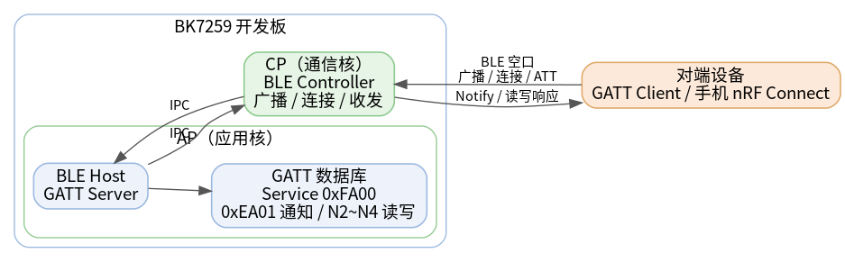
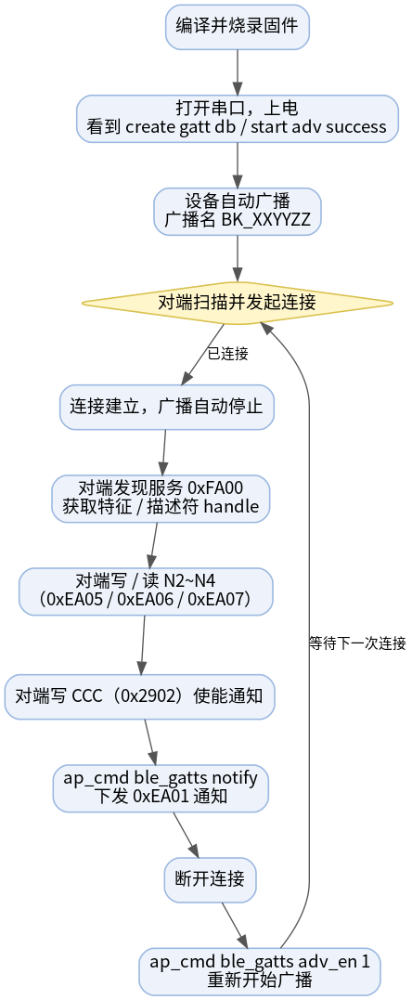
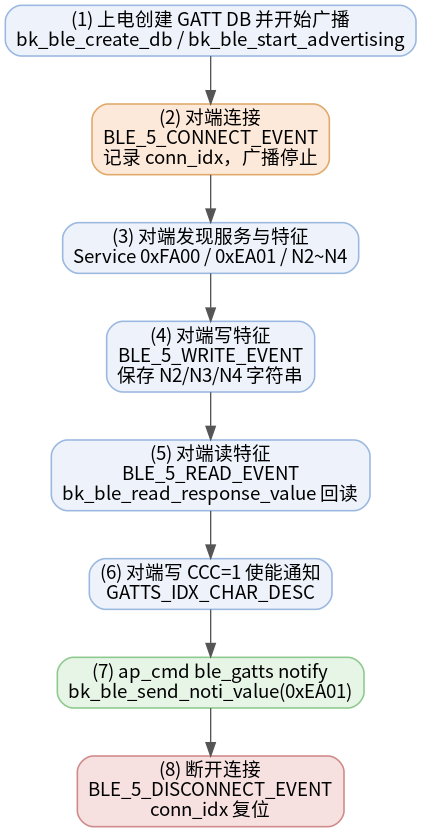

# 蓝牙 LE GATT Server 示例工程

* [English](./README.md)

一句话：**把 BK7259 开发板变成一个蓝牙 LE 从设备（GATT Server）**——上电自动广播、接受中心设备连接、对外提供一套自定义 GATT 数据库、响应读写请求、并能下发通知，全部通过串口 CLI 操作。

它是 [gatt_client](../gatt_client) 示例的天然搭档：一块板烧本工程做 server，另一块板烧 client，就能跑通完整的双板 BLE 读 / 写 / 通知 demo。

## 支持的芯片

| 芯片 | 状态 | BLE 角色 | Host / Controller 划分 |
| --- | --- | --- | --- |
| BK7259 | 支持 | 从设备（GATT Server） | Host 在 AP，Controller 在 CP |

## 1. 工程概述

上电后，demo 会创建 GATT 数据库、配置 legacy 可连接广播并自动开始广播。中心设备（`gatt_client` 板，或手机端 nRF Connect 等工具）随后可以：

- 通过广播名 `BK_XXYYZZ` 和 Service Data UUID `0xFE01` 发现本设备；
- 连接并发现主服务 `0xFA00` 及其特征；
- 读 / 写数据特征 N2 / N3 / N4（`0xEA05` / `0xEA06` / `0xEA07`）；
- 使能 CCC 描述符 `0x2902`，接收 `0xEA01` 上的通知（由命令 `ap_cmd ble_gatts notify` 触发）；
- 可选进行 bond 配对（无 MITM）。

在 BK7259 上，BLE host 跑在 AP 核、BLE controller 跑在 CP 核，两者通过 IPC 通信。这也是所有蓝牙 CLI 命令都要加 `ap_cmd` 前缀的原因。



源码：`projects/bluetooth/gatt_server/ap/gatt_server_demo.c`

## 2. 快速上手

> 假设你已搭好 BK7259 的编译与烧录环境，并有第二块板（或手机）作为中心设备。

1. **编译固件**

   ```bash
   make bk7259 PROJECT=bluetooth/gatt_server
   ```

2. **烧录：** `build/bk7259/gatt_server/package/all-app.bin` 到开发板。

3. **打开串口终端** 并上电。设备会自动开始广播，等待出现：

   ```text
   start adv success
   gatt_server_demo_init success
   ```

4. **从中心设备连接。** 用 `gatt_client` 板扫描并连接；或用手机 nRF Connect 找到 `BK_XXYYZZ` 点击连接。连接成功后广播会自动停止。

5. **下发一条通知**（需客户端先使能 CCC 描述符）：

   ```bash
   ap_cmd ble_gatts notify
   ```

这就是从设备的完整闭环。下面是属性表、详细命令和排查方法。

## 3. 测试环境

| 项目 | 要求 |
| --- | --- |
| 目标板 | BK7259 开发板 |
| 中心设备 | 第二块烧录 [gatt_client](../gatt_client) 的开发板，或手机 BLE 工具如 nRF Connect / LightBlue |
| 串口 | UART0 用于烧录、日志与 CLI |
| 固件产物 | `build/bk7259/gatt_server/package/all-app.bin` |

## 4. GATT 数据库

广播报文和连接后的 GATT 数据库使用 **不同** 的 UUID，注意不要把广播的 Service Data UUID 当成 GATT 服务 UUID。

**广播报文**

| 字段 | 取值 | 说明 |
| --- | --- | --- |
| Flags | `0x06` | LE General Discoverable，不支持 BR/EDR |
| Local Name | `BK_XXYYZZ` | `XXYYZZ` = BLE MAC 的前 3 字节 |
| Service Data UUID | `0xFE01` | 扫描结果中可见 |
| 厂商 Company ID | `0x05F0` | Beken 厂商数据 |

**GATT 属性表（主服务 `0xFA00`）**

| 索引 | UUID | 类型 | 权限 | 说明 |
| --- | --- | --- | --- | --- |
| 0 | `0xFA00` | 主服务 | 读 | 服务声明 |
| 2 | `0xEA01` | 特征 | 通知 | 通知源特征 |
| 3 | `0x2902` | 描述符（CCC） | 读 / 写 | `0xEA01` 的客户端配置描述符 |
| 5 | `0xEA02` | 特征 | 写 | 只写占位特征（N1） |
| 7 | `0xEA05` | 特征 | 读 / 写 | N2 字符串缓冲 |
| 9 | `0xEA06` | 特征 | 读 / 写 | N3 字符串缓冲 |
| 11 | `0xEA07` | 特征 | 读 / 写 | N4 字符串缓冲 |

行为说明：

- N2 / N3 / N4 保存客户端最近一次写入的字符串；写之前读会返回零长度数据；
- 属性最大长度为 `128` 字节（`BLE_5_ATT_INFO_REQ` 上报 `128`）；
- “索引”列是属性在数据库中的下标；运行时的 ATT handle（如 `0x12`、`0x13`、`0x17`）由协议栈分配，会打印在客户端的服务发现日志里——请以当前日志为准。

## 5. 目录结构

```text
gatt_server/
├── README.md / README_CN.md         # 本文档（中英）
├── picture/                         # 本文档内嵌的图片
├── .ci                              # CI 编译命令
├── .it.csv                          # 集成测试条目
├── ap/                              # AP 核：BLE host + GATT server + CLI
│   ├── ap_main.c
│   ├── gatt_server_demo.c           # GATT 数据库、广播、回调、CLI
│   ├── gatt_server_demo.h
│   └── config/bk7259_ap/defconfig
├── cp/                              # CP 核：BLE controller 拉起
└── partitions/                      # Flash / RAM 分区表
```

## 6. 编译与烧录

在 SDK 根目录编译：

```bash
make bk7259 PROJECT=bluetooth/gatt_server
```

Docker 编译：

```bash
./dbuild.sh make bk7259 PROJECT=bluetooth/gatt_server
```

用 BKFIL 烧录合并镜像：

```text
build/bk7259/gatt_server/package/all-app.bin
```

正常上电会打印：

```text
create gatt db success
set adv paramters success
set adv data success
start adv success
gatt_server_demo_init success
```

## 7. 测试流程

双板端到端流程如下图：



以 [gatt_client](../gatt_client) 板作为中心设备：

1. A 板烧本工程（server），B 板烧 `gatt_client`（client）。
2. A 板：等待 `start adv success` 和 `gatt_server_demo_init success`。
3. B 板：`ap_cmd ble_gattc scan 1`，从扫描日志读到 A 板的 `adv_addr` / `addr_type`，再 `ap_cmd ble_gattc scan 0`。
4. B 板：`ap_cmd ble_gattc conn <adv_addr> [addr_type]`，A 板广播自动停止。
5. B 板：自动服务发现后，记下服务 `0xFA00` 的各 handle。
6. B 板：写 / 读 N2，例如 `ap_cmd ble_gattc write 17 ssid_ab` 再 `ap_cmd ble_gattc read 17`。
7. B 板：使能通知，例如 `ap_cmd ble_gattc notifyindcate_en 1 13`。
8. A 板：`ap_cmd ble_gatts notify`——B 板会打印收到的通知。
9. B 板：`ap_cmd ble_gattc disconn`。
10. A 板：下次连接前先 `ap_cmd ble_gatts adv_en 1`。

与配套客户端的典型 handle：CCC `0x13`、通知值 `0x12`、N2 / N3 / N4 = `0x17` / `0x19` / `0x1B`。

## 8. CLI 命令详解

BK7259 SMP 上，AP 侧蓝牙命令必须加 `ap_cmd` 前缀。提交成功返回 `BLE GATTS RSP:OK`，失败返回 `BLE GATTS RSP:ERROR`。

| 命令 | 说明 |
| --- | --- |
| `ap_cmd ble_gatts help` | 打印所有支持的命令。 |
| `ap_cmd ble_gatts adv_en 1` | 开始广播（断开后、重连前使用）。 |
| `ap_cmd ble_gatts adv_en 0` | 停止广播。 |
| `ap_cmd ble_gatts notify` | 在 `0xEA01` 上发送通知；需已连接且客户端已使能 CCC。 |
| `ap_cmd ble_gatts bond` | 对当前连接发起 bond 配对。 |

`adv_en 1` 需要广播活动处于已创建/已停止状态；`adv_en 0` 需要广播已开始。中心设备连接后广播会自动停止，且本 demo **不会**在断开后自动重新广播——下次连接前请先 `adv_en 1` 或重启。

## 9. 工作原理

完整的 server 侧交互时序：



关键代码索引（`ap/gatt_server_demo.c`）：

| 阶段 | 函数 / 事件 | 说明 |
| --- | --- | --- |
| 初始化 | `gatt_server_demo_init` | 注册 CLI、创建 GATT DB、配置并开始广播 |
| 创建数据库 | `bk_ble_create_db` | 服务 `0xFA00`，profile task id `10` |
| 广播 | `bk_ble_create_advertising` / `bk_ble_set_adv_data` / `bk_ble_start_advertising` | legacy 可连接+可扫描，间隔 `120`–`160`，LE 1M PHY，公有地址 |
| 写 | `BLE_5_WRITE_EVENT` → `ble_gatts_notice_cb` | 保存写入 N2 / N3 / N4 的字符串 |
| 读 | `BLE_5_READ_EVENT` → `bk_ble_read_response_value` | 返回最近保存的值 |
| 通知 | `ap_cmd ble_gatts notify` → `bk_ble_send_noti_value` | 在 `0xEA01` 上发送 5 字节负载 |
| 配对 | `BLE_5_PAIRING_REQ` → `bk_ble_sec_send_auth_mode` | 无 MITM bond；加密失败则断开对端 |

## 10. 示例日志

一次完整会话的 server 侧真实串口日志（`BLE-GATT` 是 demo 的日志 TAG；对端地址取决于你的板子）：

```text
# --- 上电：创建 GATT DB 并开始广播 ---
ap1:BLE-GATT:I(590):cd_ind:prf_id:10, status:0
ap1:BLE-GATT:I(590):create gatt db success
ap1:BLE-GATT:I(590):gatt_server_demo_init, dev_name:BK_183E12, ret:9
ap1:BLE-GATT:I(590):adv data length :22
ap1:BLE-GATT:I(596):set adv paramters success
ap1:BLE-GATT:I(602):set adv data success
ap1:BLE-GATT:I(609):start adv success
ap1:BLE-GATT:I(609):gatt_server_demo_init success

# --- 中心设备连接，广播自动停止，协商 MTU ---
ap1:BLE-GATT:I(23149):c_ind:conn_idx:0, addr_type:0, peer_addr:15:3e:12:8c:47:c8
ap1:BLE-GATT:I(24120):ble_gatts_notice_cb m_ind:conn_idx:0, mtu_size:255

# --- 客户端写 N2（att_idx 7 = 0xEA05）---
ap1:BLE-GATT:I(26303):write_cb:conn_idx:0, prf_id:10, att_idx:7, len:7, data[0]:0x73
ap1:BLE-GATT:I(26303):write N2: ssid_ab, length: 7

# --- 客户端回读 N2 ---
ap1:BLE-GATT:I(28834):read_cb:conn_idx:0, prf_id:10, att_idx:7
ap1:BLE-GATT:I(28834):read N2: ssid_ab, length: 7

# --- 客户端写 CCC 描述符（att_idx 3，值 01 00）使能通知 ---
ap1:BLE-GATT:I(34527):write_cb:conn_idx:0, prf_id:10, att_idx:3, len:2, data[0]:0x01
ap1:BLE-GATT:I(34527):write notify: 01 00, length: 2

# --- ap_cmd ble_gatts notify ---
BLE GATTS RSP:OK

# --- 断开（reason 0x13 = 对端主动断开）---
ap1:BLE-GATT:I(42920):d_ind:conn_idx:0,reason:19
```

## 11. 集成测试

`.it.csv` 仅覆盖稳定的单板冒烟测试：

```text
reboot
ap_cmd ble_gatts help
ap_cmd ble_gatts adv_en 0
ap_cmd ble_gatts adv_en 1
```

完整的读 / 写 / 通知流程需要第二块板和运行时获取的对端地址，因此作为手动流程记录在 [测试流程](#7-测试流程)。

## 12. 常见问题排查

| 现象 | 可能原因与处理 |
| --- | --- |
| `cmd NOT found: ble_gatts` | 漏了 `ap_cmd` 前缀。蓝牙 CLI 在 AP 侧，必须用 `ap_cmd ble_gatts ...`。 |
| 中心设备搜不到本机 | 广播已停止（已连接过一次）。执行 `ap_cmd ble_gatts adv_en 1` 或重启。 |
| `notify` 返回 `ERROR` | 没有活动连接，或客户端未使能 CCC 描述符 `0x2902`。 |
| `adv_en` 返回 `ERROR` | 广播活动不在期望状态：停止时用 `adv_en 1`，广播中用 `adv_en 0`。 |
| 读回的数据为空 | N2 / N3 / N4 还没被写过；先写再读。 |

## 13. 参考资料

- 配套示例：[gatt_client](../gatt_client)
- 蓝牙 LE GATT / ATT 概念：Bluetooth Core Specification，Generic Attribute Profile
- demo 源码：`ap/gatt_server_demo.c`
