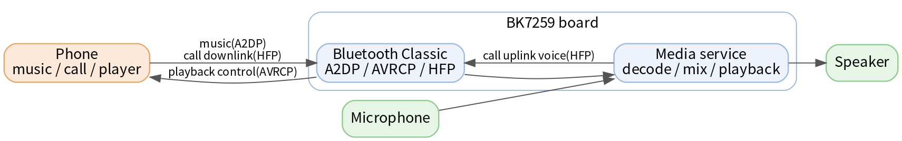
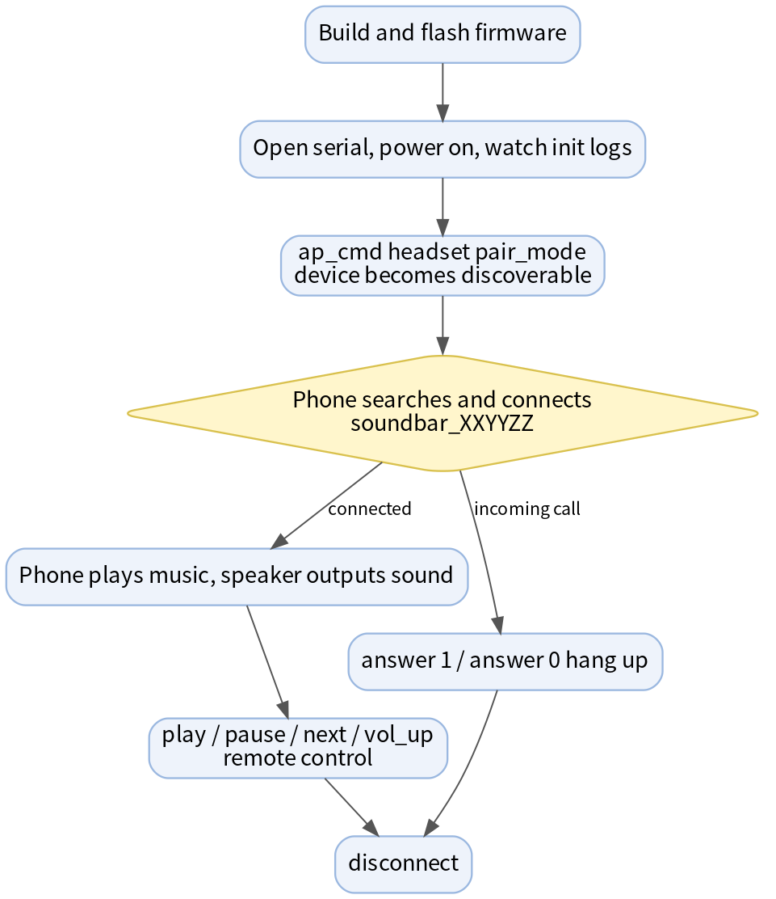
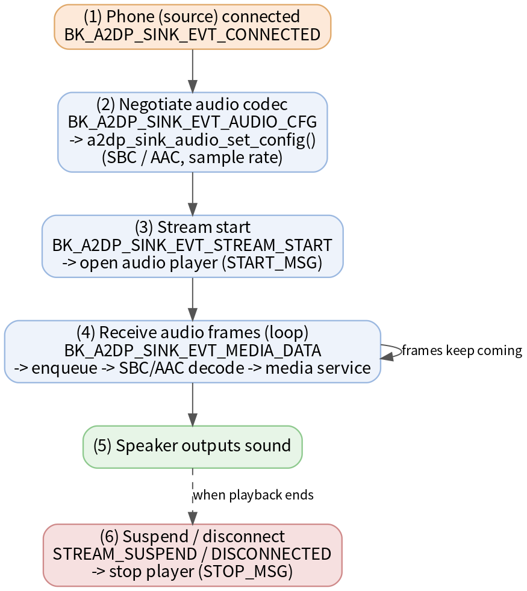
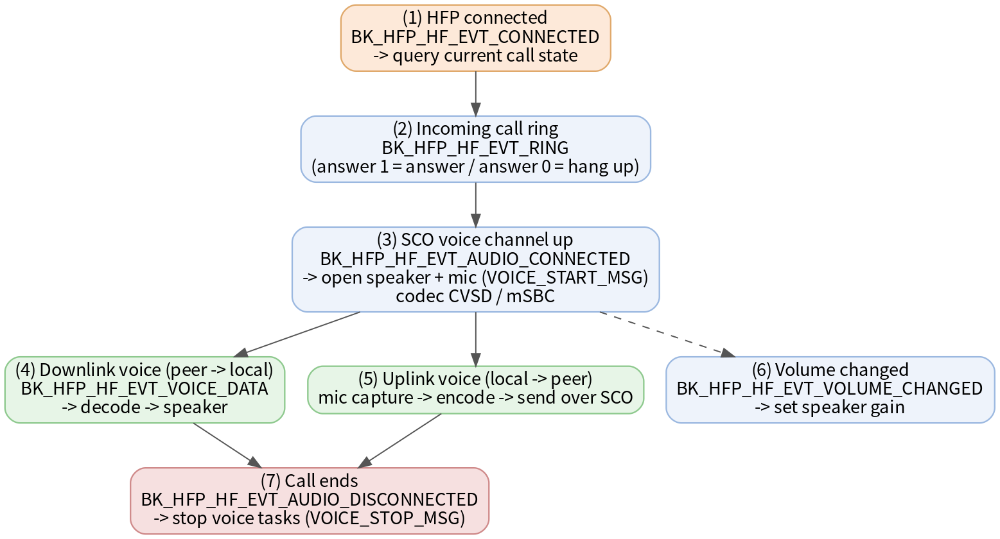

# Bluetooth Headset Example

* [中文](./README_CN.md)

## What can this project do?

In one sentence: **turn the BK7259 board into a Bluetooth speaker + Bluetooth hands-free device**.

After your phone connects to the board over Bluetooth Classic, you can:

- 🎵 Stream music from your phone and play it through the speaker attached to the board (Bluetooth speaker);
- ⏯️ Use serial commands to control the phone's play/pause/next/prev/volume;
- 📞 Answer/make phone calls from the board, with audio going through the board's microphone and speaker (hands-free).

The following acronyms appear repeatedly in this document; a rough understanding is enough for now:

| Acronym | Full name | Role in this project |
| --- | --- | --- |
| A2DP Sink | Advanced Audio Distribution Profile (sink side) | Receive the phone's music audio and play it locally |
| AVRCP | Audio/Video Remote Control Profile | Remotely control the phone's player (play, pause, switch tracks, volume) |
| HFP HF | Hands-Free Profile (hands-free side) | Act as a hands-free device for phone calls (dial, answer, call audio) |

> Note: this project demonstrates **Bluetooth Classic (BR/EDR)**, not BLE. On the phone, just use it the way you connect a Bluetooth speaker/headset.

The diagram below shows how the data flows:



## Quick Start (5 steps)

> This assumes you already have the BK7259 build & flash environment set up, and a phone that supports Bluetooth music/calls.

1. **Build the firmware**

   ```bash
   make bk7259 PROJECT=bluetooth/headset
   ```

2. **Flash the firmware** to the board, and connect a speaker (playback) and a microphone (calls).

3. **Open a serial terminal** (to view boot logs and send commands). After power-on you should see logs that Bluetooth and the media service have finished initializing.

4. **Make the device discoverable**, then search and connect from your phone:

   ```bash
   ap_cmd headset pair_mode
   ```

   A device named `soundbar_XXYYZZ` (the suffix is the last 3 bytes of the local Bluetooth MAC) will appear in the phone's Bluetooth list; tap to connect.

5. **Play music**: once the phone is connected, just play a song and the audio will come out of the board's speaker. You can also remote-control playback via serial:

   ```bash
   ap_cmd headset pause      # pause
   ap_cmd headset play       # play
   ap_cmd headset next       # next track
   ```

🎉 At this point you are already using the board as a Bluetooth speaker. See below for detailed commands, the call feature and the internals.

## Typical Usage Flow

The overall operation flow:



The following chains the common commands for "connect phone → play music → make a call" (each command is explained in detail in [Serial CLI Commands](#422-serial-cli-commands)):

```text
# 1. Enter discoverable state, search and connect soundbar_XXYYZZ from the phone
ap_cmd headset pair_mode

# (or the other way around, let the board actively connect a paired phone)
ap_cmd headset connect XX:XX:XX:XX:XX:XX

# 2. Play music on the phone, audio comes out of the board speaker; remote-control playback
ap_cmd headset play
ap_cmd headset pause
ap_cmd headset next
ap_cmd headset vol_up

# 3. When the phone rings, answer / hang up from the board
ap_cmd headset answer 1        # answer
ap_cmd headset answer 0        # reject/hang up

# 4. Disconnect when done
ap_cmd headset disconnect XX:XX:XX:XX:XX:XX
```

> Tip: a `CMDRSP:OK` return only means "the command was accepted". Whether it actually connected and played depends on the profile status and audio logs on the serial port (see [4.2.3](#423-how-to-tell-success-or-failure)).

## 1. Project Overview

This project demonstrates the Bluetooth Classic headset/speaker application capabilities on the Beken platform, mainly including:

- A2DP Sink: receive music data from a phone or other Bluetooth audio source and play it
- AVRCP Controller: control the remote player's play, pause, previous, next and volume
- HFP HF: act as a hands-free device on the phone's call link, supporting voice, dialing, answering and custom AT commands

After power-on, the project initializes the Bluetooth manager, the media service, A2DP Sink and HFP HF, and registers the `headset` serial CLI for manually triggering connection, media control and call-related operations.

### 1.1 Test Environment

- Hardware
  - Target chip: BK7259
  - Audio output: onboard or external speaker
  - Audio input: onboard or external microphone
- External devices
  - A phone or other Bluetooth Classic device supporting A2DP/AVRCP/HFP
- Output
  - Bluetooth connection and profile status logs
  - A2DP audio playback logs
  - AVRCP control logs
  - HFP call and voice link logs

> ⚠️ **Note**: please use the reference board and audio peripherals for learning and verification. If the peripheral specs differ, the audio channels, gain and board-level configuration may need to be adjusted accordingly.

## 2. Directory Structure

The project uses an AP-CP dual-core structure. The AP side handles the business logic (media service, Bluetooth manager, A2DP Sink / HFP HF demo, CLI), while the CP side only brings up the AP:

```text
headset/
├── ap/
│   ├── ap_main.c                       # AP entry: bk_init → media_service_init → bt_manager_init → demos → CLI
│   ├── Kconfig.projbuild               # A2DP_SINK_DEMO / HFP_HF_DEMO switches
│   ├── headset_user_config.h           # LOCAL_NAME, page/scan, reconnect policy, channel count, etc.
│   ├── a2dp_sink_demo_cli.c            # `headset` CLI command implementation
│   ├── a2dp_sink/
│   │   ├── a2dp_sink_demo.c            # A2DP Sink and AVRCP control logic
│   │   └── a2dp_sink_audio.c           # playback / mixing / volume / SBC|AAC decode chain
│   ├── hfp_hf/hfp_hf_demo.c            # HFP HF call and SCO audio link
│   └── config/bk7259_ap/defconfig      # AP-side Kconfig default override (audio / ADK / BT)
└── cp/
    ├── cp_main.c                       # CP entry: calls bk_start_ap_system in non-ATE mode
    └── config/bk7259/defconfig         # CP-side Kconfig default override (BT controller / PWM / low power)
```


## Code Walkthrough (read this to modify / extend the code)

The entry point of the whole demo is `ap/ap_main.c`. After power-on it initializes in a fixed order:

```c
bk_init();                 // SDK basic init
media_service_init();      // media service (audio playback / record framework)

bt_manager_init(&cfg);     // Bluetooth Classic manager: name / COD / discoverability / pairing / reconnect
a2dp_sink_demo_init(0, 1); // A2DP Sink + AVRCP (aac=0, auto accept connection=1)
hfp_hf_demo_init(0);       // HFP HF hands-free (msbc=0)
cli_headset_demo_init();   // register the headset serial commands
```

Module responsibilities and key functions:

| Module / file | Key function | Description |
| --- | --- | --- |
| `ap/ap_main.c` | `main` | Startup entry, chains the init order; builds the advertised name from `LOCAL_NAME` + last 3 bytes of MAC |
| Bluetooth manager (`bt_manager`) | `bt_manager_init(&cfg)` | Device name, class of device (COD), page/scan discoverability, pairing IO capability, auto reconnect |
| A2DP/AVRCP (`a2dp_sink/a2dp_sink_demo.c`) | `a2dp_sink_demo_init(aac, auto_accept)` | Registers `on_a2dp_evt` / `on_avrcp_ct_evt` / `on_avrcp_tg_evt`, inits the sink and avrcp ct/tg services |
| A2DP audio (`a2dp_sink/a2dp_sink_audio.c`) | data/state handling in `on_a2dp_evt` | SBC/AAC decode, volume handling, feed into the media service for playback |
| HFP (`hfp_hf/hfp_hf_demo.c`) | `hfp_hf_demo_init(msbc)` | Registers `hfp_demo_event_cb`, inits the HFP HF service, handles SCO call audio |
| CLI (`a2dp_sink_demo_cli.c`) | `cli_headset_demo_init` / `cmd_headset_demo` | Parses the `headset xxx` sub-commands and calls the demo APIs above |

Common modification points:

- **Change device name / discoverability / reconnect policy**: `bt_manager_cfg_t` in `ap_main.c` and `headset_user_config.h`.
- **Enable AAC / mSBC**: change the parameter of `a2dp_sink_demo_init(0, 1)` / `hfp_hf_demo_init(0)` to `1`, and confirm the Kconfig and the peer capability (see [4.2.1](#421-default-configuration)).
- **Add a custom command**: add a branch in `cmd_headset_demo` in `a2dp_sink_demo_cli.c`.

### A2DP Audio Data Flow Sequence

A2DP is **one-way downlink**: the phone sends encoded audio frames to the board over Bluetooth, and the board decodes them and plays through the speaker. The events (`BK_A2DP_SINK_EVT_*`) are handled in `on_a2dp_evt`:



### HFP Call Voice Sequence

An HFP call is **bidirectional**: voice goes over the SCO link, with downlink (peer → speaker) and uplink (microphone → peer) happening at the same time. The events (`BK_HFP_HF_EVT_*`) are handled in `hfp_demo_event_cb`:



## 3. Function Description

### 3.1 Currently Supported Features

- Auto-initialize Bluetooth Classic and the media service on boot
- A2DP Sink audio receiving and local playback
- AVRCP playback control: play, pause, previous, next, rewind, fast forward, volume
- A2DP delay value set and get
- HFP HF call control: voice recognition toggle, dial, answer/reject, custom AT commands
- Serial CLI to manually control the headset demo

## 4. Build and Run

### 4.1 Build

```bash
make bk7259 PROJECT=bluetooth/headset
```

### 4.2 Run

After flashing the firmware, observe the boot logs through a serial terminal and use the `headset` CLI to control Bluetooth connection and audio services.

#### 4.2.1 Default Configuration

The AP-side default configuration is located at `ap/config/bk7259_ap/defconfig`, with key switches:

```text
CONFIG_BT=y
CONFIG_BLUETOOTH_AP=y
CONFIG_MEDIA_SERVICE=y
CONFIG_AUDIO=y
CONFIG_AUDIO_PLAY=y
CONFIG_AUDIO_RECORD=y
CONFIG_A2DP_SINK_DEMO=y
CONFIG_HFP_HF_DEMO=y
```

The current startup code uses:

```text
a2dp_sink_demo_init(0, 1)   // aac_supported=0, auto_accept_conn=1
hfp_hf_demo_init(0)         // msbc_supported=0
```

So A2DP AAC support and HFP mSBC support are off by default; prefer SBC music playback and the CVSD call link for verification.

#### 4.2.2 Serial CLI Commands

The CLI of this project runs on the AP side, so serial commands need to be forwarded to the AP side via `ap_cmd`. In the commands below, `XX:XX:XX:XX:XX:XX` is the MAC address of the phone or other Bluetooth device.

> When unsure about the parameter format, send `ap_cmd headset -h` first to view the help.

**Help command**

| Command | Description |
| --- | --- |
| `ap_cmd headset -h` | Print the `headset` command help and the supported sub-commands and parameter formats |

**Connection management commands**

| Command | Description |
| --- | --- |
| `ap_cmd headset pair_mode` | Put the device into pairable/discoverable state so the phone can search and pair |
| `ap_cmd headset connect XX:XX:XX:XX:XX:XX` | Actively connect the remote device with the given MAC, establishing A2DP/AVRCP/HFP links |
| `ap_cmd headset disconnect XX:XX:XX:XX:XX:XX` | Disconnect the remote device with the given MAC |

**Media playback control commands (AVRCP)**

| Command | Description |
| --- | --- |
| `ap_cmd headset play` | Send a play command to the remote player (usually after A2DP is connected) |
| `ap_cmd headset pause` | Send a pause command |
| `ap_cmd headset next` | Switch to the next track |
| `ap_cmd headset prev` | Switch to the previous track |
| `ap_cmd headset rewind 500` | Rewind; the parameter is the duration in ms, example rewinds 500 ms |
| `ap_cmd headset fast_forward 500` | Fast forward; the parameter is the duration in ms, example forwards 500 ms |
| `ap_cmd headset vol_up` | Increase the volume (effect depends on AVRCP volume sync and playback state) |
| `ap_cmd headset vol_down` | Decrease the volume |

**A2DP delay control commands**

| Command | Description |
| --- | --- |
| `ap_cmd headset set_delay_value 100` | Set the audio delay value reported to the remote device (16-bit value), example 100 |
| `ap_cmd headset get_delay_value` | Read the current A2DP Sink delay value to confirm the configuration took effect |

**AVRCP attribute query command**

| Command | Description |
| --- | --- |
| `ap_cmd headset get_attr 1` | Query a specific media attribute of the remote player; the parameter is the attribute ID (see `bk_avrcp_media_attr_id_t`) |

**HFP HF call control commands**

| Command | Description |
| --- | --- |
| `ap_cmd headset dial 1 10086` | Start dialing; the first parameter controls the dial action, the second is the number, example dials `10086` |
| `ap_cmd headset answer 1` | Answer the current incoming/ongoing call request |
| `ap_cmd headset answer 0` | Reject/hang up the current call request (actual behavior depends on the HFP state) |
| `ap_cmd headset hfpcmd AT+BRSF` | Send a custom HFP AT command for debugging, example sends `AT+BRSF` |

A command returns `CMDRSP:OK` when accepted and `CMDRSP:ERROR` when it fails.

#### 4.2.3 How to Tell Success or Failure

`CMDRSP:OK` only means the CLI command was accepted, **not that the Bluetooth service has completed**. Judge based on the Bluetooth profile status, audio playback and call link logs.

For A2DP playback verification, check:

- The phone successfully connects to the device, which advertises as `soundbar_XXYYZZ`, with the suffix being the last 3 bytes of the local BT MAC;
- The local speaker can output the remote music.

For HFP call verification, check:

- The phone can establish a hands-free connection;
- After dial, answer or reject commands, the HFP status logs match expectations;
- The local microphone and speaker links work during the call.

#### 4.2.4 Integration Test Commands

The current `.it.csv` only covers a basic device-reboot check:

```text
AT+RST
```

The expected result matches the `wakeup` log. A2DP/HFP services require an external Bluetooth device and are usually verified manually or through dedicated automated tests.

## 5. Notes and FAQ

1. **An external Bluetooth device is required**: this project relies on a phone/audio source; confirm the peer supports A2DP, AVRCP and HFP before testing.
2. **Fixed MAC format**: the MAC address in the CLI must be written as `XX:XX:XX:XX:XX:XX`, otherwise the command fails to parse.
3. **Device name**: the default local device name prefix is `soundbar`, adjustable in `headset_user_config.h` (`LOCAL_NAME`) or the HFP demo as needed.
4. **Shared audio link**: both A2DP and HFP use the audio playback link; when switching services, observe the current profile status first to avoid confusion from concurrent scenarios.
5. **AAC / mSBC off by default**: to verify them, you need to adjust the init parameters, Kconfig and the remote device capability accordingly (see [4.2.1](#421-default-configuration)).

**FAQ**

- **Phone can't find the device?** Send `ap_cmd headset pair_mode` first to make it discoverable, and confirm Bluetooth initialized successfully in the serial logs.
- **Connected but no sound?** Check the speaker wiring, make sure the phone is playing music, and look at the A2DP audio logs; use `vol_up` to raise the volume if needed.
- **Command returns `CMDRSP:ERROR`?** Usually a wrong parameter format (especially the MAC address); use `ap_cmd headset -h` to check the format.
- **No sound during a call?** Confirm the microphone is connected, HFP is connected, and that CVSD is used by default (mSBC is off by default).
