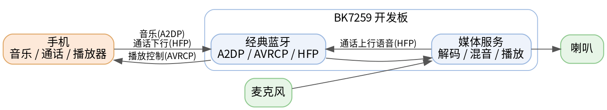
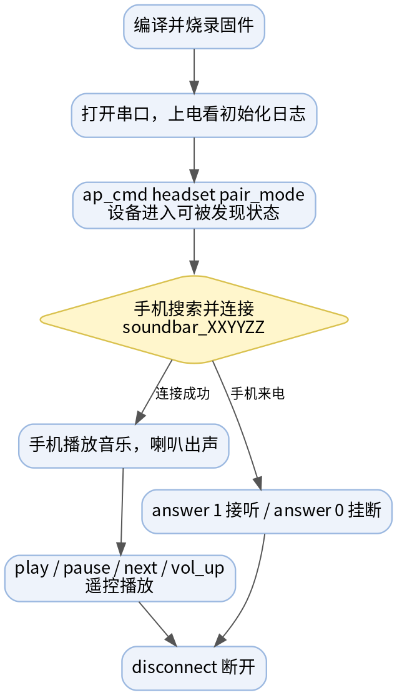
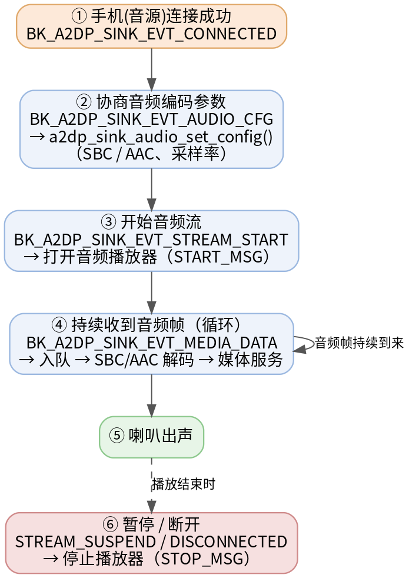
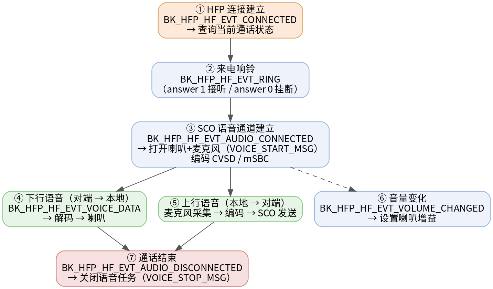

# 蓝牙 Headset 示例工程

* [English](./README.md)

## 这个工程能做什么？

一句话：**把 BK7259 开发板变成一个蓝牙音箱 + 蓝牙免提（车载/耳机）设备**。

手机通过经典蓝牙连上开发板后，你可以：

- 🎵 把手机里的音乐推到开发板，从板子接的喇叭放出来（蓝牙音箱）；
- ⏯️ 用串口命令控制手机的播放/暂停/上一曲/下一曲/音量；
- 📞 用开发板接听/拨打手机电话，声音走板子上的麦克风和喇叭（免提）。

下面这几个缩写在本文档里会反复出现，先了解个大概即可：

| 缩写 | 全称 | 在本工程里的作用 |
| --- | --- | --- |
| A2DP Sink | Advanced Audio Distribution Profile（接收端） | 接收手机的音乐音频并在本地播放 |
| AVRCP | Audio/Video Remote Control Profile | 远程控制手机播放器（播放、暂停、切歌、音量） |
| HFP HF | Hands-Free Profile（免提端） | 作为免提设备接入手机通话（拨号、接听、通话语音） |

> 说明：本工程演示的是**经典蓝牙（BR/EDR）**，不是 BLE。手机端按“连接蓝牙音箱/耳机”的方式使用即可。

数据是怎么流动的，看下面这张图就明白了：



## 快速上手（5 步）

> 假设你已经搭好 BK7259 的编译与烧录环境，并且有一台支持蓝牙音乐/通话的手机。

1. **编译固件**

   ```bash
   make bk7259 PROJECT=bluetooth/headset
   ```

2. **烧录固件** 到开发板，并接好喇叭（放音）和麦克风（通话）。

3. **打开串口终端**（查看启动日志、发送命令）。上电后应能看到蓝牙与媒体服务初始化完成的日志。

4. **让设备可被发现**，然后用手机搜索并连接：

   ```bash
   ap_cmd headset pair_mode
   ```

   手机蓝牙列表里会出现名为 `soundbar_XXYYZZ` 的设备（后缀是本机蓝牙 MAC 的末 3 字节），点击连接即可。

5. **播放音乐**：手机连上后直接播放歌曲，声音会从开发板的喇叭放出来。可以用串口命令遥控手机播放：

   ```bash
   ap_cmd headset pause      # 暂停
   ap_cmd headset play       # 播放
   ap_cmd headset next       # 下一曲
   ```

🎉 到这里你就已经把开发板当蓝牙音箱用起来了。更详细的命令、通话功能和原理见下文。

## 典型使用流程

整体操作流程如下：



下面以“连接手机 → 放音乐 → 打电话”为例，串联常用命令（命令都在 [串口 CLI 命令](#422-串口-cli-命令) 一节有详细说明）：

```text
# 1. 进入可被发现状态，手机端搜索并连接 soundbar_XXYYZZ
ap_cmd headset pair_mode

# （或者反过来，由开发板主动连接已配对的手机）
ap_cmd headset connect XX:XX:XX:XX:XX:XX

# 2. 手机播放音乐，板子喇叭出声；用命令遥控播放
ap_cmd headset play
ap_cmd headset pause
ap_cmd headset next
ap_cmd headset vol_up

# 3. 手机来电时，用开发板接听 / 挂断
ap_cmd headset answer 1        # 接听
ap_cmd headset answer 0        # 拒接/挂断

# 4. 用完断开
ap_cmd headset disconnect XX:XX:XX:XX:XX:XX
```

> 提示：命令返回 `CMDRSP:OK` 只代表“命令被接受”，是否真的连上、出声，要看串口里的 profile 状态和音频日志（见 [4.2.3](#423-如何判断测试成功或失败)）。

## 1. 项目概述

本工程用于演示 Beken 平台上的经典蓝牙耳机/音箱类应用能力，主要包含：

- A2DP Sink：接收手机或其他蓝牙音源的音乐数据并播放
- AVRCP Controller：控制远端播放器的播放、暂停、上一曲、下一曲和音量
- HFP HF：作为免提设备接入手机通话链路，支持语音、拨号、接听和自定义 AT 命令

工程上电后会初始化蓝牙管理模块、媒体服务、A2DP Sink、HFP HF，并注册 `headset` 串口 CLI，便于手动触发连接、媒体控制和通话相关操作。

### 1.1 测试环境

- 硬件配置
  - 目标芯片：BK7259
  - 音频输出：板载或外接扬声器
  - 音频输入：板载或外接麦克风
- 外部设备
  - 支持 A2DP/AVRCP/HFP 的手机或其他经典蓝牙设备
- 输出内容
  - 蓝牙连接与 profile 状态日志
  - A2DP 音频播放日志
  - AVRCP 控制日志
  - HFP 通话与语音链路日志

> ⚠️ **注意**：请使用参考板卡和音频外设进行示例学习与验证。如果外设规格不同，音频通道、增益和板级配置可能需要同步调整。

## 2. 目录结构

项目采用 AP-CP 双核结构。AP 侧承担业务逻辑（媒体服务、蓝牙管理、A2DP Sink / HFP HF demo、CLI），CP 侧仅负责拉起 AP：

```text
headset/
├── ap/
│   ├── ap_main.c                       # AP 入口：bk_init → media_service_init → bt_manager_init → 各 demo → CLI
│   ├── Kconfig.projbuild               # A2DP_SINK_DEMO / HFP_HF_DEMO 开关
│   ├── headset_user_config.h           # LOCAL_NAME、page/scan、重连策略、声道数等
│   ├── a2dp_sink_demo_cli.c            # `headset` CLI 命令实现
│   ├── a2dp_sink/
│   │   ├── a2dp_sink_demo.c            # A2DP Sink 与 AVRCP 控制逻辑
│   │   └── a2dp_sink_audio.c           # 播放 / 混音 / 音量 / SBC|AAC 解码链路
│   ├── hfp_hf/hfp_hf_demo.c            # HFP HF 通话与 SCO 音频链路
│   └── config/bk7259_ap/defconfig      # AP 侧 Kconfig 默认覆盖（音频 / ADK / BT）
└── cp/
    ├── cp_main.c                       # CP 入口：非 ATE 模式下调用 bk_start_ap_system
    └── config/bk7259/defconfig         # CP 侧 Kconfig 默认覆盖（BT controller / PWM / 低功耗）
```


## 代码导读（想改 / 扩展代码看这里）

整个 demo 的入口在 `ap/ap_main.c`，上电后按固定顺序初始化：

```c
bk_init();                 // SDK 基础初始化
media_service_init();      // 媒体服务（音频播放 / 录音框架）

bt_manager_init(&cfg);     // 经典蓝牙管理：设备名 / COD / 可发现性 / 配对 / 重连
a2dp_sink_demo_init(0, 1); // A2DP Sink + AVRCP（aac=0，自动接受连接=1）
hfp_hf_demo_init(0);       // HFP HF 免提（msbc=0）
cli_headset_demo_init();   // 注册 headset 串口命令
```

各模块职责与关键函数：

| 模块 / 文件 | 关键函数 | 说明 |
| --- | --- | --- |
| `ap/ap_main.c` | `main` | 启动入口，串起初始化顺序；用 `LOCAL_NAME` + MAC 末 3 字节拼出广播名 |
| 蓝牙管理（`bt_manager`） | `bt_manager_init(&cfg)` | 设备名、设备类型 COD、page/scan 可发现性、配对 IO 能力、自动重连 |
| A2DP/AVRCP（`a2dp_sink/a2dp_sink_demo.c`） | `a2dp_sink_demo_init(aac, auto_accept)` | 注册 `on_a2dp_evt` / `on_avrcp_ct_evt` / `on_avrcp_tg_evt`，初始化 sink 与 avrcp ct/tg 服务 |
| A2DP 音频（`a2dp_sink/a2dp_sink_audio.c`） | `on_a2dp_evt` 中处理数据/状态 | SBC/AAC 解码、音量处理、送入媒体服务播放 |
| HFP（`hfp_hf/hfp_hf_demo.c`） | `hfp_hf_demo_init(msbc)` | 注册 `hfp_demo_event_cb`，初始化 HFP HF 服务，处理 SCO 通话语音 |
| CLI（`a2dp_sink_demo_cli.c`） | `cli_headset_demo_init` / `cmd_headset_demo` | 解析 `headset xxx` 子命令并调用上面各 demo 接口 |

常见改动点：

- **改设备名 / 可发现性 / 重连策略**：`ap_main.c` 里的 `bt_manager_cfg_t` 和 `headset_user_config.h`。
- **打开 AAC / mSBC**：把 `a2dp_sink_demo_init(0, 1)` / `hfp_hf_demo_init(0)` 的参数改成 `1`，并同步确认 Kconfig 与对端能力（见 [4.2.1](#421-默认配置)）。
- **新增自定义命令**：在 `a2dp_sink_demo_cli.c` 的 `cmd_headset_demo` 里加一个分支即可。

### A2DP 音频数据流时序

A2DP 是**单向下行**：手机把编码后的音频帧通过蓝牙发给开发板，开发板解码后从喇叭播放。各事件（`BK_A2DP_SINK_EVT_*`）在 `on_a2dp_evt` 中处理：



### HFP 通话语音时序

HFP 通话是**双向**的：语音走 SCO 链路，下行（对端→喇叭）和上行（麦克风→对端）同时进行。各事件（`BK_HFP_HF_EVT_*`）在 `hfp_demo_event_cb` 中处理：



## 3. 功能说明

### 3.1 当前支持的功能

- 开机自动初始化经典蓝牙与媒体服务
- A2DP Sink 音频接收与本地播放
- AVRCP 播放控制：播放、暂停、上一曲、下一曲、快退、快进、音量调节
- A2DP 延时值设置与读取
- HFP HF 通话控制：语音识别开关、拨号、接听/拒接、自定义 AT 命令
- 串口 CLI 手动控制 headset demo

## 4. 编译与运行

### 4.1 编译方法

```bash
make bk7259 PROJECT=bluetooth/headset
```

### 4.2 运行方式

烧录固件后，通过串口终端观察启动日志，并使用 `headset` CLI 控制蓝牙连接和音频业务。

#### 4.2.1 默认配置

AP 侧默认配置位于 `ap/config/bk7259_ap/defconfig`，关键开关如下：

```text
CONFIG_BT=y
CONFIG_BLUETOOTH_AP=y
CONFIG_MEDIA_SERVICE=y
CONFIG_AUDIO=y
CONFIG_AUDIO_PLAY=y
CONFIG_AUDIO_RECORD=y
CONFIG_A2DP_SINK_DEMO=y
CONFIG_HFP_HF_DEMO=y
```

当前启动代码中使用：

```text
a2dp_sink_demo_init(0, 1)   // aac_supported=0, auto_accept_conn=1
hfp_hf_demo_init(0)         // msbc_supported=0
```

因此默认 A2DP AAC 支持和 HFP mSBC 支持没有打开，验证时优先使用 SBC 音乐播放和 CVSD 通话链路。

#### 4.2.2 串口 CLI 命令

本工程的 CLI 运行在 AP 侧，因此串口命令需要通过 `ap_cmd` 转发到 AP 侧执行。以下命令中的 `XX:XX:XX:XX:XX:XX` 为手机或其他蓝牙设备的 MAC 地址。

> 不确定参数格式时，先发 `ap_cmd headset -h` 查看帮助。

**帮助命令**

| 命令 | 说明 |
| --- | --- |
| `ap_cmd headset -h` | 打印 `headset` 命令帮助，查看当前支持的子命令和参数格式 |

**连接管理命令**

| 命令 | 说明 |
| --- | --- |
| `ap_cmd headset pair_mode` | 让设备进入可配对/可发现状态，便于手机搜索并发起配对连接 |
| `ap_cmd headset connect XX:XX:XX:XX:XX:XX` | 主动连接指定 MAC 的远端设备，建立 A2DP/AVRCP/HFP 链路 |
| `ap_cmd headset disconnect XX:XX:XX:XX:XX:XX` | 断开指定 MAC 的远端设备连接 |

**媒体播放控制命令（AVRCP）**

| 命令 | 说明 |
| --- | --- |
| `ap_cmd headset play` | 向远端播放器发送播放命令（通常在 A2DP 已连接后使用） |
| `ap_cmd headset pause` | 发送暂停命令 |
| `ap_cmd headset next` | 切换到下一首 |
| `ap_cmd headset prev` | 切换到上一首 |
| `ap_cmd headset rewind 500` | 快退，参数为持续时间（毫秒），示例为快退 500 ms |
| `ap_cmd headset fast_forward 500` | 快进，参数为持续时间（毫秒），示例为快进 500 ms |
| `ap_cmd headset vol_up` | 调高音量（效果取决于 AVRCP 音量同步与播放状态） |
| `ap_cmd headset vol_down` | 调低音量 |

**A2DP 延时控制命令**

| 命令 | 说明 |
| --- | --- |
| `ap_cmd headset set_delay_value 100` | 设置上报给远端的音频延时值（16 位数值），示例为 100 |
| `ap_cmd headset get_delay_value` | 读取当前 A2DP Sink 延时值，确认配置是否生效 |

**AVRCP 属性查询命令**

| 命令 | 说明 |
| --- | --- |
| `ap_cmd headset get_attr 1` | 查询远端播放器指定媒体属性，参数为属性 ID（含义见 `bk_avrcp_media_attr_id_t`） |

**HFP HF 通话控制命令**

| 命令 | 说明 |
| --- | --- |
| `ap_cmd headset dial 1 10086` | 发起拨号，第一个参数控制拨号动作，第二个参数为号码，示例拨打 `10086` |
| `ap_cmd headset answer 1` | 接听当前来电/通话请求 |
| `ap_cmd headset answer 0` | 拒接/挂断当前来电/通话请求（实际行为取决于 HFP 状态） |
| `ap_cmd headset hfpcmd AT+BRSF` | 发送自定义 HFP AT 命令用于调试，示例发送 `AT+BRSF` |

命令提交成功时返回 `CMDRSP:OK`，失败时返回 `CMDRSP:ERROR`。

#### 4.2.3 如何判断测试成功或失败

`CMDRSP:OK` 仅表示 CLI 命令已被接受，**不代表蓝牙业务已经完成**。请结合蓝牙 profile 状态、音频播放和通话链路日志判断。

A2DP 播放验证建议检查：

- 手机端成功连接到设备，对外广播名为 `soundbar_XXYYZZ`，后缀为本机 BT MAC 的末 3 字节；
- 本地扬声器能够输出远端音乐。

HFP 通话验证建议检查：

- 手机端能够建立免提连接；
- 拨号、接听或拒接命令后，HFP 状态日志符合预期；
- 通话时本地麦克风和扬声器链路工作正常。

#### 4.2.4 集成测试命令

`.it.csv` 当前只覆盖设备重启基础检查：

```text
AT+RST
```

期望结果匹配 `wakeup` 日志。A2DP/HFP 业务需要配合外部蓝牙设备，通常通过手动或专项自动化测试验证。

## 5. 注意事项与常见问题

1. **必须有外部蓝牙设备**：本工程依赖手机/音源设备，测试前请确认对端支持 A2DP、AVRCP 和 HFP。
2. **MAC 地址格式固定**：CLI 中的 MAC 地址必须写成 `XX:XX:XX:XX:XX:XX`，否则命令会解析失败。
3. **设备名**：默认本地设备名前缀为 `soundbar`，可在 `headset_user_config.h`（`LOCAL_NAME`）或 HFP demo 中按需修改。
4. **音频链路共用**：A2DP 与 HFP 都会使用音频播放链路，切换业务时建议先观察当前 profile 状态，避免并发场景影响判断。
5. **AAC / mSBC 默认关闭**：如需验证，需要同步调整初始化参数、Kconfig 和远端设备能力（见 [4.2.1](#421-默认配置)）。

**常见问题（FAQ）**

- **手机搜不到设备？** 先发 `ap_cmd headset pair_mode` 让设备进入可发现状态，并确认串口里蓝牙已初始化成功。
- **连上了但没声音？** 确认喇叭接线正常、手机正在播放音乐，并查看 A2DP 音频日志；必要时用 `vol_up` 调高音量。
- **命令返回 `CMDRSP:ERROR`？** 多为参数格式不对（尤其 MAC 地址），用 `ap_cmd headset -h` 核对格式。
- **打电话没声音？** 确认麦克风已接、HFP 已连接，且默认走 CVSD（mSBC 默认关闭）。
