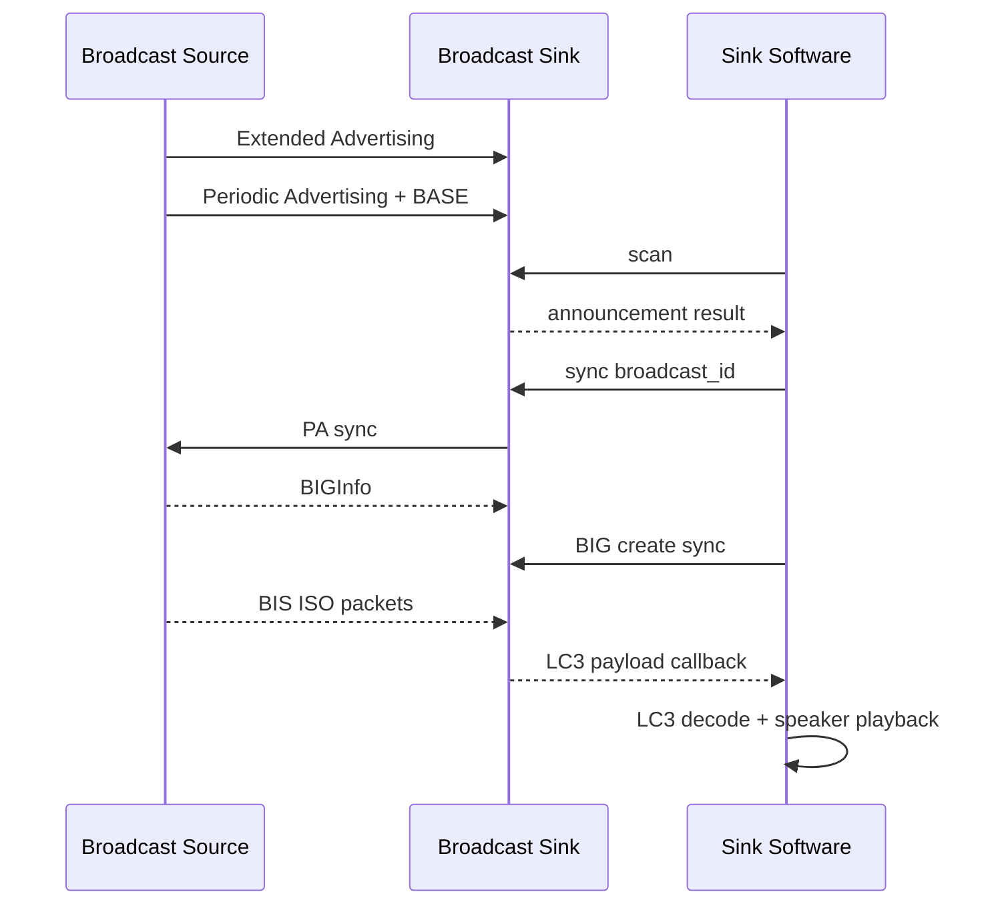
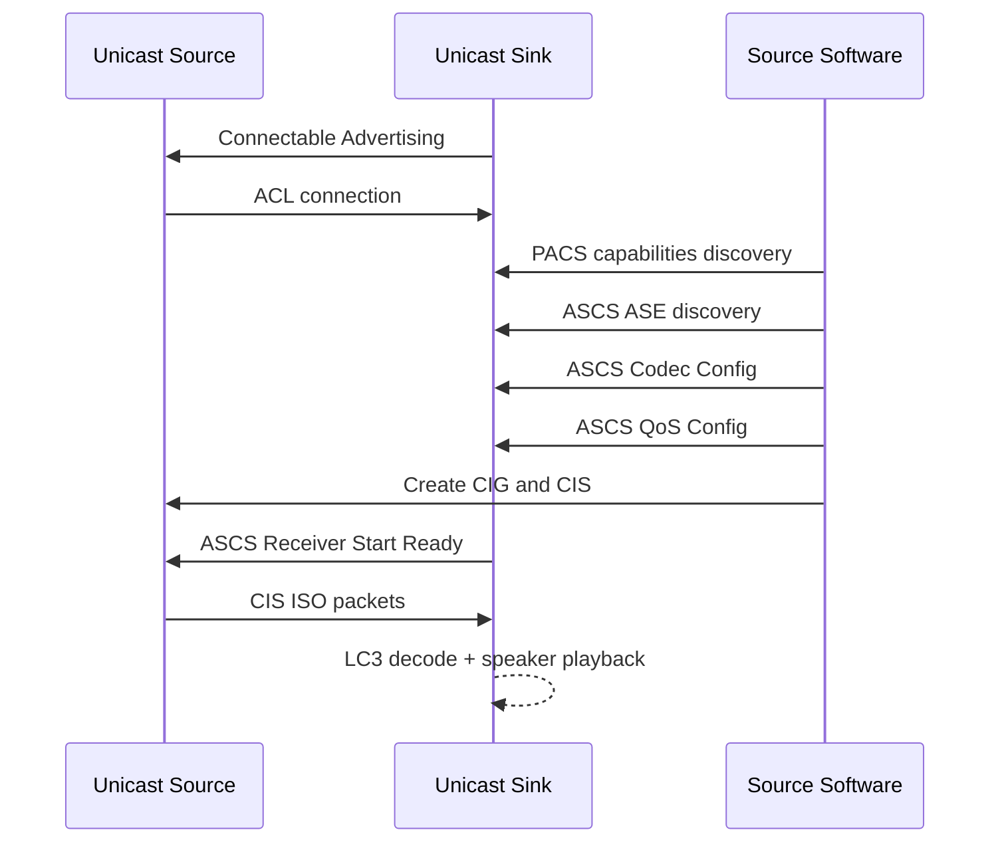

# BK7259 LE Audio / Auracast Demo

* [中文](./README_CN.md)

This project demonstrates LE Audio Broadcast and Unicast basics on BK7259 AP/CP. The default entry is the `le_audio` protocol demo; the `auracast` CLI is kept as a BTA application-layer reference implementation.

- **Broadcast Source**: local PCM is LC3-encoded and sent over LE Audio Broadcast / BIS.
- **Broadcast Sink**: scans Auracast advertisements, synchronizes PA/BIG, receives ISO audio, decodes LC3, and plays through the onboard speaker.
- **Unicast Source**: discovers PACS/ASCS, configures ASE/QoS, creates CIG/CIS, and sends LC3 test audio over CIS.
- **Unicast Sink**: advertises for connection, handles ASCS receiver readiness, receives CIS ISO audio, decodes LC3, and plays through the onboard speaker.

## Build And Flash

Run from the SDK root:

```bash
make bk7259 PROJECT=bluetooth/le_audio
```

Outputs:

- `build/bk7259/le_audio/package/all-app.bin`: recommended for full flashing.
- `build/bk7259/le_audio/package/app_pack.rbl`: OTA package.

## Key Config

AP:

```text
CONFIG_BLUETOOTH_AP=y
CONFIG_BT=y
CONFIG_BLE=y
CONFIG_BLE_LE_AUDIO=y
CONFIG_BLUETOOTH_BTDM_COMPONENT_ENABLE=y
CONFIG_AUDIO_PLAY=y
CONFIG_LE_AUDIO_PROTOCOL_DEMO=y
```

CP:

```text
CONFIG_BTDM_CONTROLLER_ONLY=y
CONFIG_BT=y
CONFIG_BLE=y
CONFIG_BLE_LE_AUDIO=y
```

## Default CLI: `le_audio`

The CLI runs on AP and is accessed through `ap_cmd`:

```text
ap_cmd le_audio -h
```

Common commands:

```text
ap_cmd le_audio role source|sink
ap_cmd le_audio broadcast source start|stop
ap_cmd le_audio broadcast sink scan
ap_cmd le_audio broadcast sink sync <id>
ap_cmd le_audio broadcast sink stop
ap_cmd le_audio adv on|off
ap_cmd le_audio connect <addr> [type] [legacy|ext]
ap_cmd le_audio unicast source setup|discover|caps sink|source
ap_cmd le_audio unicast source config <ase_id> sink|source [cap_index]
ap_cmd le_audio unicast source cig <ase_id> <cig_id> <cis_id>
ap_cmd le_audio unicast source qos|enable|cis|release <ase_id>
ap_cmd le_audio unicast sink rx_ready|release <ase_id>
ap_cmd le_audio unicast source tone start <handle>|stop
```

The protocol demo keeps control paths separate from the shared sink media path:
`source/broadcast` and `source/unicast` contain Source-side flows, while
`sink/broadcast` and `sink/unicast` contain Sink-side control flows.
`sink/common/le_audio_sink_core.c` plus `sink/common/le_audio_sink_media.c`
own the common BAP sink registration, ISO callback, LC3 decode, and playback
pipeline.

## Broadcast Two-Board Test

Start the Broadcast Source on the source board:

```text
ap_cmd le_audio role source
ap_cmd le_audio broadcast source start
```

Scan and synchronize on the sink board:

```text
ap_cmd le_audio role sink
ap_cmd le_audio broadcast sink scan
ap_cmd le_audio broadcast sink sync <broadcast_id>
```

Broadcast synchronization flow:



Expected logs:

```text
BIS Conn Handle ...
ISO DataPath Set OK
first iso payload ...
first lc3 decoded ...
speaker playback open / unmuted
```

Stop the broadcast test:

```text
ap_cmd le_audio broadcast sink stop
ap_cmd le_audio role source
ap_cmd le_audio broadcast source stop
```

## Unicast Two-Board Test

This flow is for LE Audio Unicast Source -> Sink debugging. The unicast CLI does not hide `ase_id` or CIS handles behind fixed defaults; use the values printed by callbacks.

Unicast setup flow:



Sink board:

```text
ap_cmd le_audio role sink
ap_cmd le_audio adv on
```

Source board:

```text
ap_cmd le_audio role source
ap_cmd le_audio connect <sink_addr> 0 ext
ap_cmd le_audio unicast source setup
ap_cmd le_audio unicast source caps sink
ap_cmd le_audio unicast source discover
```

After discovery, read the ASE ID from the Source log:

```text
Unicast CLI ASE discovered: ase_id=0x.. db=0x.. role=0x.. state=0x..
```

Then pass that `ase_id` explicitly:

```text
ap_cmd le_audio unicast source config <ase_id> sink
ap_cmd le_audio unicast source cig <ase_id> <cig_id> <cis_id>
ap_cmd le_audio unicast source qos <ase_id>
ap_cmd le_audio unicast source enable <ase_id>
ap_cmd le_audio unicast source cis <ase_id>
```

When the Sink ASE enters Enabling, send Receiver Start Ready on the Sink board:

```text
ap_cmd le_audio unicast sink rx_ready <ase_id>
```

Read the Source-local CIS handle from the Source log:

```text
CIS handle assigned: ase_id=0x.. db=0x.. cig=0x.. local_cis_handle=0x....
CIS established remote ASE: ase_id=0x.. db=0x.. local_cis_handle=0x....
ISO Data Setup Success: ase_id=0x.. db=0x.. local_cis_handle=0x....
```

Start the 48 kHz / 10 ms / 100-byte LC3 test tone on the Source board:

```text
ap_cmd le_audio unicast source tone start <local_cis_handle>
```

Expected logs:

```text
ISO DataPath Set Successfully
first iso payload ...
first lc3 decoded ...
unicast tone start handle=0x....
```

Stop the test tone:

```text
ap_cmd le_audio unicast source tone stop
```

HCI connection handles are local to each device. Use the Source-local CIS handle for Source ISO TX; do not copy the Sink-side handle.

## BTA/Auracast Reference CLI

The project also keeps the `auracast` CLI as a BTA application-layer reference implementation:

```text
ap_cmd auracast client scan_start
ap_cmd auracast client associate
ap_cmd auracast client enable

ap_cmd auracast server announcement
ap_cmd auracast server start
```
