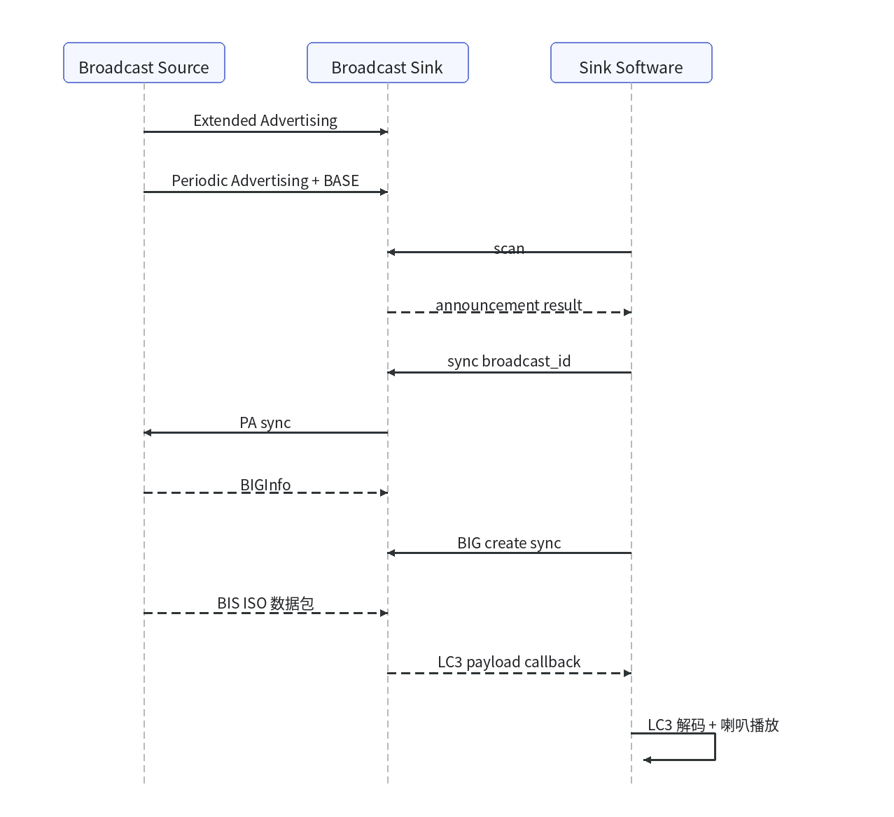
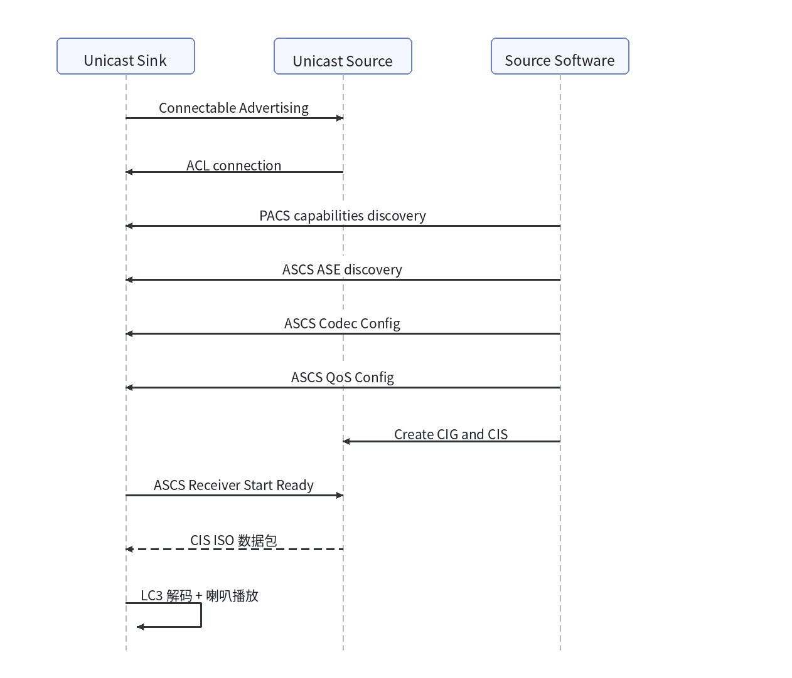

# BK7259 LE Audio / Auracast 示例

* [English](./README.md)

## 1. 项目概述

本工程演示 BK7259 AP/CP 架构下的 LE Audio Broadcast 与 Unicast 基础功能。默认入口为 `le_audio` protocol demo；`auracast` CLI 保留为基于 BTA 应用层的参考实现。

- Broadcast Source：本地 PCM 经 LC3 编码后，通过 LE Audio Broadcast / BIS 发送。
- Broadcast Sink：扫描 Auracast 广播，同步 PA/BIG，接收 ISO 音频，LC3 解码后经板载扬声器播放。
- Unicast Source：通过 PACS/ASCS 完成 Sink 能力发现、ASE 配置、QoS 配置、CIG/CIS 建链，并通过 CIS 发送 LC3 测试音。
- Unicast Sink：广播可连接地址，接收 ASCS 控制流程，发送 Receiver Start Ready，并接收 CIS ISO 音频后解码播放。

本 demo 可验证 BAP Broadcast Source/Sink over BIS、BAP Unicast Source/Sink over CIS、PACS 能力发现、ASCS ASE 发现与配置、LC3 编解码和 Sink 侧扬声器播放。

工程位置：`projects/bluetooth/le_audio`。

## 2. 目录结构

```text
le_audio/
├── README_CN.md / README.md / app.rst
├── ap/
│   ├── ap_main.c
│   ├── le_audio_demo_cli.c        # le_audio CLI + auracast reference CLI
│   ├── bta/                       # BTA/Auracast 参考应用层
│   │   ├── bluetooth_app.c
│   │   ├── ble/bta_auracast.c
│   │   └── audio/                 # LC3 encode/decode + DAC playback
│   └── le_audio_demo/             # protocol bring-up demo
│       ├── le_audio_protocol_main.c
│       ├── le_audio_protocol_demo.h
│       ├── source/
│       │   ├── broadcast/le_audio_broadcast_source.c
│       │   └── unicast/le_audio_unicast_source.c
│       └── sink/
│           ├── common/
│           │   ├── le_audio_sink_core.c   # sink 注册 + 共享 ISO callback
│           │   └── le_audio_sink_media.c  # ISO queue + LC3 decode + playback
│           ├── audio/le_audio_playback.c
│           ├── broadcast/le_audio_broadcast_sink.c
│           └── unicast/le_audio_unicast_sink.c
├── cp/
│   └── config/bk7259/defconfig
└── partitions/bk7259/
```

## 3. 编译与烧录

在 SDK 根目录执行：

```bash
make bk7259 PROJECT=bluetooth/le_audio
```

产物：

- `build/bk7259/le_audio/package/all-app.bin`：推荐全量烧录。
- `build/bk7259/le_audio/package/app_pack.rbl`：OTA 包。

## 4. 关键配置

AP 默认打开：

```text
CONFIG_BLUETOOTH_AP=y
CONFIG_BT=y
CONFIG_BLE=y
CONFIG_BLE_LE_AUDIO=y
CONFIG_BLUETOOTH_BTDM_COMPONENT_ENABLE=y
CONFIG_AUDIO_PLAY=y
CONFIG_LE_AUDIO_PROTOCOL_DEMO=y
```

CP 默认打开：

```text
CONFIG_BTDM_CONTROLLER_ONLY=y
CONFIG_BT=y
CONFIG_BLE=y
CONFIG_BLE_LE_AUDIO=y
```

## 5. 默认 CLI：`le_audio`

CLI 运行在 AP 侧，需要通过 `ap_cmd` 转发。查看帮助：

```text
ap_cmd le_audio -h
```

常用命令：

```text
ap_cmd le_audio role source|sink
ap_cmd le_audio broadcast source start|stop
ap_cmd le_audio broadcast sink scan
ap_cmd le_audio broadcast sink sync <id>
ap_cmd le_audio broadcast sink stop
ap_cmd le_audio adv on|off
ap_cmd le_audio connect <addr> [type] [legacy|ext]
ap_cmd le_audio unicast source setup|discover|caps sink|source
ap_cmd le_audio unicast source config <ase_id> sink|source [cap_index]
ap_cmd le_audio unicast source cig <ase_id> <cig_id> <cis_id>
ap_cmd le_audio unicast source qos|enable|cis|release <ase_id>
ap_cmd le_audio unicast sink rx_ready|release <ase_id>
ap_cmd le_audio unicast source tone start <handle>|stop
```

## 6. Broadcast 双板测试

Source 板启动 Broadcast Source，发送本机 LC3 测试音：

```text
ap_cmd le_audio role source
ap_cmd le_audio broadcast source start
```

Sink 板扫描并同步 Broadcast Source：

```text
ap_cmd le_audio role sink
ap_cmd le_audio broadcast sink scan
ap_cmd le_audio broadcast sink sync <broadcast_id>
```

广播同步过程示意：



成功判定：

```text
BIS Conn Handle ...
ISO DataPath Set OK
first iso payload ...
first lc3 decoded ...
speaker playback open / unmuted
```

停止广播测试：

```text
ap_cmd le_audio broadcast sink stop
ap_cmd le_audio role source
ap_cmd le_audio broadcast source stop
```

## 7. Unicast 双板测试

该流程用于调试 LE Audio Unicast Source -> Sink。Unicast CLI 不隐含 `ase_id` 或 CIS handle，实际值以回调日志为准。

单播建立过程示意：



Sink 板：

```text
ap_cmd le_audio role sink
ap_cmd le_audio adv on
```

Source 板连接 Sink。`<sink_addr>` 可从 Sink log 或 `ap_cmd auracast address` 获取，地址格式为 `XX:XX:XX:XX:XX:XX`：

```text
ap_cmd le_audio role source
ap_cmd le_audio connect <sink_addr> 0 ext
```

Source 板完成 PACS/ASCS、QoS、CIG/CIS 控制流程：

```text
ap_cmd le_audio unicast source setup
ap_cmd le_audio unicast source caps sink
ap_cmd le_audio unicast source discover
```

`discover` 后从 Source log 读取远端 ASE：

```text
Unicast CLI ASE discovered: ase_id=0x.. db=0x.. role=0x.. state=0x..
```

后续命令显式填写该 `ase_id`，例如：

```text
ap_cmd le_audio unicast source config <ase_id> sink
ap_cmd le_audio unicast source cig <ase_id> <cig_id> <cis_id>
ap_cmd le_audio unicast source qos <ase_id>
ap_cmd le_audio unicast source enable <ase_id>
ap_cmd le_audio unicast source cis <ase_id>
```

Sink 板在 ASE 进入 Enabling 后发送 Receiver Start Ready：

```text
ap_cmd le_audio unicast sink rx_ready <ase_id>
```

Source 板从回调日志读取本地 CIS handle：

```text
CIS handle assigned: ase_id=0x.. db=0x.. cig=0x.. local_cis_handle=0x....
CIS established remote ASE: ase_id=0x.. db=0x.. local_cis_handle=0x....
ISO Data Setup Success: ase_id=0x.. db=0x.. local_cis_handle=0x....
```

Source 板用该 `local_cis_handle` 启动 48 kHz / 10 ms / 100-byte LC3 测试音：

```text
ap_cmd le_audio unicast source tone start <local_cis_handle>
```

成功判定：

```text
ISO DataPath Set Successfully
first iso payload ...
first lc3 decoded ...
unicast tone start handle=0x....
```

停止测试音：

```text
ap_cmd le_audio unicast source tone stop
```

注意 HCI connection handle 是本地值，Source 侧发送 ISO 数据时必须使用 Source 本地 CIS handle，不要直接照抄 Sink 侧 handle。

## 8. BTA/Auracast 参考实现

工程同时保留 `auracast` CLI 作为 BTA 应用层参考实现，可用于 Broadcast Sink / Source 的应用封装示例：

```text
ap_cmd auracast client scan_start
ap_cmd auracast client associate
ap_cmd auracast client enable

ap_cmd auracast server announcement
ap_cmd auracast server start
```
