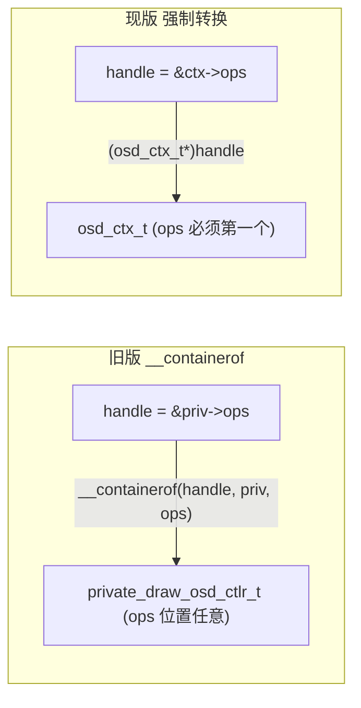
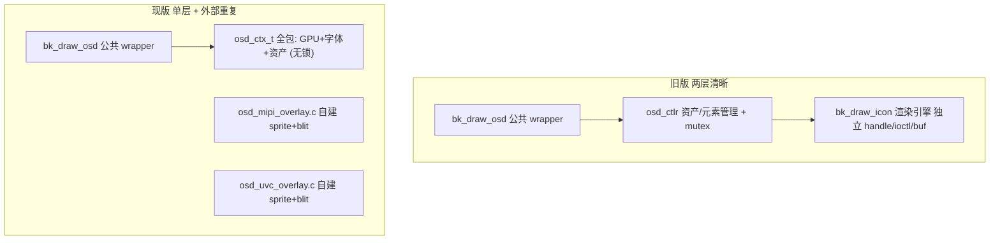

# bk_draw_osd 接口 / 架构评估文档

> 目的：对比 `ap/components/bk_draw_osd/fa4592d/` 旧版官方接口与现版组件在**对外接口、handle 使用、分层架构**上的差异，指出现版的差距，并给出分级（低 / 中 / 高风险）的优化建议。
>
> 本文只做评估，不改动任何 `.c` / `.h` / `CMake`。落地实施等本文确认后按选定风险级别单独进行。

---

## 1. 背景与目的

- `fa4592d` 是重写前的旧版 `bk_draw_osd`，其渲染引擎基于 CPU（`bk_draw_icon` + `modules/lcd_font.h` / emWin 字模），产物直接写进线性 RGB565 / YUYV 帧。
- 现版 `bk_draw_osd` 是为 **GPU / VG-Lite** 叠加 + **LVGL 字库光栅化**重写的版本，支持把 ARGB8888 sprite 以 `SRC_OVER` 混到 GPU 产出的帧上（MIPI / UVC 通路）。
- 用户认可旧版**对外接口设计与 handle 使用方式**（不透明 handle + vtable + `__containerof` + 分层）。本文以旧版为参照，评估现版是否可优化。

参照文件：

- 旧版：[ap/components/bk_draw_osd/fa4592d/src/bk_draw_osd.c](../../../../ap/components/bk_draw_osd/fa4592d/src/bk_draw_osd.c)、[fa4592d/src/bk_draw_osd_ctlr.c](../../../../ap/components/bk_draw_osd/fa4592d/src/bk_draw_osd_ctlr.c)、[fa4592d/include/bk_draw_icon.h](../../../../ap/components/bk_draw_osd/fa4592d/include/bk_draw_icon.h)
- 现版：[ap/components/bk_draw_osd/src/bk_draw_osd.c](../../../../ap/components/bk_draw_osd/src/bk_draw_osd.c)、[ap/include/components/bk_draw_osd.h](../../../../ap/include/components/bk_draw_osd.h)

---

## 2. 两版对外接口对照

### 2.1 旧版公共 API（fa4592d）

- `bk_draw_osd_new(handle, config)` / `bk_draw_osd_delete(handle)`
- `bk_draw_osd_image(handle, bg_info, img_info)`
- `bk_draw_osd_font(handle, bg_info, font_info)`
- `bk_draw_osd_array(handle, bg_info, osd_array)`
- `bk_draw_osd_add_or_update(handle, name, content)`
- `bk_draw_osd_remove(handle, name)`
- `bk_draw_osd_ioctl(handle, cmd, p1, p2, p3)`
- 底层另有独立引擎 API：`bk_draw_icon_new/delete/image/font/ioctl`（`bk_draw_icon.h`）

特点：**所有对外能力都以 `blend_info_t` 资产 + handle 为中心**，文本也是通过 `bk_draw_osd_font` 走 `blend_info_t`（`content` 字段承载动态字符串）。

### 2.2 现版公共 API（bk_draw_osd.h）

- `bk_draw_osd_new` / `bk_draw_osd_delete`
- `bk_draw_osd_image` / `bk_draw_osd_font` / `bk_draw_osd_array`
- `bk_draw_osd_add_or_update` / `bk_draw_osd_remove`
- `bk_draw_osd_ioctl`
- **额外新增（游离在 vtable 之外）**：
  - `bk_draw_osd_text(handle, bg_info, font, utf8, x, y, argb, scale)` —— LVGL 字库
  - `bk_draw_osd_text_bkfont(handle, bg_info, font_digit, utf8, x, y, argb)` —— bk_font / emWin 字模

### 2.3 逐项差异（要点）

- 旧版无 `*_text` / `*_text_bkfont`；现版新增两个直接吃「原始字库指针 + UTF-8 + 坐标 + 颜色」的扁平文本接口。
- 旧版文本经 `blend_info_t.content` 走资产模型，坐标 / 颜色 / 字库都来自资产表；现版两个新文本接口把这些参数直接摊在函数签名上，不进资产表、不进显示列表。
- 旧版 `bk_draw_osd_font` 的 `blend_info_t` 里的字库固定是 `gui_font_digit_struct`（emWin）；现版 `osd_draw_font`（vtable）也走 bk_font，但同时又有独立的 `bk_draw_osd_text_bkfont`，功能重叠。
- 旧版无 GPU 概念；现版 `bk_draw_osd_new` 内部隐式 `osd_gpu_acquire()`（全局 vg_lite 单例 + 引用计数），这是对外接口未体现、但生命周期上很重的一步。

---

## 3. handle / vtable 用法对比

### 3.1 旧版：`__containerof`，布局无关

旧版 handle 是不透明的 `bk_draw_osd_ctlr_t *`（即 `&priv->ops`），实现里统一用 `__containerof` 反查私有结构：

```308:315:ap/components/bk_draw_osd/fa4592d/src/bk_draw_osd_ctlr.c
static avdk_err_t osd_ctlr_delete(bk_draw_osd_ctlr_handle_t handle)
{
    private_draw_osd_ctlr_t *priv_ctl = __containerof(handle, private_draw_osd_ctlr_t, ops);
    AVDK_RETURN_ON_FALSE(priv_ctl, AVDK_ERR_INVAL, TAG, "control is NULL");

    osd_ctlr_destroy(priv_ctl);
    ...
}
```

`ops` 放在 `private_draw_osd_ctlr_t` 的**任意位置**都能正确反查，与整个 SDK 的控制器惯例一致（`bk_gpu` / `bk_display` 等同款）。

### 3.2 现版：强制类型转换，依赖「ops 必须放第一个」

现版把 `ops` 强制放在结构体首位，靠 `(osd_ctx_t*)handle` 直接转：

```41:52:ap/components/bk_draw_osd/src/bk_draw_osd.c
typedef struct {
    bk_draw_osd_ctlr_t ops;         /* MUST be first: handle == &ctx->ops */
    bool gpu_owned;
    const blend_info_t *assets;
    ...
} osd_ctx_t;
```

```424:428:ap/components/bk_draw_osd/src/bk_draw_osd.c
static avdk_err_t osd_draw_image(bk_draw_osd_ctlr_handle_t handle, osd_bg_info_t *bg_info, const blend_info_t *info)
{
    osd_ctx_t *ctx = (osd_ctx_t *)handle;
    ...
}
```

脆弱点：一旦有人调整结构体成员顺序（把某字段挪到 `ops` 前面），`handle` 反查就会静默错位，编译器不会报错，属于隐性坑。

### 3.3 反查关系对比



---

## 4. 分层架构对比

### 4.1 旧版：两层（管理层 + 引擎层）

- `osd_ctlr`（`bk_draw_osd_ctlr.c`）：**资产 / 元素管理**——`dynamic_array` 动态显示列表、按 name/content 增删改查、PSRAM 策略、打印，加 mutex 保护，实际像素工作委托给下层。
- `bk_draw_icon`（`bk_draw_icon.c` / `bk_draw_icon_ctlr.c`）：**渲染引擎**——`icon_image_blend_cfg_t` / `icon_font_blend_cfg_t` 细粒度配置，自带独立 handle、自己的 `ioctl`（`SET_PSRAM_USAGE` / `SHRINK`）、自己的 `buf1/buf2` 缓冲管理。可独立复用。

```746:757:ap/components/bk_draw_osd/fa4592d/src/bk_draw_osd_ctlr.c
    icon_ctlr_config_t icon_config = {
        .draw_in_psram = config->draw_in_psram,
    };
    ret = bk_draw_icon_new(&priv_ctl->context.icon_handle, &icon_config);
    ...
    priv_ctl->context.blend_assets = config->blend_assets;
    priv_ctl->context.blend_assets_size = config->blend_assets ? osd_ctlr_get_array_length(config->blend_assets) : 0;
```

### 4.2 现版：单层全包 + project 侧重复

- 现版 `osd_ctx_t` 一个结构体把 **GPU 生命周期（vg_lite 单例 + refcount）、sprite staging、字体光栅（LVGL + bk_font）、资产引用**全揽。
- 更关键：project 侧 [osd_mipi_overlay.c](../ap/mipi/src/osd_mipi_overlay.c) 与 [osd_uvc_overlay.c](../ap/uvc/src/osd_uvc_overlay.c) **各自重复实现**了「CPU 合成 sprite -> `bk_gpu_blit_set`」这套逻辑，组件里并没有一个可被它们复用的渲染引擎层。

### 4.3 分层图对比



---

## 5. 差距清单（逐条 + 影响）

1. **handle 反查脆弱**：现版 `(osd_ctx_t*)handle` 依赖「ops 第一个」，成员顺序一变即静默错位。影响：可维护性、后续加字段的风险。
2. **无 mutex**：旧版 `osd_ctlr_context_t.lock` 保护 array/add/remove/ioctl；现版 `osd_ctx_t` 无锁。若渲染线程与控制线程并发调用（动态改 OSD），存在竞态。影响：多线程安全。
3. **`add_or_update` / `remove` 是 stub**：现版直接返回 `AVDK_ERR_UNSUPPORTED`：

```502:518:ap/components/bk_draw_osd/src/bk_draw_osd.c
static avdk_err_t osd_add_or_update(bk_draw_osd_ctlr_handle_t handle, const char *name, const char *content)
{
    (void)handle;
    (void)name;
    (void)content;
    /* Runtime display-list mutation: not needed by the case tests. */
    LOGW("add_or_update not implemented\n");
    return AVDK_ERR_UNSUPPORTED;
}
```

   影响：运行时增删「时间 / WiFi / 天气」等 OSD 元素的产品需求无法通过组件完成（旧版可）。

4. **文本 API 脱离 vtable 与资产模型**：`bk_draw_osd_text` / `bk_draw_osd_text_bkfont` 直接 `(osd_ctx_t*)handle` 且不进显示列表，与「一切经 handle->ops + blend_info」的旧风格不一致，接口面变宽、心智负担增加。
5. **公共 wrapper 与实现同文件、边界检查偏薄**：旧版 `bk_draw_osd.c` 是独立薄 wrapper（含 `AVDK_RETURN_ON_FALSE` 对 `bg_info->frame` / 宽高 / 越界的完整校验）；现版 wrapper 与实现都在一个 `bk_draw_osd.c`，且部分校验（如 `handle->draw_image` 是否为空）缺失，`handle->xxx` 为空会崩。
6. **ioctl 覆盖不全**：旧版有 `SET/GET_PSRAM_USAGE`、`GET_ALL_ASSETS`、`GET_DRAW_INFO`、`SHRINK`（均加锁 + snapshot-then-print）；现版仅部分实现，缺 `SHRINK` / PSRAM 策略等。
7. **渲染引擎不可复用**：mipi/uvc overlay 重复造轮子（见 4.2）。影响：重复代码、行为易不一致、维护成本高。

---

## 6. 优化建议（按风险分级）

### P0 低风险（纯内部整形，接口不变、行为不变）

- 用 `__containerof(handle, osd_ctx_t, ops)` 取代 `(osd_ctx_t*)handle`，去掉「ops MUST be first」的隐性约束。
- 把公共 `bk_draw_osd_*` wrapper 从实现中分离到独立文件（对齐旧版 `bk_draw_osd.c` 仅做 wrapper），并补齐 `handle` / `handle->op` 非空与 `bg_info->frame` / 宽高 / 越界校验（复用旧版 `AVDK_RETURN_ON_FALSE` 风格）。
- 收益：健壮性、可维护性、与 SDK 惯例一致。风险：极低。
- 影响文件：`ap/components/bk_draw_osd/src/bk_draw_osd.c`（可拆分为 wrapper + ctlr 两文件）。

### P1 中风险（补齐能力、统一接口）

- 把 `bk_draw_osd_text` / `bk_draw_osd_text_bkfont` **收敛进 vtable**：新增 `draw_text` op（或让二者内部改走 `blend_info_t` 的 `draw_font`），使「所有能力经 handle->ops」一致。保留旧签名作为薄 wrapper 以兼容现有 case 调用。
- 恢复 `mutex` + 真正实现 `add_or_update` / `remove`（可直接移植旧版 `dynamic_array` + `find_*` + snapshot-then-print 逻辑）。
- 补齐 `ioctl`：`SET/GET_PSRAM_USAGE`、`SHRINK`、`GET_ALL_ASSETS`、`GET_DRAW_INFO`。
- 收益：满足动态 OSD 产品需求、线程安全、接口自洽。风险：中（改动 vtable / 结构体，需回归 case1~case7）。
- 影响文件：`bk_draw_osd.c`、`ap/include/components/bk_draw_osd*.h`、`bk_draw_osd_types.h`、CLI 调用处。

### P2 高风险（分层重构，最贴近旧版）

- 抽出可复用的 **GPU render engine 子层**（对标旧 `bk_draw_icon`）：封装 sprite staging + `SRC_OVER` blit + 字体光栅，自带 handle/ioctl/缓冲管理；`osd` 控制器只做资产 / 元素管理。
- 让 project 侧 `osd_mipi_overlay.c` / `osd_uvc_overlay.c` 复用该引擎，删除重复的 sprite 合成 + `bk_gpu_blit_set` 代码。
- 收益：架构清晰、消除重复、行为统一、引擎可被其他方案直接复用。风险：高（跨组件与 project、需全量回归 MIPI/UVC 四类 case + 性能对比）。
- 影响文件：新增引擎源/头、`bk_draw_osd.c`、`osd_mipi_overlay.c`、`osd_uvc_overlay.c`、两侧 `CMakeLists.txt`。

---

## 7. 结论与推荐路线

- 现版功能已验证可用（MIPI/UVC 图标 + 两种字库均能显示），但**对外接口一致性、handle 稳健性、线程安全、运行时元素管理**相比旧版有明显退化，且渲染逻辑在 project 侧重复。
- 推荐分阶段落地：
  1. **先做 P0**（零风险整形）：`__containerof` + 拆 wrapper + 补校验，立刻消除隐性坑。
  2. **再做 P1**（按产品需要）：文本接口收进 vtable、恢复 mutex 与 add/remove、补齐 ioctl —— 若客户有「运行时增删时间/WiFi 图标」需求则必做。
  3. **视复用需求再做 P2**：只有当要把 OSD 引擎复用到 mipi/uvc/其他方案、且愿意承担全量回归时才推进分层重构。
- 每个阶段独立可交付、可单独回归，不必一次性重构到底。
  